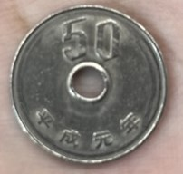
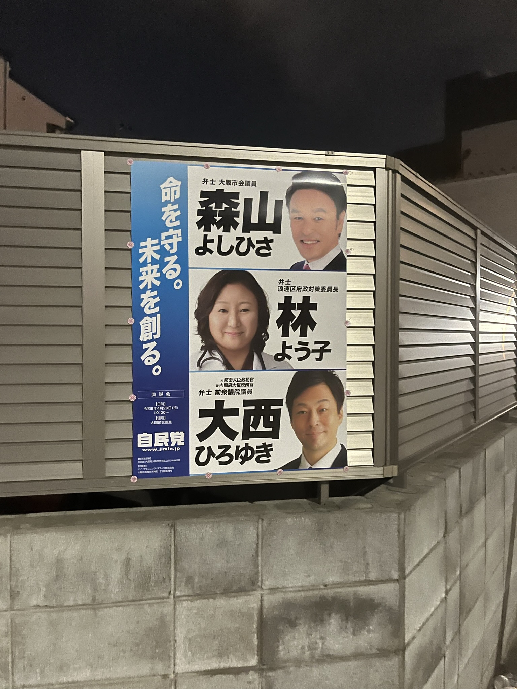

# Overview

这次从2022.12.1-2022.12.9的9天日本之行，抛开往返的飞机行程和从关西到关东的路程，其实一共也就7天多一些真正在玩。这次旅行从关西国际机场落地，分别以大阪、京都和东京为据点，途径了奈良、宇治、箱根和镰仓。虽然走马观花式去的地方很多，但四舍五入也可以算是深度游。 而且想去的地方实在是太多，所以在很多地方不得不单走，比如一个人一分钱日元没带就跑到小城市宇治和拉着行李箱绕了一圈镰仓。甚至在发现晚上很多神社依然开门之后夜游了八坂神社和伏见稻荷大社，也会把在京都没能入住的半天挤出来去宇治圣地巡礼，可以说无论是路径还是时间规划上都相当紧凑。这9天期间也经历了从兴奋到平淡的心态变化，很难说到底是因为大阪/关西的氛围和东京/关东不同还是已经习惯了这种日式的“空气”。

<!--more-->

我其实很不想从什么民族性和素质之类大而无当的文字评价一路上的人和事，这种被国内二三流媒体十年前传出的说法一路上其实被当作烂梗来玩，“素质真高”、“真没素质”成了一路上调侃用的佐料。非常热心的路人会帮我们买票、指路和翻译菜单；但在711的销售人员一看我是不会日语的外国人就一副司马脸草草应付连敬语都不说。泛泛而谈的结论对自己和对他人都是一种不负责任，因为这种所谓民族性的差异往往是用来对比自己与他人所在的群体，而群体内部的差异同样不必群体之间的差异小。但话虽如此，在日本文化差异的趣事还是可以聊一下的。

首先就是语言问题，因为这个是作为外国人与当地人交流最为直接的障碍。英语的普及度很高，除了海关之外，公交地铁报站也都是英文。但说实话报站的英文还不如没有，因为英文地名直接是用的日语罗马音，完全没办法对应到汉字上，这也是中文母语的日语初学者对和制汉字深恶痛绝的原因之一。另外一点就是，虽然平时交流基本上都用英语，但还是不可以默认对方不会中文（和新加坡很像）。我们在大阪便利店买地铁卡的时候，一位白发苍苍的老爷爷就来了一句中文的“没有”。第二天起床在大阪坐地铁的时候遇到一位在日本工作的中国人，而在京都酒店入住和东京银座吃寿司的时候也遇到了会说中文的服务人员（感觉像是打工的）。

再一个就是国内刚刚解封的，新冠问题，时间是2022年12月初。在日本绝大部分人还是会佩戴口罩，虽然日本的人口密度做不到保持社交距离，但是隔离板等控制间隔的措施依然会有（但可以拆了不用），而且神社里舀水的勺子也因为疫情问题停用了。相比新加坡限制还是会多一些，毕竟新加坡这里室内除公共交通和医院之外已经不需要戴口罩了，但在日本依然会有店员要求客人将口罩戴上。

说到什么民族性，那大国工匠一件产品用五十年之类的也可以说一下。确实有些东西会用很久，比如电铁轨道。JR的很多铁道在1920年代因为军国主义需要开始大修大建，很多铁路一直用到今天。新干线的年头也很长，1960年的轨道跑着2020年代的新车，但即使如此无论是列车速度还是调度也依然可以和21世纪的中国高铁相媲美。再一个就是日本的硬币。我们在出关西空港的南海电铁售票机里就发现了一个昭和时期的硬币，一路上昭和时期的硬币更是见到了不少，这种随处可以见的历史感实在是令人震惊。很难说日本是因为电子支付没发展起来加上90年代泡沫破裂才导致这些硬币一直在流通，日本的电子支付同样十分发达，而且只要是支持电子支付基本上都能用微信支付宝。泡沫破裂说更是不值一驳，毕竟昭和三四十年的硬币依然不少。

我们在大阪、京都和东京的大街小巷上都遇到了游戏机厅。日本的游戏机厅和中国的很不一样，虽然看上去大家都在玩各种游戏，但实际上几乎所有的游戏机，都是老虎机。很难想象，一个超大的游戏厅里面，一排排游戏机前面坐满了人，但他们都是在赌博。不知是不是压抑的社会氛围让他们选择用这种方式解压，我是实在是看不下去，更别说体验一把了。

既然提到赌博的危害，那就不得不提一句在关西和关东都见到的流浪汉了。游戏机厅前有、大阪的道顿堀商业街的天桥上有、涩谷最繁华的人行道的大树下也有。但话说回来，即使是游戏机厅前的流浪汉也不好说到底是不是因为赌博破产的。大冬天裹着被子在商业街最繁华的地方攒成一团睡觉，不知道日本的社会保障体系会如何帮助他们。

有些东西过了一周之后很容易忘了，更何况我这烂记性写着写着就忘东西，就拿日本的政治海报作结吧。政党的海报也是日本大街小巷很常见的东西之一。在大阪最多的是公明党的海报，到了京都和宇治就全都是日共的海报了。东京玩的时间不多，没怎么深入到小巷子里面，也就没机会找海报看。

有些东西过了一周忘了，再过一周写日记的时候又会想起来，这一条就是写的时候新加的：都说日本重男轻女很严重，但是我还是在日本铁道系统的各处见过各种各样的女性职工，也在机场见到过带着安全帽身穿防护服的检修机械工。似乎这个刻板印象又在现实里给我一种不同的感受，请各位在日记的照片中发现一路上的工作女性吧。
