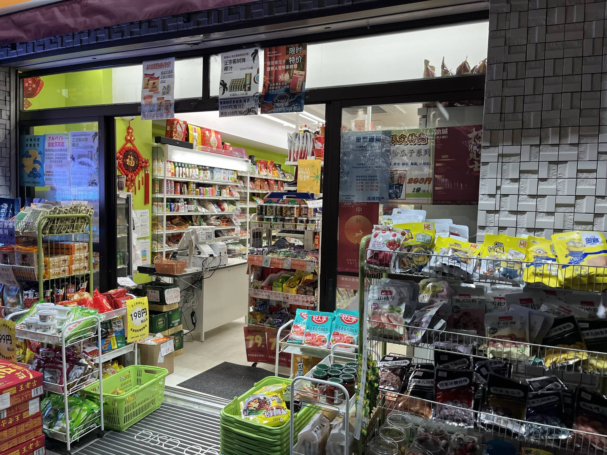
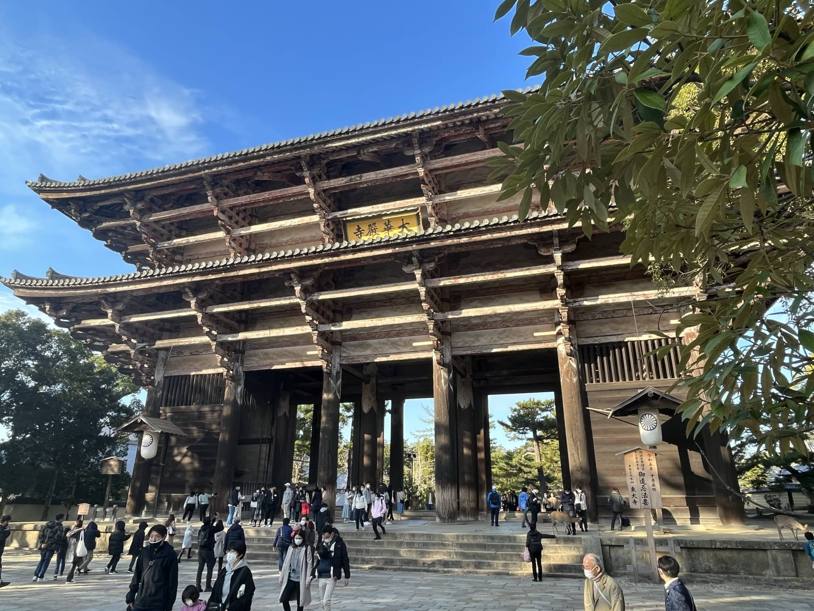
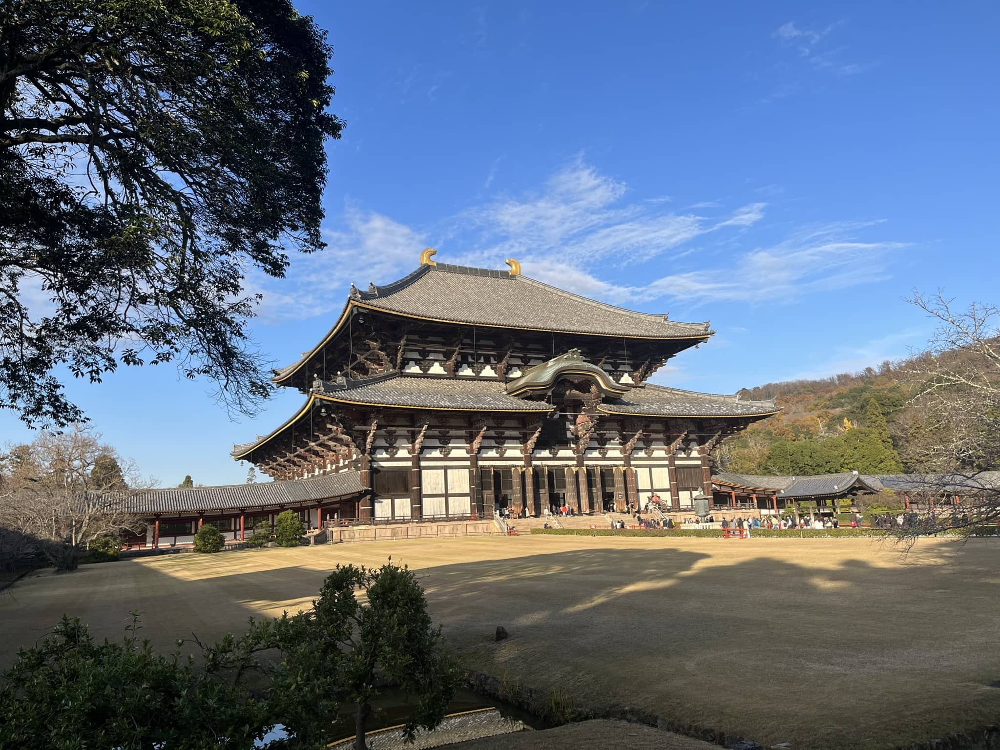

# 2022.12.1-3 Osaka & Nara

从大阪天守阁到关西最繁华的商圈，再到古色古香的南都奈良三天行。

<!--more-->

## 大阪初印象

12.1降落到大阪的第一天是非常爽的，主要表现在气温上。因为刚下飞机在海关排长队之后没能来得及换衣服就直接奔上了南海电铁，不到10度穿着从新加坡带来的短袖是完全不够用的。这个温度也让我怀念很久没能体验到的冬天，来自大自然真正的寒冷，而不是新加坡空调房里的室内外温度失衡。

上了电铁之后，动漫里的电车风就扑面而来，虽然在车上的基本都是拿着行李的外国人，但摇晃的扶手与狭长的车厢还是让番剧里随处可见的电车场景映入眼帘了。更为神奇的是南海的电车竟然还有座椅加热，记不清其他电车有没有了，但刚下飞机就能坐上座椅加热的电车还是给我留下了非常深刻的印象。

赶到了住处赶紧把羽绒服穿上。不得不说组织这次旅行的小伙伴立了大功，无论是机票还是民宿酒店都帮我们一手搞定。我们的住处在大阪新今宫，这个站名不知道听了多少遍，以至于我们在秋叶原下榻模仿电车运行报站的时候还会说“tsugi wa shin imamiya”。

非常神奇的是，我们民宿的窗户外面就是一个电车轨道，跑着一辆一节车厢的小电车。

[【阪堺小电车 下榻大阪第一天的惊喜！】](https://www.bilibili.com/video/BV1c84y1t73L/?share_source=copy_web&vd_source=11cc2c31f0b4e6576a1a2b9d744d9136) 

<iframe src="//player.bilibili.com/player.html?aid=606584002&bvid=BV1c84y1t73L&cid=932918757&page=1" scrolling="no" border="0" frameborder="no" framespacing="0" allowfullscreen="true"> </iframe>

除此之外更为神奇的是在民宿旁边就是一家中国超市，虽然不会在这里买什么东西，但给了我一种很强的穿越感。这种穿越感真的是仅在大阪第一天才会有。

之前在序言中提到的游戏机厅也在民宿旁边，实在是太恐怖了。

我们在游戏机厅旁边的餐厅吃了顿饭，1000日元套餐，有甜鸡块米饭和乌冬面，相比起国内物价还是很贵，和新加坡不相上下。

吃完饭我们在大阪住处周边的大街小巷走了好一会，第二天去奈良也从巷子里穿行而过走了很久，政党海报也是在这期间拍摄的。这是在东京完全没有过的感觉，毕竟在东京的时候更多情况下是在商业街而不是居民区穿行。真正些许进入到在日本生活的感觉也只是在关西而已。

## 天守阁

我们在12.2一大早便出发去了大阪天守阁，在天守阁公园地铁站旁的面包店吃的brunch。味道真的非常不错的面包店。绿色牌子上写的间隔座位被我们完全无视了，直接拆了塑料板大吃特吃。

大阪城天守阁建在市中心的大阪城公园，天守阁本身仅仅作为公园中央很小的一部份区域，而公园的外围修了不少市民剧院等娱乐休闲场所。这种将历史遗迹与市民休闲结合的方案对城市来说很有意义。不仅仅让天守阁这个大阪城的名片成为显眼的旅游胜地，而且能将市民文化融合进来，将城市的地标作为市民的娱乐中心，对提振旅游业和发展市民文化都是绝佳的配合。

不可以欺负猫猫！

天守阁旁的欧式城堡，之前是日本帝国军队驻地，现在已经改造成餐厅。

第一张图片来源：By Cesar I. Martins from Jundiai, Brazil - Vista do alto do Castelo de Osaka, CC BY 2.0, https://commons.wikimedia.org/w/index.php?curid=64171681

.jpg)

经历了丰臣和德川两代将军家修筑与焚毁，如今的天守阁是战前钢筋混凝土重建版本。整个天守阁实际上作为了博物馆，套路和大多数的历史文化建筑相似：介绍大阪城建筑本身的历史和建立大阪城的丰臣秀吉的一生。说实话这一套叙事搞得我有些审美疲劳，让我有一种回到国内类似于名人故居博物馆的感觉。但很可惜的是展览战国时期文化遗产的展厅不允许拍照，让我印象很深的除了武士的甲胄、各大家族的棋子和画着历史名人的浮世绘屏风，还有一个在大阪城内服侍的宫女写下的起请文。这上面写下了女性在服侍期间要确保看管的物品不遗失。这玩意的作用还是在查找江户城大奥（后宫）时了解到的。登顶之后大阪城公园和周围市中心的高楼林立一览无余，是在市中心俯瞰大阪城的一个绝佳地点。下了城是纪念品商店，同样遗憾的是没能在大阪城的纪念品商店带一些东西回去，无论是战国家纹的小饰品还是天守阁木制模型都是很值得收藏的，但转念一想新加坡的宿舍也不够大吧。

免费的印章纪念！旁边很多戴帽子的小学生。

不知道为什么“三代目天守阁”这种表述让我感觉很缺德（

## 大阪的寺庙与神社

大阪城作为德川家康歼灭丰臣家残党的主战场，以及德川幕府在关西的重要据点，随便走两步就是一个历史痕迹。会津藩士（佐幕派在德川庆喜于鸟羽伏见战败逃回江户城仍在大阪拼死抵抗）的墓碑对面就是真田幸村战死地。可惜这两个墓地处在两个不知名的小神社内，不知道有没有深度挖掘一下文化价值。

大阪城公园里供奉丰臣秀吉的丰国神社，虽然十二月但对标国内依然是深秋的景色。周边的公园和神社在十二月初开满了银杏和红叶，很有深秋的感觉。

从公园出来之后我们步行前往大阪天满宫，一路上的景色也十分别致。

我们对一路上的建筑也有所点评，对日本建造出不少长宽相等占地面积小十分拥挤设计还各不相同的建筑感到不解。我们也开了不少关于这些建筑的玩笑，比如这些建筑就像是随时会和狂热运输或者天际线里面的建筑一样突然倒塌之后立起一座新楼。

12.3起床前往四天王寺，据说是圣德太子遣隋将佛教带入日本的第一个佛教寺庙，可即使这样的名声依然不能吸引多少游客，多数来此处参拜的仍是本地信众。

而且不得不说日本的佛教已经和当地本土神道充分融合，佛教寺庙内还有伊势神宫遥拜石（类似于回教不拜麦加拜曲阜的感觉），只能说是十分缝合。

参观过后在一个老夫妻开的咖啡厅吃的吐司面包，小店的氛围很不错。

说到神社和寺庙光是大阪这个工业城市就已经遍地都是了，但说实话作为小红书和各种旅游app推荐的大阪这些神社寺庙实在是乏善可陈，我们去的时候也并没有多少游客在，这样的神社接下来还会遇到不少。

## 关西的消费之都

虽然我对买买买没什么兴趣，但宝可梦中心算是把我拉进商场的巨大动力。一开始我们去的是宝可梦咖啡店，但似乎要等好久才能看皮卡丘跳半小时的舞。后来才发现旁边的周边店。虽说商店里有卖朱紫游戏，但似乎是电子兑换码，而且说实话gf搞正作摆烂依然能恰烂钱让我实属不悦。最后看上了黑白2女主角鸣伊的布娃娃，以此怀念正作那个在剧情、机制、画面表现力和创新性都无可比拟的黄金时代，也为了怀念我用模拟器玩nds宝可梦的青春时代（当然才不是因为什么本子王才买呢）。最后一天我也看到了背着巨型水水獭回新加坡的游客，果然布娃娃周边永远的神。

大阪同样作为关西的消费之都存在。难波-道顿堀-心斋桥的商业街连成了片。地上地下都有，地铁两站地之间开辟了地下连廊，两侧便是各种商家。下午的时候在心斋桥吃的海鲜寿司，本来应该是回转寿司的，但因为饭点没到只能自己点餐，说起来当时的服务员英语也是非常的日式英语，table(lu) or counter(lu)，让我们反应了好一阵子。晚上接到了朋友一起去道顿堀吃的自助烤肉，烤肉店的排风系统不太行，肉肉滴下的油还会让火势十分不可控，出来之后我们每个人的眼睛都很难受。

心斋桥

san值狂掉，2025世博会吉祥物新浪之眼群

帅哦层桑

第三天从奈良回来之后我们还去了一趟大阪的二次元一条街，很多二次元点和成人影像点开在一起，一层是游戏卡带，二层是动漫周边，三层是动漫DVD，四层是本子，五层就是成人电影。拾级而上，内容越来越不正经。路上有不少女性正在揽客，我们问是不是女仆咖啡厅，她们说不是，是陪睡觉觉给抱抱的（正经业务）。

京吹全集！

河北人的骄傲河北彩花（不是

## 奈良半日游

12.3在四天王寺的游览结束后，坐上近铁特急，穿过大阪林立的高楼，爬上市区郊外的小山丘，再穿过古都奈良遗址旁的蒲苇丛，我们在近铁奈良下车。

火车开始爬坡了，远处的大阪市中心和建在郊外的独栋构成了日本特色的城市群

眼前的第一个景点是兴福寺，跳过，直接没去。去往奈良国立博物馆半路调戏了不少梅花鹿。冬天的鹿刚刚换完毛，要等到暖和的时候才有斑点。

好呆哦你们两个

层桑可爱捏

小心发情！

商店卖的奈良周边，商标产权真的没问题吗

奈良国立博物馆的常展为各类佛像和少数中国青铜器，佛像的部分基本上都是禁止拍照的，两个例外是别的寺庙正在维修，将这两个天王放在博物馆代管。

青铜器部分看个乐呵吧，这玩意国博多的是

很可惜临展将会展出春日大社的国宝，但还在准备当中，并没有展出。博物馆底部的纪念品超市和咖啡厅前有知识长廊，介绍了佛教塑像的等级和雕刻方法。其实这种介绍应该多来一点，为不了解宗教的旅行者普及一下知识背景，再根据知识背景对馆内展品进行介绍，比单纯的介绍展品本身好得多。

甚至我们在吃牛肉饭的餐厅都有这种分类表，这种将历史科普做到餐厅，对文化科普的重视也是十分值得学习的，毕竟不是每个人都是狂热的历史文化爱好者，能将这些基本的知识在参观宗教场所前给游客普及，也能让游客对参观游玩的佛寺印象更加深刻。

吃完饭拐了个弯就到了东大寺，这是日本华严宗的大本营。啥是华严宗，这和其他宗派的区别是什么？没有背景知识进行游览就会很痛苦。

小鹿挡住了去路，远处的寺庙正门牌匾上隐约可见大华严寺。

正门特写

东大寺正殿据说是现存最大的木质建筑，比故宫三大殿任何一个单拎出来都要大不少。

大殿前的古灯也被列为国宝

殿内除了如来佛像之外还有一个换下来的鱼尾（房顶的犄角），单纯一个犄角就有五米多，再来看整个大殿只能说十分宏伟。

更不必说殿内各种佛像了。

说起来我在这里也才明白大阪城的印戳是多么好。寺庙里提供的都是御朱印，虽然是手写，但还是需要花钱的。

东大寺木制还原模型

盘根错节的大树与当地土著霸主

庭院里的景色也很美！

临走之前看一下奈良神兽吧！在一旁伸脚的小朋友想要和当地霸主抢鹿粑粑，被🦌霸主一jio踢走

[【尥蹶子你比得过我？ 对决奈良东大寺的鹿】](https://www.bilibili.com/video/BV1Z44y1Z7Es/?share_source=copy_web&vd_source=11cc2c31f0b4e6576a1a2b9d744d9136) 

<iframe src="//player.bilibili.com/player.html?aid=989028119&bvid=BV1Z44y1Z7Es&cid=932974345&page=1" scrolling="no" border="0" frameborder="no" framespacing="0" allowfullscreen="true"> </iframe>

很可惜的是出于体力原因我们的奈良之行就到此结束了。奈良这种古都遍地都是文化遗产，若是要深度游值得一去的寺庙和遗迹也至少要一整天乃至两天才能逛完，只能说时间紧迫体力不支十分可惜。