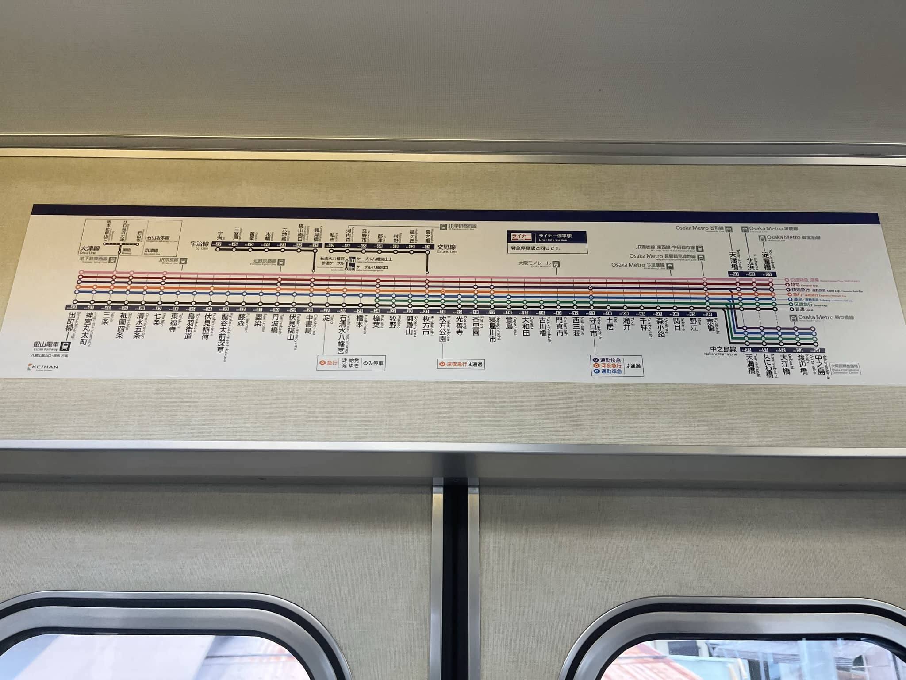
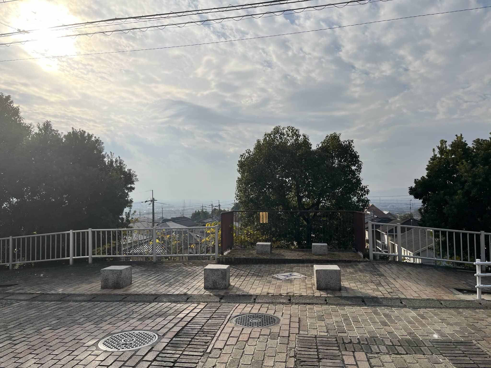
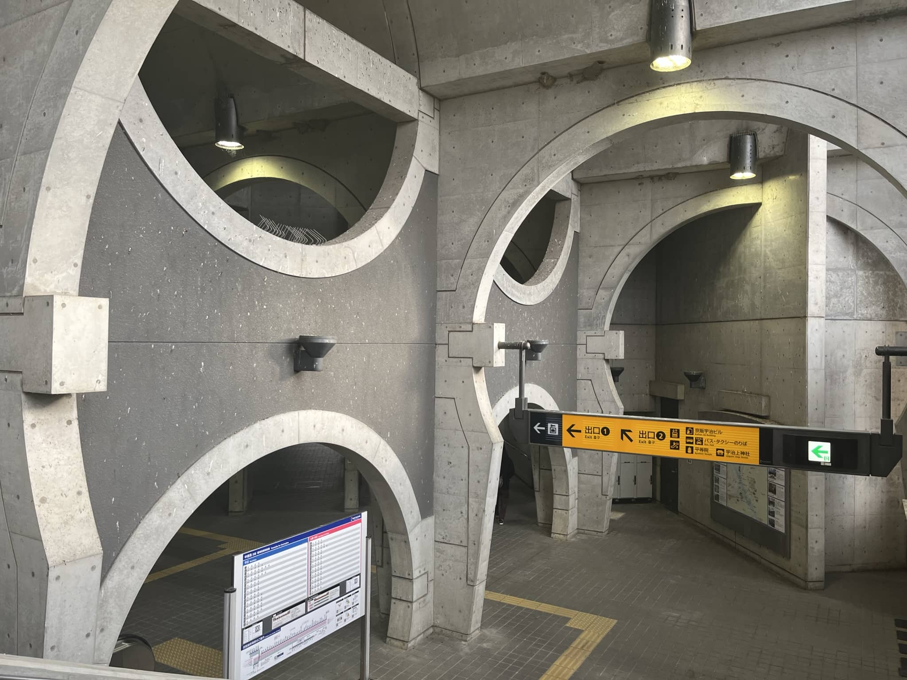
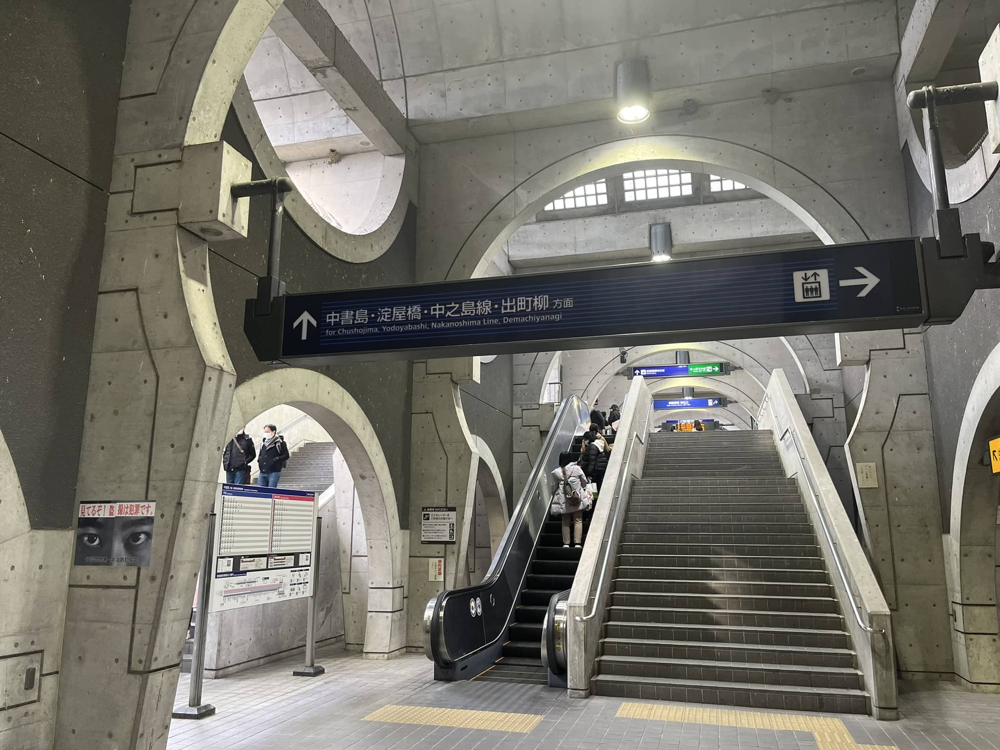
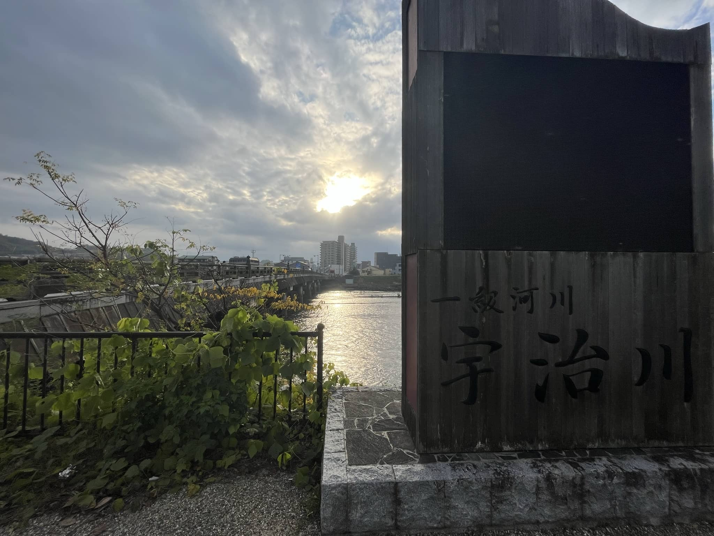
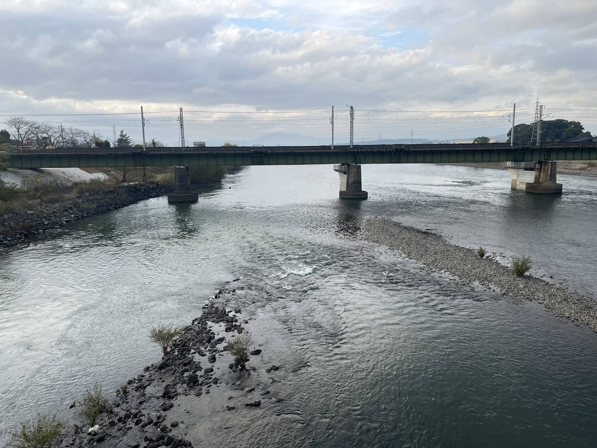

# 2022.12.4 Uji

## 宇治之缘

说实话，这次圣地巡礼在去日本之前甚至都没有规划，真正开始找巡礼攻略还是要等到到了大阪听说第四天上午去京都下午没事干之后才拍脑袋决定的。而且毕竟是拍脑袋决定，临走前其实身上一分钱日元都没带。本来是想着在京都的地铁站找个机器取钱，但不知道为什么我的visa卡等我从日本回来才正式开通境外取款的功能，所以在日本用银行卡取现金的尝试都失败了（但幸好境外消费还没问题）。虽然在线路上做了充分的准备，但这次旅程还是遗憾满满。比如京阿尼的线下商店在2022年3月份就正式关闭了、宇治的《源氏物语》博物馆没开门、甚至没能吃到宇治的抹茶（因为从大吉山下来已经饿疯了吃的萨莉亚）。虽然遗憾颇多，但总体来说整个圣地巡礼的感觉还是相当不错的，尤其是因为圣地巡礼能接触到平等院这个世界文化遗产，按理来说我的性格应该是追逐历史文化经典的，但这次竟然是因为圣地巡礼而偶遇了世界文化遗产，不得不说《京吹》带来的旅程真是一次神奇的经历。

## 目标，北宇治

我们从大阪启程，坐京阪特急先奔赴京都。京阪特急车非常好看，红褐色的车皮上印着星星，车厢内部是双层座椅。在购票处我们折腾了好一阵子，不知道要不要买特急券。一位当地白发上班族用英文告诉我们现在特急已经不需要额外买特急券了，只需要买坐票，我们这才赶紧进了站。

在沿路上我发现了一个京阪的车辆仓库，里面停满了京吹里常见的京阪绿皮车，《京吹》的味道一下子就上来了。

从京阪三条站出来到了酒店还是中午，暂时不能入住。眼看时间马上就要到一点多，掐指一算时间还不一定来得及，便连午饭都来不及吃就急匆匆地直奔宇治线。

北宇治的名义位置和实际位置因为隐私考虑产生了质壁分离，原型取材于菟道高，但实际地理位置应该在六地藏。但说实在的六地藏的巡礼并没有多少东西，便直接跳过了。另外一处应去未去的巡礼地是木幡的京阿尼总部，原先线下商店的驻地。但毕竟线下商店关门了，所以木幡站也不得不跳过。

于是我从中书岛开始坐上宇治线的站站乐，一直坐到了黄檗。当时坐在了车头旁边的照顾专座，驾驶室和列车前方运行的情形一览无余。当时早有耳闻通往菟道高的路线多难爬，于是便在黄檗车站坐上了大巴车。虽然看起来北宇治前只是一条长长的坡道，但是实际上北宇治，现实里的的菟道高，在一片住宅区的山顶。大巴车上除了我只有两位老太太，坐了不到五站地花了我230日元（应该是全京都统一票价，当时还嫌贵）。而且这个公交车频率很低，周末的时候两个小时一班车，也正因如此我才会紧赶慢赶从京都一路坐过来，别的什么都顾不上了，撇开日元没换不说，连厕所都顾不得上。

下了公交车基本上也就到了，转头便是《利兹与青鸟》开场时铠冢霙等待伞木希美时的台阶，但仔细一看我就喷了，这个电影取景地竟然贴着日共反对废除和平宪法第九条的海报。不知道这个这个场景融入到电影中会是怎么一副画面。

走上台阶右手边是学生们的自行车棚，而眼前便是上学必经的、长长的坡道（Clannad乱入），坡道右手边是学校校名的汉字标牌，在动漫里换成了北宇治。

动漫中学校大门的场景不能说十分还原，只能说一模一样。但毕竟这里是学校，即使开着门也是不能闲杂人员进入的，所以不得不拍几张照片就走人。

走下坡道和台阶，穿过马路就是大名鼎鼎的北宇治第一会议室，羽户山第三儿童公园。公园标牌、儿童攀爬杆、秋千滑梯跷跷板，乃至入口的水龙头都十分还原。

道路两侧都是居民住宅，几乎住在这里的人家户均一辆车，毕竟在羽户山上如果没有车的话爬山还是非常费力费时的。

沿着坡道往下走，来到第二儿童公园。这个公园的孩子们很多，踢足球砸沙包爬杆……十几个小朋友玩的不亦乐乎，但很可惜处于隐私原因也就没有拍照。

再往下走就是黄檗观景台，与动画中不同，现实里的观景台视线被一棵大树挡住了一大半，前几年的照片中这颗树还刚刚出头并不是很茂盛。

往右手边走是久美子拎着书包跳起的场景取景地，山坡上的防护栏与远处密集的城镇和蓝天相得益彰。

紧接着就是动画里长长的台阶，一开始我并没注意到这个台阶有什么特别，只是觉得很长所以拍了一张。但后来在整理照片的时候才反应过来这也是巡礼地之一。

经过一个小咖啡厅，本来想吃一顿，可惜不支持visa，但借了厕所救急。又走了一段路发现身旁竟然是高速，高速入口旁有个全家，搞了份鸡排吃填了填空腹。再沿着高速路走啊走，走了好一阵子，要从京阪三室户站坐一站地到京阪宇治。

三室户站是一个很典型的日本乡下小站点。从铁道与人行道的平交口进站，刷了卡就是月台，连天桥都没有，所以两边进站口要看好，月台决定了列车的方向。也正因如此我被平交口要出站的列车挡住，又等了15分钟才等到下一趟车。这里也是op明日香上学的通道。

## 宇治市中心

抵达京阪宇治站。京阪宇治站里一切都和动漫里一样，停靠在站台上的绿皮京阪普通车、京阪站内圆形的空洞都让我与久美子更近一步而兴奋不已。

但我还有现实的考量，站内有货币兑换机，赶紧把随身携带的70新币都扔了进去换成日元，有了定心丸一下子轻松多了。

我走进游客咨询中心拿了几份京吹的观光海报，工作人员叫住了我并给了我几份新的。真的是太贴心了（虽然海报上的活动都结束了）。

接下来过宇治桥，宇治桥的照片拍的都极为拉跨，久美子跑的名场面也没能还原。

过了宇治桥就是山田尚子信号灯和县神社鸟居，但现实里我无论如何都找不好角度，我手机的焦距限制我如果想要拍出好照片只能在斑马线上被车撞，还是算了。

接着沿着平等院表参道进了平等院，平等院的部分我会在后文单列。从平等院出来之后找到了久美子之椅，体验了一把女高中生的迷茫困惑。

沿着河接着走，走过久美子上学必经的樱花路，发现了宇治市观光中心。

观光中心里有京吹联动立牌和粉丝留言册。似乎有个粉丝经常会来这里为每一位过生日的角色画画。我也在留言册上用中文写下了对工作人员的感谢。更为神奇的是这里的桌子是菟道高中搬过来的，看来菟道高对京吹也是爱意满满。

从观光中心出来就是久美子之家，当然啥也没有就只有一个路口。左转上喜撰桥，这里是秀一表白久美子的地方。当时天色已晚，喜撰桥的角度并不是很好看，所以照片并没有能拍出久美子在秀一鸡拉住羽绒服袖口告白时的惊讶。

走过喜撰桥上了小岛进入宇治公园的区域，眼前便是建造于镰仓后期的浮岛十三重塔。向对岸往去可以看到丽奈酱问泷老师前妻时的观流桥。虽然名字叫做观流桥，但不如叫听涛桥更合适。我在小岛上都能听见巨大的流水声，丽奈在桥上问话实际上应该很难交流。

沿着公园继续走可以发现朝雾桥和宇治川先阵碑。这个石碑记载了源平合战中源氏内战的一部分。木曾义仲和源义经在此处交战，源义经方的佐佐木高纲和梶原景季抢着穿越宇治川争夺先锋。

晚上的朝雾桥会亮灯，RGB一直通向河对岸宇治神社的鸟居，好看吗？真的走上去其实光照有点离谱。公园里的照明灯写的都是《源氏物语》中“宇治十帖”的故事。宇治川两侧也经常能看见紫式部和源氏物语的雕像。很可惜的是这次旅行期间源氏物语博物馆正在维修（btw毕竟源氏物语我也没看完）

进了宇治神社的鸟居往里走，右手边就能看见兔兔。2022年12月，舀水的勺子还是因为疫情防控的原因收起来了。当时下午17点左右太阳已经落山，神社里已经乌漆嘛黑了。整理照片的时候才发现兔脑袋已经被摸得油光锃亮的。原来摸雕塑中外皆有之。

神社已经关门，御守和御朱印早就歇业了。正殿前面有一个“智慧之环”，看不懂日语，没敢钻。按照泷老师教的参拜方法拜了拜。

参拜完毕后从神社偏门离开宇治神社，继续向上山方向走，宇治上神社的鸟居就能看到了。不显山不漏水的世界文化遗产就在此处，可惜+1，来得太晚了。

再往上走一段就是大吉山登山处了，登山请穿轻便的运动鞋，夜间登山请带好手电筒。毕竟我已经在宇治绕了大半天，登大吉山还是非常痛苦的。更不用说大吉山的路连沥青都没铺，是完完全全的土路，有时候还会有裸露的层状岩石和树木的枝条来绊脚。要是你学丽奈，背着乐器穿着高跟鞋晚上来爬，我只能说是找死（确信）。

登顶之后的夜景还是很不错的，顺着地标左边能看到平等院，右边能看到宇治桥。我在山上的时候应该是没有宅宅的，来的几位都是大叔，带着三脚架和长枪短炮的摄影爱好者。如果相机不错的话在这里真的能拍出很不错的照片。下山的时候尾随了一个大叔安全感倍增。

从大吉山下来，我的脑海中只有找吃的一件事情。抹茶什么的已经不重要了。从一片居民区中穿行而过时，发现了一件真的很奇怪的事情：京都甚至宇治这个地方日共海报肉眼可见的多。

兜兜转转又回到了宇治市中心的起点，宇治桥。没有体验久美子跑，实在是跑不动了。宇治桥南侧有个小观景凸起，应该也是作画背景。

再次穿过宇治桥，宇治这个白天充满游客的小城现在已经十分寂静，想来作为京都的卫星城，大多数游客都会在晚上返回京都吧。因此难受的是白天随处可见的抹茶店到了晚上就一家都没有了（才6点钟）。空着肚子进了萨莉亚，看不懂菜单也懒得翻译，点完餐之后店员跟我叽里咕噜说了一通什么，应该是确认订单。开胃菜和正餐都上很快，唯独甜点等了一个小时都没上来。按了好几遍铃，我都想去结账的时候终于菜上完了。原来我点了两个冰激凌。这大冬天的吃冻得和石头一样的冰激凌，怪不得店员要我反复确认。

要是有力气的话，原本还应该去县神社的，但那是有力气的前提下。爬大吉山真的对精神和毅力都是一种折磨，更何况我没吃午饭，晚饭大开杀戒了一顿，分配到消化系统的血液已经让我昏昏欲睡了。沿着这个安静的小城市又走了一会儿，期间看到了葵学姐上的辅导班（大概）

来到JR宇治站。不得不说宇治站的两个车站设计的都非常有艺术感。本来还应该再拍一张邮筒的照片，但我当时只想着赶紧回去。幸好拍下来的照片里也把邮筒拍了进去。

到这里圣地巡礼的部分就结束了。这次巡礼的时间其实非常紧张，其实是从大阪到京都之后大部队没有安排的半天里抠出来的半天。也因为各种原因在宇治留下了各种各样的遗憾。哪怕我不是对角度和光线要求完全一致的强迫症大佬，但我依然感觉这次的照片不够出彩。一方面是照片本身质量就不行，另一方面也因为过于吝惜快门和手机容量导致照片的数量也相对较少，更别说找出出彩的照片。希望各位读者带着我的遗憾，也能够早日开启属于自己的巡礼。

## 平等院

久美子上学的必经之路，那条长长的樱花树小路的一侧，其实就是世界文化遗产平等院。除了与京吹的缘分（如果不是京吹我根本不会来宇治），另外一个缘分则是，平等院是源赖政相应以仁王反对平家起兵处（《镰仓殿的13人》有提到）。这座古朴典雅的寺庙，在日本12月秋意的笼罩下格外美丽。这里也是作为藤原摄关时期唯一一座遗留下来的建筑作为10日元硬币取景地。

平等院内部的博物馆也是看点之一。馆内珍藏了凤凰堂中26座云中菩萨雕像，原本被安置在凤凰堂的墙壁上。另外一处国宝则是凤凰堂塔尖上的一对凤凰。这些珍宝都是平安时代传承下来的。凤凰堂虽许额外购票，但也非常值得参观。除了总共52座云中菩萨像，大殿的菩萨也是一绝。菩萨本身使用木头雕刻拼接而成，外面覆以金箔。墙壁上的壁画已经褪色，但有修复的版本，具体壁画因为不让拍照，具体画了什么也忘了。