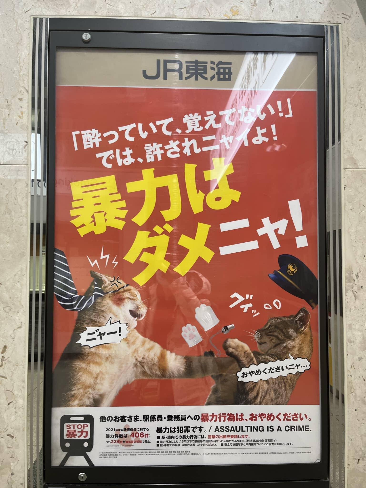
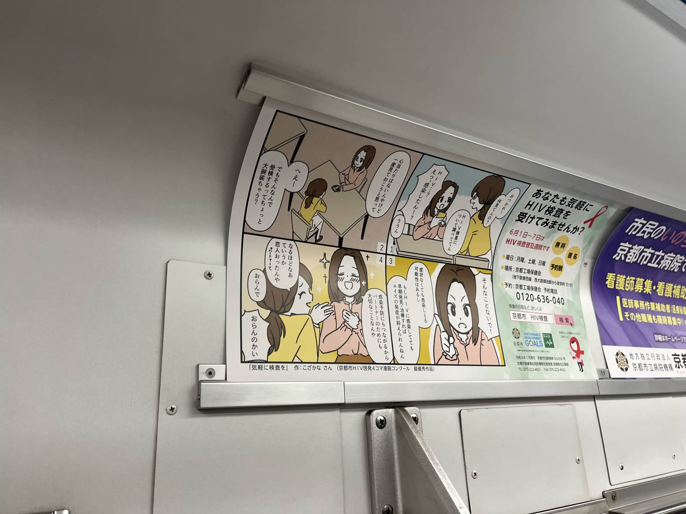
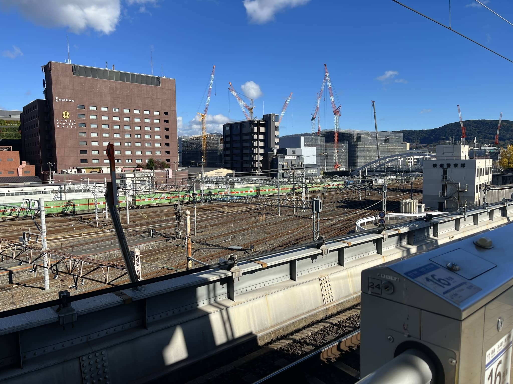
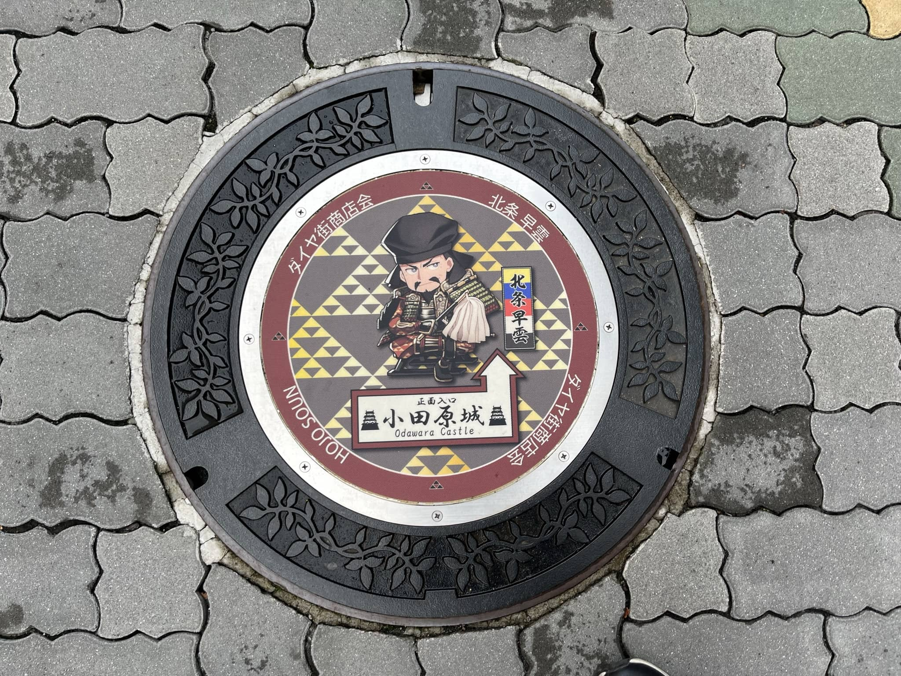
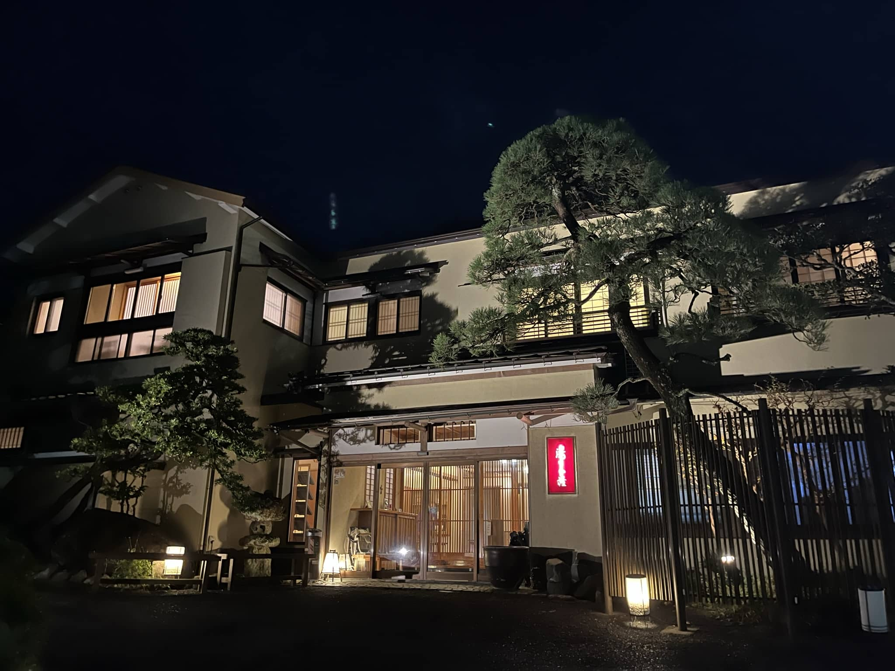
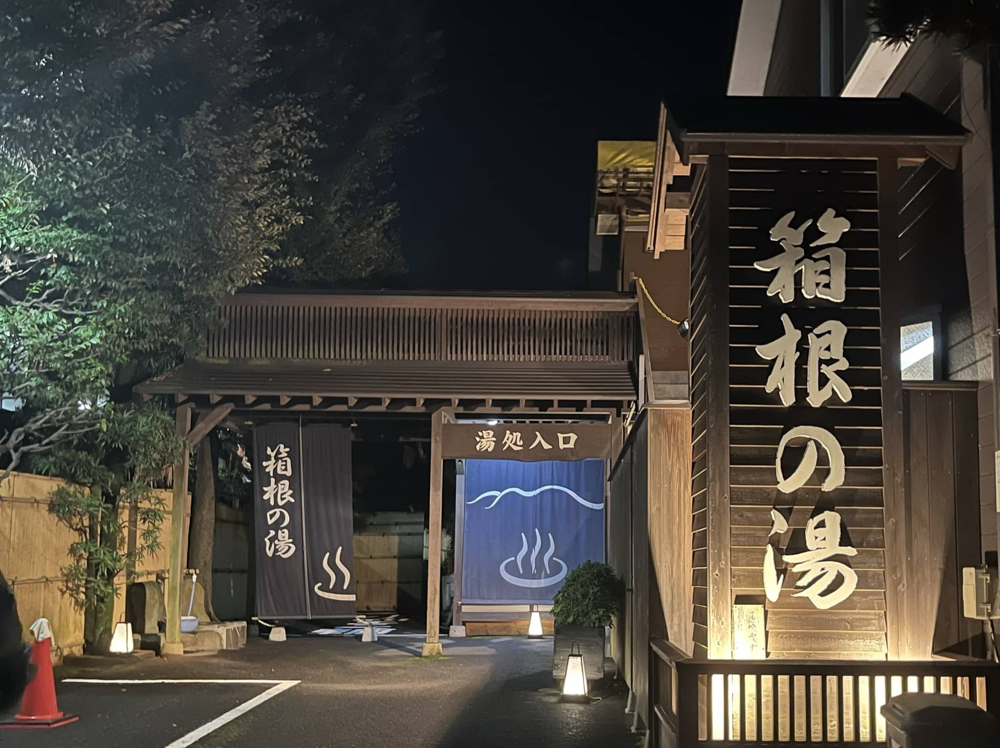

# 12.6 Shinkansen-Odawara-Hakone

新干线的图片与视频。作为中转站的小田原与温泉之乡箱根汤本。

<!--more-->

## 哐当哐当新干线！

来也匆匆去也匆匆，为期一天半的京都之行告一段落，早上我们将会从JR京都站出发，由新干线坐到小田原，再坐登山列车到箱根汤本。从酒店去往JR京都站的推荐路线原本是坐公交车，但地铁大佬一直没有办公交卡，公交车要求提供230円的零钱不找零，所以为了避免麻烦只能坐地铁。因此京都站外景的表演舞台和红色菱形雕塑也因此没能见到。同时错过的还有京都塔，中二病剧场的巡礼处。

京都地铁内免费检测HIV的广告。话说京都地铁出了一系列动画片，应该把女主照下来的（后悔+1）

京都站内人来人往，我们买票也花了不少时间。当时同行的四位小伙伴都用现金买完了，而我手头的现金又不够，只能排人工窗口刷visa。新干线的人工窗口还不支持微信支付宝，相比日本其他地方丰富的支付方式算是很慢了。但好在还可以刷visa，让新加坡的银行卡救我一条狗命。

现在在东海道新干线上运行的大部分列车都是属于速度最快的NOZOMI希望号列车，这玩意的发音和希美相同。但NOZOMI并不能经过小田原，所以我们要坐次一等的HIKARI光号。最慢的KODAMA回声号列车站站停靠，在繁忙的东海道新干线上比较少见。（电子显示屏频闪，没有完整出现NOZOMI和HIKARI的牌子）

京都新干线站是高架站，一共就4条轨道。但实际上京都作为大站，所有的车都会停靠。在高架的站台上可以看到低处的在来线，远处是京阪集团的酒店，酒店与京吹的合作套房活动继续延期，3万多日元一晚的酒店排期排的满满当当，近几个月很难找到空房。（应该是搞错了，和京阪合作的酒店是京都塔下面的，怎么会这么近两家京阪的酒店）

[【京都站新干线月台眺望在来线（意义不明）】](https://www.bilibili.com/video/BV1dV4y1c72U/?share_source=copy_web&vd_source=11cc2c31f0b4e6576a1a2b9d744d9136)

<iframe src="//player.bilibili.com/player.html?aid=861551498&bvid=BV1dV4y1c72U&cid=933420428&page=1" scrolling="no" border="0" frameborder="no" framespacing="0" allowfullscreen="true"> </iframe>

列车还没出站就已经开始加速了，和国内高铁等到了乡下再提速感觉快了不少。日本这种摊大饼式的城市规划也让新干线跑到乡下需要很久，所以列车就在城市中高架铁路桥上飞驰。

[【哐当哐当新干线！】](https://www.bilibili.com/video/BV1Y14y1A7dK/?share_source=copy_web&vd_source=11cc2c31f0b4e6576a1a2b9d744d9136) 

<iframe src="//player.bilibili.com/player.html?aid=776473985&bvid=BV1Y14y1A7dK&cid=928634692&page=1" scrolling="no" border="0" frameborder="no" framespacing="0" allowfullscreen="true"> </iframe>

当时经过羽岛站，被铁路大佬航桑拉下来想拍列车过站不停，但我太怂了不知道这车什么时候关门，所以赶紧回去了。在站台上拍了一张N700A的大长鼻子。

在名古屋的时候拍到了JR货物和停车的在来线列车。过了名古屋下一站就是小田原，中间就没有经停站了。

[【新干线被再来线超车】](https://www.bilibili.com/video/BV19W4y1T7db/?share_source=copy_web&vd_source=11cc2c31f0b4e6576a1a2b9d744d9136) 视频来源航桑

<iframe src="//player.bilibili.com/player.html?aid=946516555&bvid=BV19W4y1T7db&cid=932303587&page=1" scrolling="no" border="0" frameborder="no" framespacing="0" allowfullscreen="true"> </iframe>

静冈县的天气很差，本来想经过富士的时候拍一下富士山，但结果非常拉跨。除了乌云什么也没拍到。

新干线完全不虚国内的高铁。虽然时速上高铁以350km/h胜过新干线的285km/h，但这用了几乎60年的基建依然在不断提速。限制列车时速的至今不是技术而是法律，限制周边噪音导致不能进一步提速，也让新干线的N700系列长了长鼻子。但说起来日本优秀的调度系统也是因为狭长的地理环境导致整个新干线只需要为数不多但排班密集的线路，这与中国四通八达的铁路运输需求又是不同的。

最后来看一下我和航桑在小田原拍摄的待避和跃行的新干线吧。

[【小田园新干线合集】](https://www.bilibili.com/video/BV1Ke4y1T7zw/?share_source=copy_web&vd_source=11cc2c31f0b4e6576a1a2b9d744d9136)  

<iframe src="//player.bilibili.com/player.html?aid=649014309&bvid=BV1Ke4y1T7zw&cid=933435996&page=1" scrolling="no" border="0" frameborder="no" framespacing="0" allowfullscreen="true"> </iframe>

## 中转站小田原城与箱根汤本

小田原城作为战国时期后北条氏的根据地而闻名，小田原对北条早云的纪念类似于丰臣秀吉之于大阪。但《镰13》让我把所有的注意力都放在了镰仓时代的前北条氏，后北条氏在当时看来反倒像个蹭热度的。

在小田原市最靠近车站的市中心绕了一圈，从711里找到了一个取款机，说起来日本对旅游真的是武装到乡下的小城，随便找个机器就能把钱取了。市中心也开始准备圣诞活动了，真正的文化自信就应该是保留自己文化精髓的同时开放包容兼容并蓄。

坐上箱根登山线前往箱根汤本，但其实和旁边特急小田急线没有任何区别。很帅气的女性乘务员与特急列车。

从电车运行的方向可以看到小田原城。

走了一阵的山路高架铁轨来到箱根汤本，听这名字也能听出来，这个就是个泡温泉的小乡村。

箱根汤本站内的火车玩具

吃晚饭的地方餐厅也有箱根汤本的圣诞活动海报。当时吃饭的时候有个美女姐姐过来帮我们翻译菜单。

箱根汤本的温泉，每一家都很别致。

我们去的温泉与住的民宿有合作，只需要500円泡个爽。比较可惜的是发现清泉饮用水太晚了，泡的稍微有点脱水头已经晕乎乎的，要是早点发现饮用水还能再泡个半小时。

那么作为关西到关东的中转站箱根汤本的历史使命就完成了。这里不得不再次表白负责规划整体路线订机票酒店的层桑，一路的民宿都十分宽敞舒适，在箱根的民宿甚至是独栋三层日式小楼。选择箱根汤本中转也能够劳逸结合，解除大阪和京都的劳累之后泡了温泉又能元气满满。

