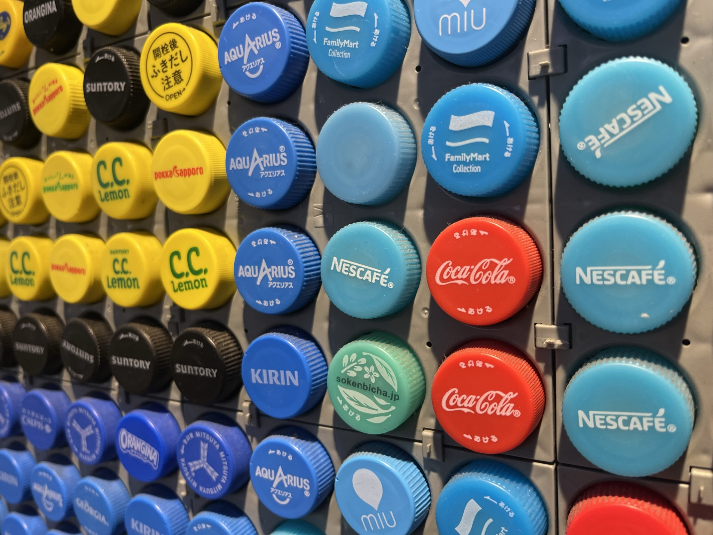
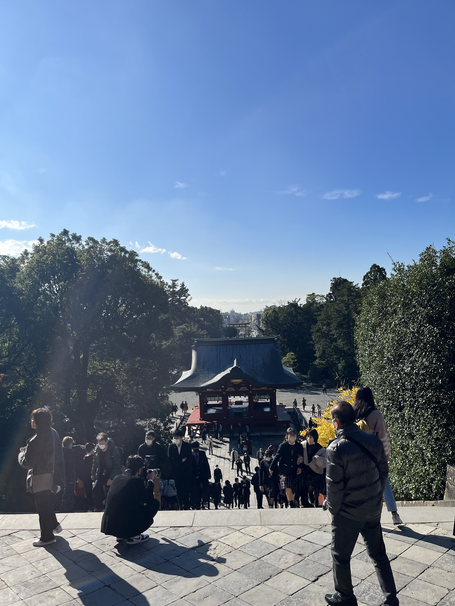
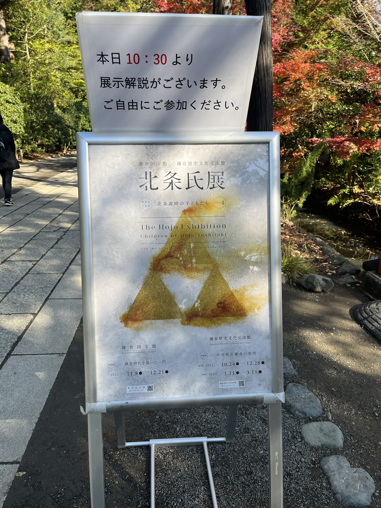
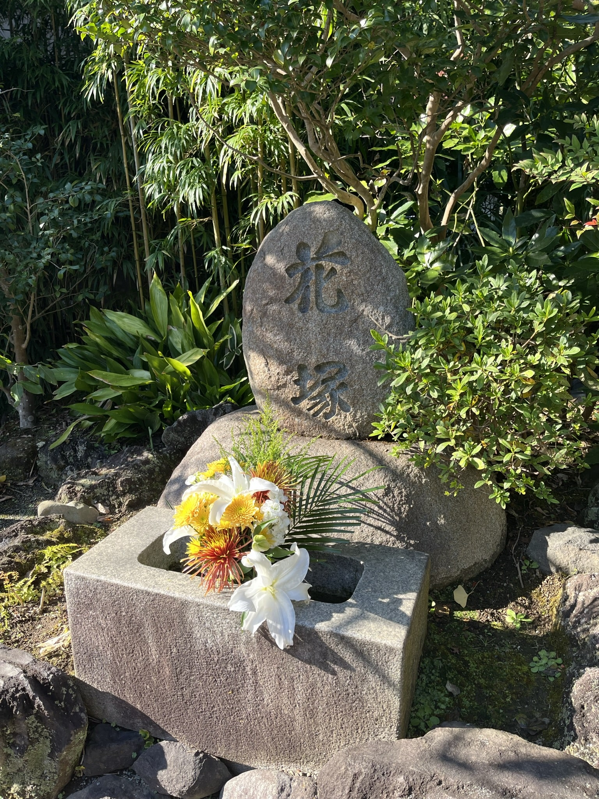
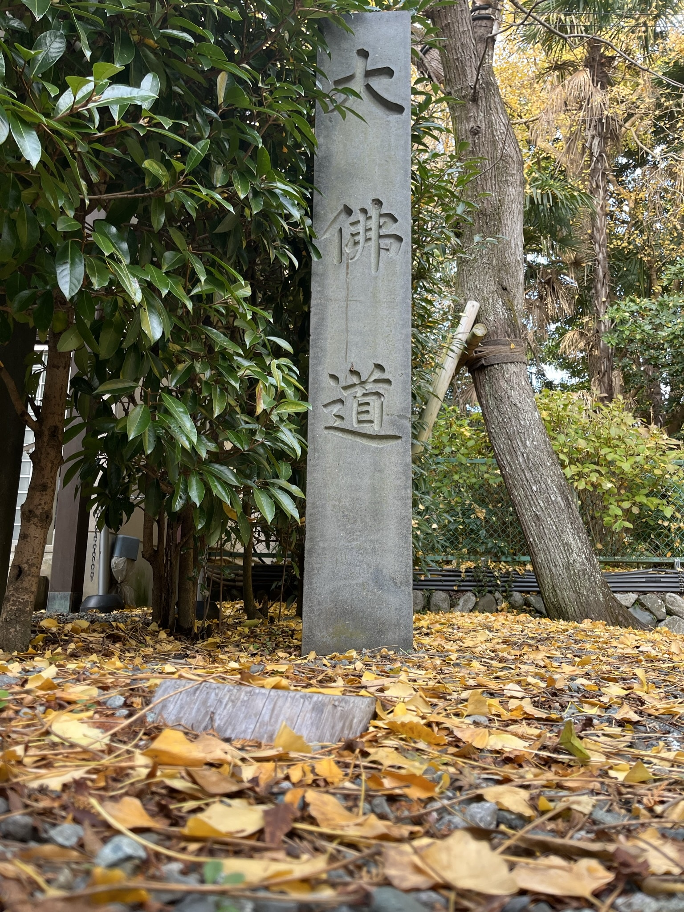
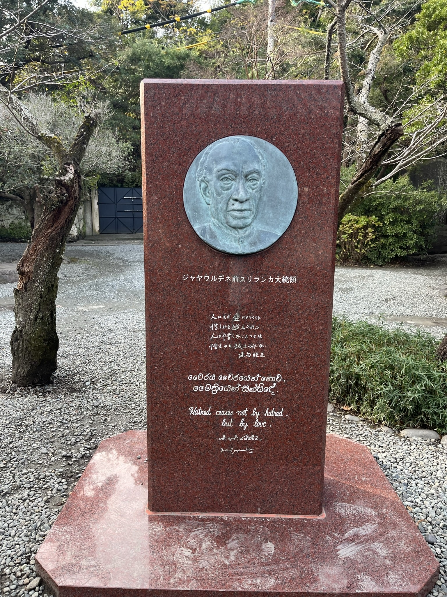

# 12.7 Kamakura

镰仓的鹤岗八幡宫、博物馆与佛寺。《镰仓殿的13人》圣地巡礼！

<!--more-->

## JR镰仓与小町通

从箱根汤本出发到东京还是需要将近半天时间，航桑说想去横须贺看美军航母，但怕被抓起来作罢了。但他这一提激起了我去镰仓的念头，毕竟《镰仓殿的13人》这部剧陪伴我打发了考前的无聊时光，作为武家政权的开创者，镰仓也是历史爱好者不能错过的。

JR镰仓站前的踏切

[【镰仓JR平交道口】](https://www.bilibili.com/video/BV1vV4y1c7gG/?share_source=copy_web&vd_source=11cc2c31f0b4e6576a1a2b9d744d9136) 

<iframe src="//player.bilibili.com/player.html?aid=861480107&bvid=BV1vV4y1c7gG&cid=928635651&page=1" scrolling="no" border="0" frameborder="no" framespacing="0" allowfullscreen="true"> </iframe>

于是趁着米娜桑还在睡懒觉的时候出发啦。但到了JR镰仓站遇到的第一个问题就是要把行李箱存了，这个行李箱真的有点耽误事。但也幸亏有这个行李箱后来我才敢在动漫店“大买特买”（其实根本没买多少东西）。从信息咨询中心和镰仓站绕了一圈才找到能用硬币存包的存包柜，还向路人换了零钱。下图是JR镰仓站内由饮料瓶盖组成的电车。非常不错的创意。

同时也在镰仓站买了个江之电和公交车的一日通票。

存了包穿过镰仓小町通，和南锣古巷差不多的商业街，已经完全商业化了景点街。买了个草莓麻薯当早饭，但最后一口实在是咽下了太大一块，差点和源赖朝一样噎死。

大概率是伪物的上海烧小笼包，假中国菜+1

## 八幡宫与镰仓历史遗迹

穿过镰仓小町通就是在雪之下的鹤冈八幡宫。

镰仓除了中央城区的商业区之外几乎全都是历史保存区域了

从鹤岗八幡宫的旁殿上抽的签，里面还有小饰品。200円一个，感觉还不错，可惜抽出来是个凶，拍完照片挂在旁边的绳子上将厄运留在这里了。旁边还有小兔子，拿了三个，里面也是有谶词的。售卖这玩意的箱子是无人看管的，全凭自觉，旁边还有一起修学旅行的小姑娘们一起拿着纪念品合影，年轻真好啊。

走上八幡宫的阶梯就是正殿了，阶梯左边的大银杏是相传源赖家之子，鹤岗八幡宫的别当公晓刺杀时任将军源实朝时藏身之处。原先的大银杏被台风刮倒，如今的银杏是在当时银杏的根系上嫁接而成的。

八幡宫的正殿，进这个神社当然是要参拜的啦。好多在旅行的可爱高中生。

向下眺望远方的城区，可惜看不到由比滨

八幡宫旁有两个博物馆，先花了700円买了其中一个博物馆的门票，但后来看有人拿着小册子，盖了个戳就进了。没太懂。博物馆里展出了很多镰仓时代北条家的遗物。其中有不少北条家的执权画像、《吾妻镜》抄本、以及镰仓时代的佛像。不让拍照实在是太令人遗憾了。就算是网上有高清电子版的话，也比不上现场拍照的留下回忆的真实感，更何况有很多时候还没有电子版照片。当时入场的时候正好有志愿者讲解文物古迹，但我不会日语，残念。

另外一个馆展出的是大河剧《镰仓殿的13人》场景道具。到了这个博物馆我才反应过来，原来这两个博物馆是联动的，只需要买大河剧这边1000円的门票就可以参观三个博物馆。算是花了700円冤枉钱，抽签抽中的凶也是在这里应验了。

在这个博物馆中我隐约记得是有镰仓地理沙盘的，但还是因为不让拍照嘛，忘了。最令人兴奋的是与镰仓殿人物立牌合影的环节啦。

演出用的道具也有不少。

源赖家派能剧艺人请求上皇下发追讨义时的院宣、假骷髅头和和田义盛修复的观音像

附属的博物馆里还有这种联动的，hello kitty no Yoritomo。最后买了承久之乱政子山高海深名场面的保温杯，以及一个画着源氏家纹的龙胆手帕（用来擦眼镜）。

随后步行前往源赖朝和北条义时之墓，一路上看到了不少旧地遗址碑，现在已经变成镰仓这个小城市的居民区和学校了。

但可惜，这个墓并没有留下什么镰仓时期的遗迹，寺庙也只留下了台柱。如今看到的墓是岛津萨摩藩和毛利长州藩重建的。毛利家应该是来祭奠毛利家的始祖大江广元，萨摩藩来干嘛就不得而知了。

在这里也看到了最早的石碑，来自安政五年（1858年），比明治维新还要早。

总之这个地方并不是十分出彩，相关的史料发掘也并不完善。毕竟已经是几乎700余年的遗迹，在镰仓幕府失势之后又退化成小村庄，所以没了也很正常。但说回来，像东京这种大范围大修大建的繁华城市，即使是江户时期的文物建筑也没留下来多少。

在坐公交车去净妙寺和报国寺之后又坐公交车回鹤冈八幡宫前的中轴线大道上。途中经过一个商场，有展出镰仓雕的博物馆，但门票有点小贵，据说是当时来日本的宋人引进的技术，木雕也比较精湛，但在国内其实也见得多了。

与《镰13》联动的第三个博物馆在JR镰仓站旁的居民区内，馆内有个会说英文的大叔，帮我把所有的馆室介绍了一遍，还帮我调出了介绍视频的英文版本。从介绍视频中可以看出，确实镰仓的繁荣时期只有镰仓幕府时代，其余时间基本上乏善可陈了。

原来佛像真的能在镰仓时代雕刻到这么小，确实能藏在源赖朝的发髻里面。

这个馆内最吸引我的展品并不是什么古代的遗物，而是这个卡通版的北条双六。在网上都找不到在哪买，作为历史爱好者的收藏品会是很好的玩具。

和《镰13》联动的部分则是北条义时的支系介绍，每家都有一些展品，不允许拍照QAQ，这几个官网做的也不是很出彩，直接附属在镰仓市政府网站下了，连几个像样的照片都没有

## 镰仓的佛寺

从源赖朝墓步行街坐公交车到净妙寺站，首先来到报国寺，报国寺是一家很小的寺庙，其中的竹林非常好看。来这里的很多也都带着长枪短炮，也是摄影爱好者的圣地。

报国寺对面则是净妙寺，寺内比报国寺还要清净。参观费用也很便宜，似乎只要100円。相传足利贞式的墓就在此处，和寺庙中商业化运营的墓地并在一起。

再从博物馆步行回JR镰仓，坐镰仓电铁江之电前往镰仓大佛。江之电的轨道竟然是单线，因此整条江之电线路的闭塞区间变成了站点到站点。更为夸张的是并不是每一站都是双轨，有些站点竟然还是单轨，意味着电铁闭塞区间可能有好几站的间隔。下图是轨道尽头的🐸

从长谷站下车，这里和京阪三室户站就很像，进入铁道的两则不同的月台决定了乘车的方向。这一次赶在了平交道口关闭之前冲过了铁道线，但为了照照片又折返了回来。

沿路上遇到一家不知道卖什么的店，竟然在源氏发迹地镰仓用平家的扬羽蝶，真的也是很神奇。

屹立在高德院内部的镰仓大佛被日本政府列为国宝，相传是镰仓时代的铜制佛像在经历了地震海啸之后大殿没有重建只留下了佛像在这里风吹雨打。一眼望过去给我一种非常突兀，但又十分肃穆的感觉。

除此之外佛像的寺院值得大书特书的东西就不多了，有一个和歌碑，有几个外国政要的名言。

说起来镰仓这座城到处都是防洪警报避难所的路标，虽然遍地都是但我其实也没怎么太关注到底该往那边跑。

镰仓之行在下午三点左右就结束了，就以江之电长谷站的视频结束镰仓的旅程吧。

[【镰仓电铁江之电进站】](https://www.bilibili.com/video/BV1H3411Q7Ys/?share_source=copy_web&vd_source=11cc2c31f0b4e6576a1a2b9d744d9136) 

<iframe src="//player.bilibili.com/player.html?aid=434123543&bvid=BV1H3411Q7Ys&cid=933461106&page=1" scrolling="no" border="0" frameborder="no" framespacing="0" allowfullscreen="true"> </iframe>
