# Japan Political Posters

一路上见到的政党海报实在是太多了，如果全部插入到正文会影响观感，所以开一个单独的post来展示这些海报。

<!--more-->

## Osaka

大阪的政治海报是最多的，因为穿行于日本小巷子的大部分时间都在大阪，也只有深入到巷子里才能体会到与景点不一样的空气。

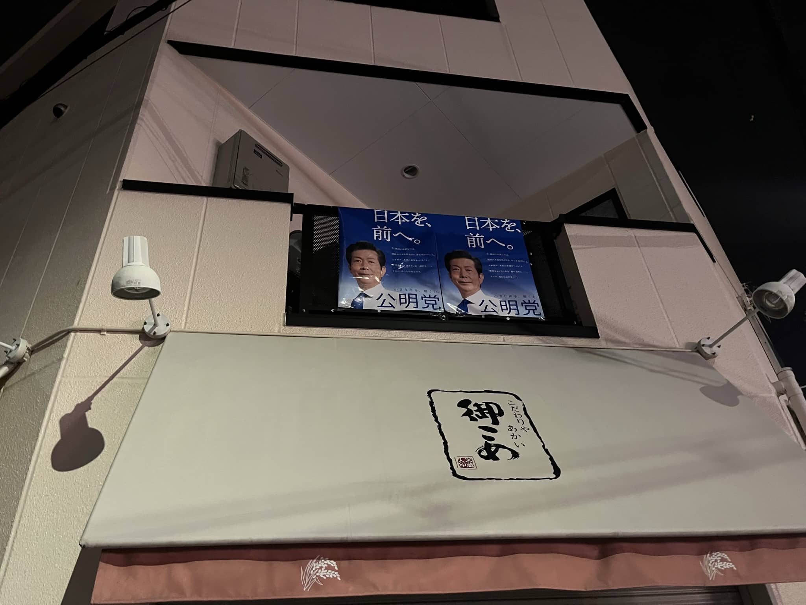

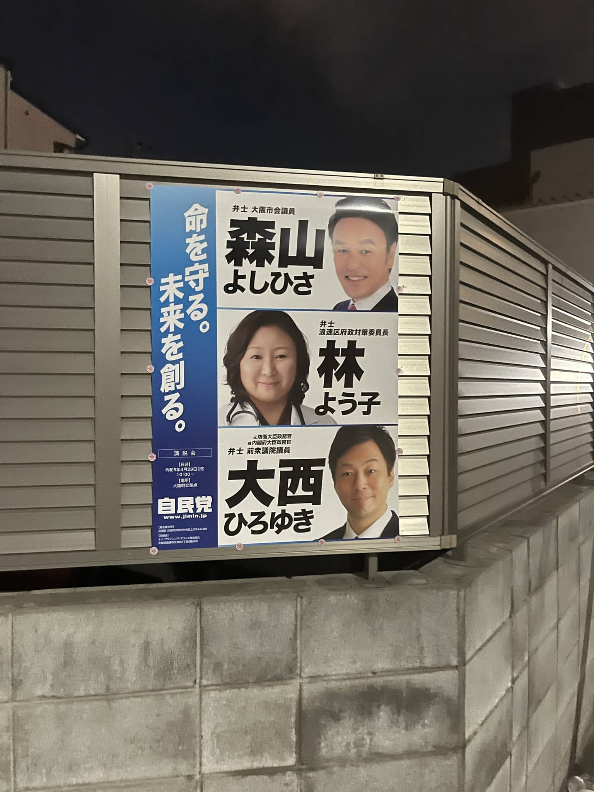

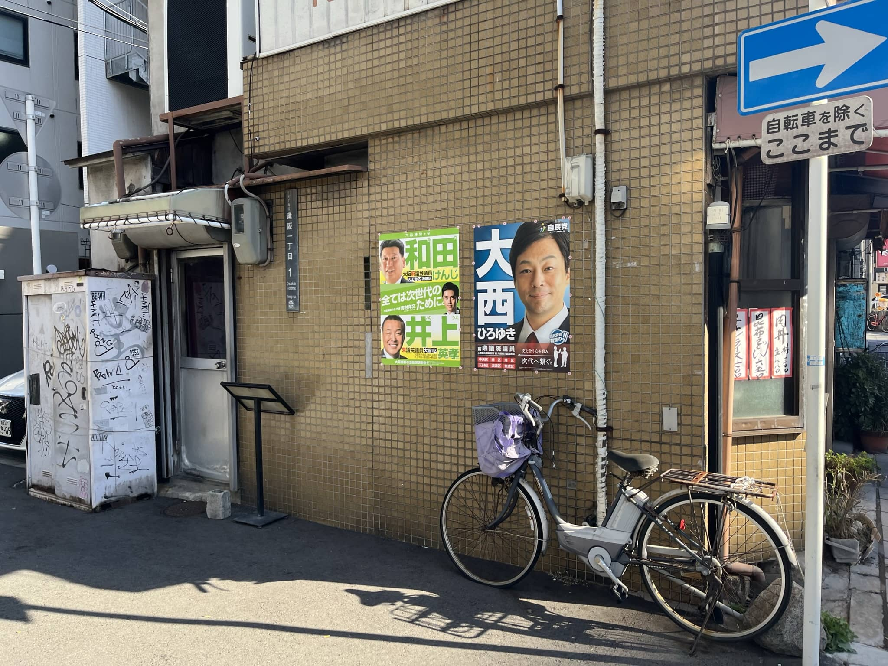

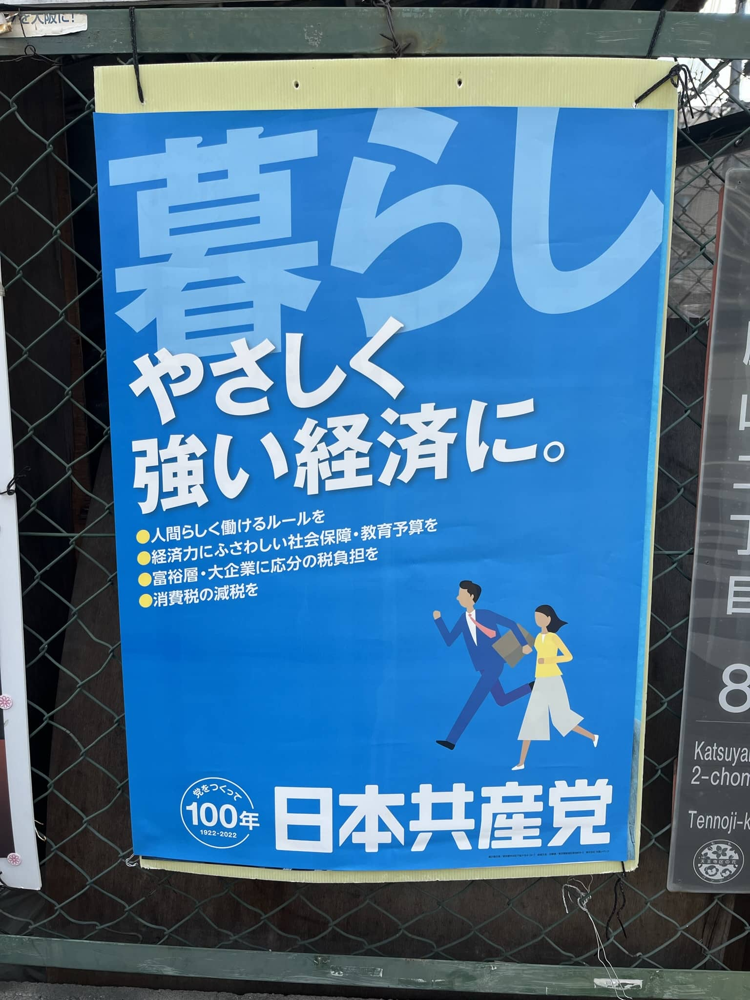

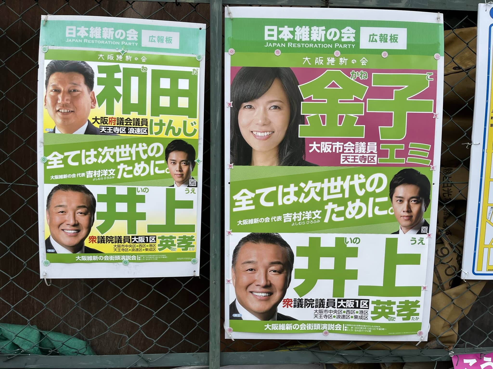

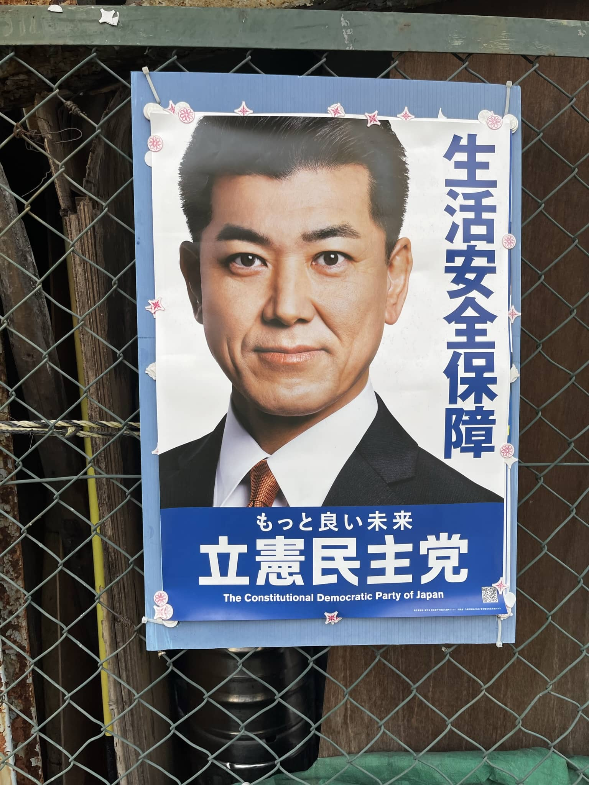

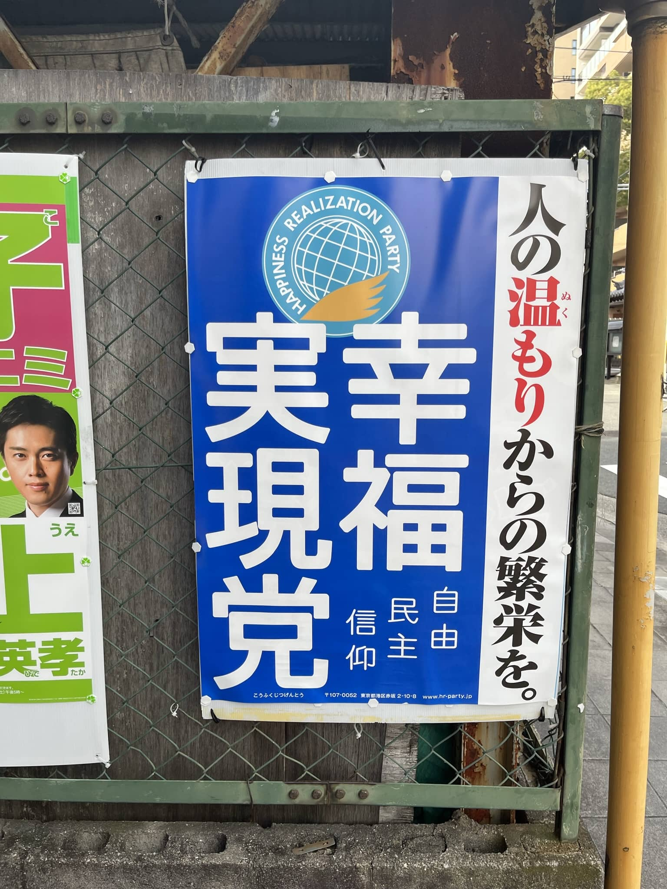

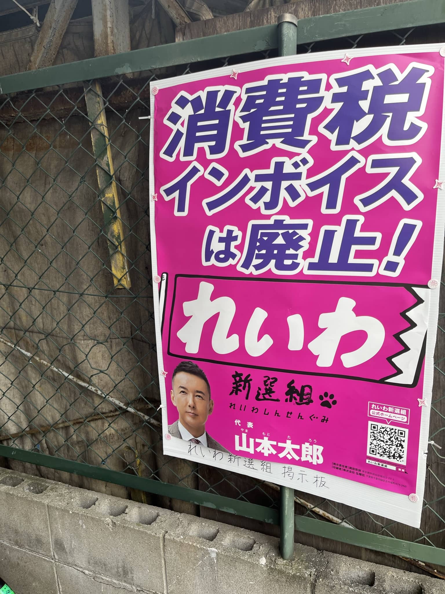

## 宇治

利兹与青鸟也是反战片（

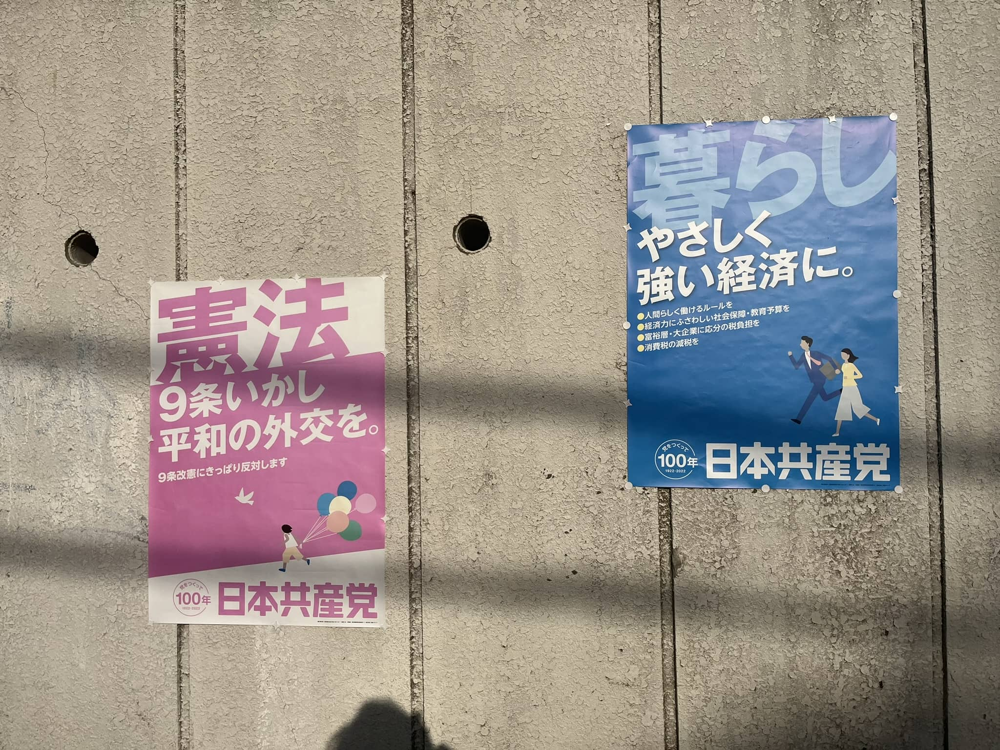

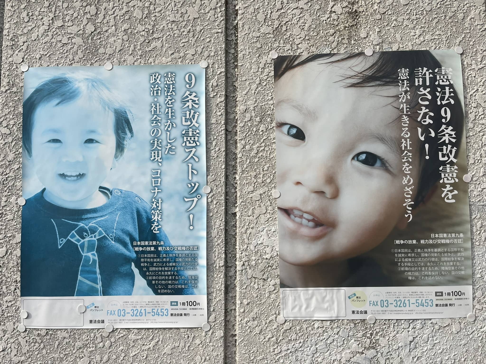

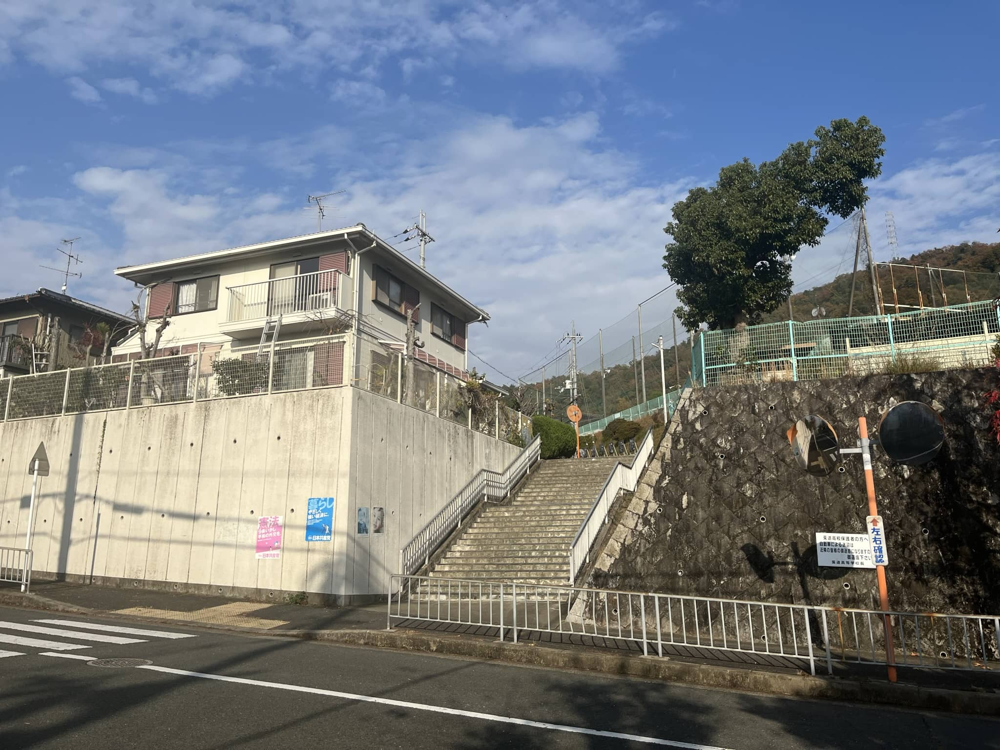

## 京都

最多种类在一起的日共海报就在京都

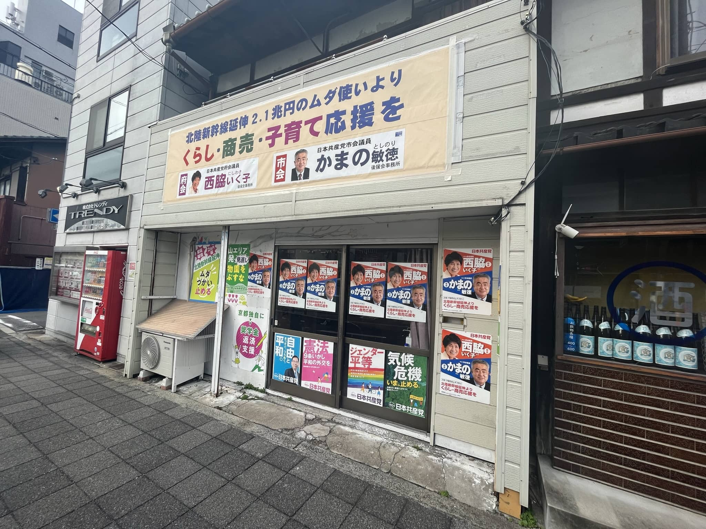