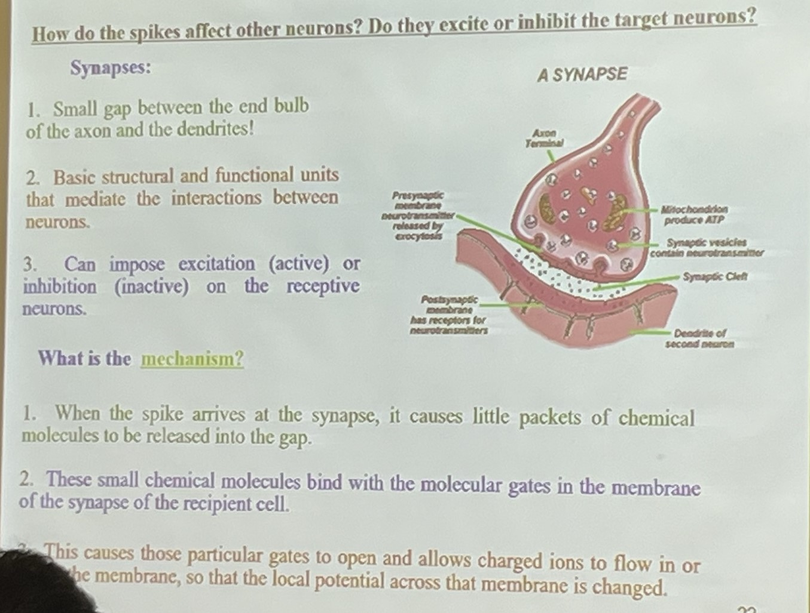
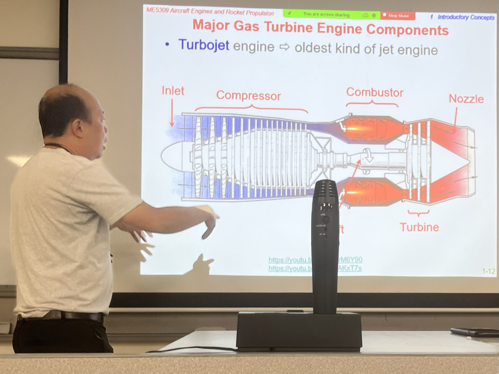

啊真是的怎么又开学了！

<!--more-->

## 开学前

这个学期开学之前又刷了一遍京吹，真的是百看不厌。虽然一遍又一遍的刷剧情早就让第一次观影的兴奋消散，但可以沉下心来可以发现别的更细节的地方：分镜、光影、音效……甚至在京阿尼官网上又淘了不少壁纸。又在刷武田绫乃的原作小说。京吹宇宙实在是太棒了。

## 找工作/找实习

从日本旅行的留恋和建站的纷繁中脱离出来，开始了新一年找实习的历程。但感觉还是后知后觉了一些，这个学期的实习总不可能开学前一周找得到。之后又找了几个别的找工作软件，又随便投了一些岗位。和就业导师约时间聊了聊，但她实在是太热情了，我还没来得及问完所有的问题，她就把预定的一个小时用完了。下周还要再约一次就业导师，时间还改了两三次。这个学期的实习找不到的话就只能在NUS的IAAS的平台上找短期实习了，毕竟学费和生活费越来越高，也要想办法自己搞点钱了。

## 科研

科研这个东西实在是硕士最失败的一个决策，从没到新加坡时想去搞科研去读博，但在了解技术移民要求过了半学期又醒过神来想去连接工业界。但在半学期之后又退不了研究项目，也就只能硬着头皮混下去。这个新学期的科研计划不知道又要怎么搞。上个学期带我的大佬们去了A*star真的准备去搞学术，我这边从上学期导师给大佬的方向就只剩我一个，不知道随便搞一搞能不能完事。

## 课程

这学期选了三门课，但为了让学制能够延长到1.5年，三门里需要退一门。虽然NUS的课程基本上都是一个授课教师会将一半的课程，但即使如此一位教师将半学期也是非常影响对课程的整体印象。

周一上的那门课，就不说是谁上的了。这个授课教师上个学期也上过别的课，当时也上的昏昏欲睡，这学期还是相似的情况。一周三门课还没上完，基本上就已经决定要退这门课了。

第二门课是周三的神经网络。授课老师同样是上个学期遇到过的老师Xiang Cheng。这位老师授课非常有特色，比如上课之前不发课件、非常重视引入知识点的介绍和带动我们思考的过程。上个学期的线性控制的下半部分也是他授课，当时我在假期发邮件问问题晚上10点还给了我非常详细的回复。

周三的课纯粹是为了玩才选的，航空航天发动机。这门课的任课教师精力十分充沛，对自己讲授的内容应该是十分热爱。而且他同时还有一些自信的幽默感在身上，比如他会故意把National Service说成National Slavery。但这门课的前置课程流体力学和热力学基本上是我本科期间基本上没怎么认真学的内容，尤其是热力学，或许以后相关的学科也不会太放在心上。但看着这位任课教师身上发散的活力与激情，让我下了课也不想离开，晚上9点下了课之后我们还聚在讲台前面聊着各种飞机、聊着西方发动机的技术壁垒（对中国，也对新加坡）、聊中美博弈下的科学家（从钱学森到特朗普时期的亚裔调查）。即使是完全处于兴趣考虑，以后大概率不会选择成为职业的课程，这位任课教师的存在依然让我被这门课深深吸引。但似乎这门课上的311学生并不多，面孔大多数都是新加坡的当地学生，311的学生还是更加“功利”一些（无贬义），要么选择了更加热门的神经网络深度学习和机器人、要么去选择更容易拿学分的增材制造项目管理等课程。

话说回来，当时有一门最优化控制的课。从大二的信号与系统开始我对这类控制类课程都是最上心的，别的课程可以不管不顾。但似乎一路学过来，虽然上心，最终的结果似乎并没有很理想。BJTU的控制理论80、NUSRI的现代控制75、到NUS线性控制B+，都不算是一个脱颖而出的水准。再一个就是这学期最优化的任课教师授课风格会更偏向数学，所以综合考虑下来还是算了。不知道该怎么面对这种情况，该说是喜欢的不一定适合嘛……？

## 结语

这个学期就这样开始了，并没有什么结语可以写，就这样吧。
