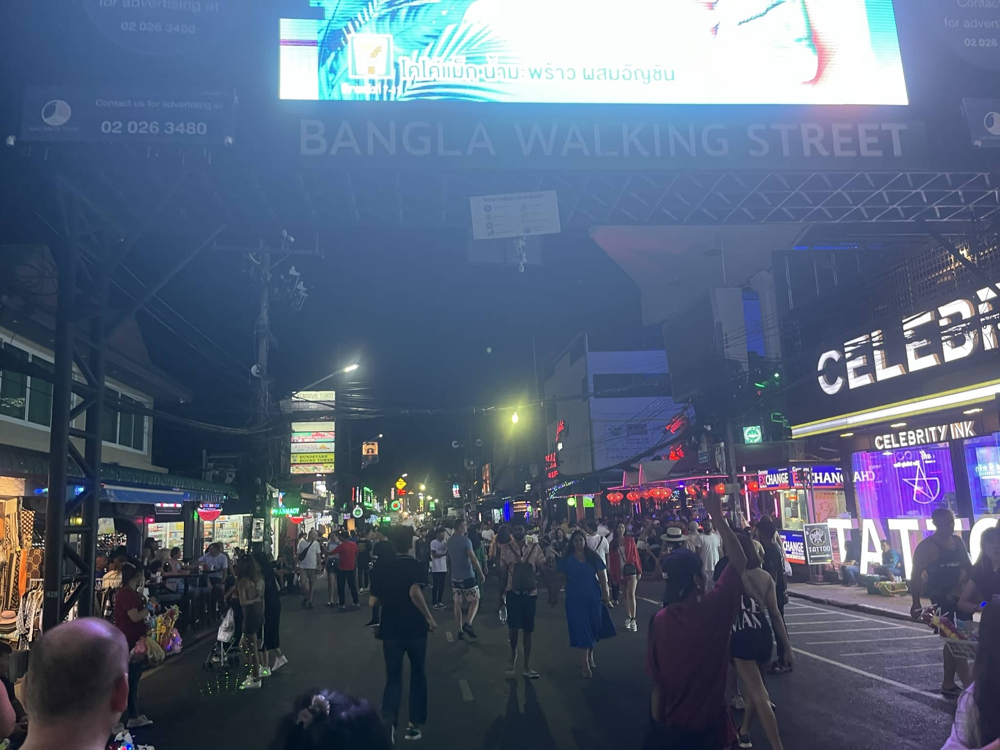
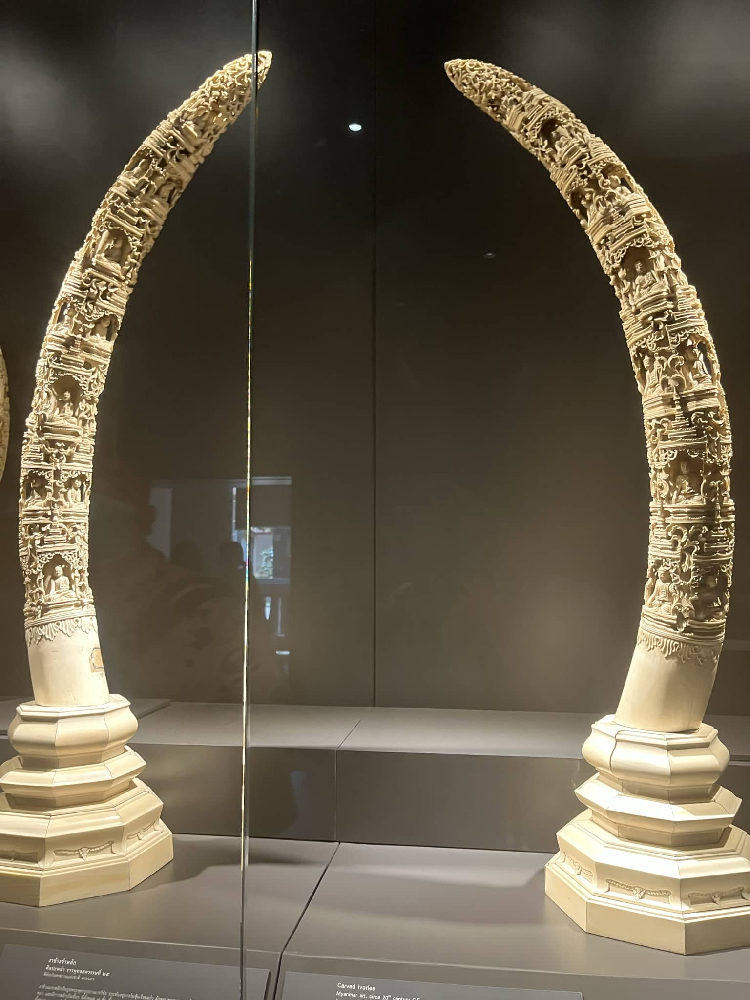

记录一下在recess week前往泰国的旅途

<!--more-->

首先还是要感谢一下同行的小伙伴，几乎又是让我躺尸一般逛完了全程，机票酒店打车行程等诸多旅途必不可少的过程我几乎一点没参与。

从樟宜机场出发，第一站落地的是泰国南部的普吉岛。不得不说泰国边检多少有点收钱办事的意思，仅仅多了200泰铢走的快速通道，材料审核都没怎么审核就直接盖章入境。虽然是国际机场，但普吉岛机场并不算大，走了没两步路就走到了大街上。我们在机场等车的时间几乎和坐车到酒店的时间差不多——都是一小时。说实话这次来泰国并没有太多的兴奋感，和上次去日本完全两个概念，在机场等车的时候还顺便和高中同学玩起了鹅鸭杀。坐上车普吉岛的路说实话有点离谱，山路最陡峭能到60度。

我们在普吉岛的酒店在芭东海滩，在普吉岛的这几天几乎也没去别的地方，除了最后去了一趟机场海滩拍飞机之外也全都在芭东。

在酒店简单收拾过后我们遇到了在泰国的开幕雷击，酒店旁边的旅行社大叔用奇怪口音的中文向我们打招呼：抽大麻吗？等我们玩完回来招呼我们的方式则更上一层楼：吸粉吗？随后逛夜市的时候才反应过来，大麻在泰国是合法的，大街小巷多少都会有药店——主营商品就是大麻。与毒品的孽缘等我们到新加坡还阴魂不散，从泰国飞新加坡的飞机要跑到T4航站楼进行额外安检，甚至没什么申报的行李也要进行行李抽查。

芭东夜市的另一点离谱之处是其软色情文化。即使是写着“no sex”的按摩店，按摩技师也会在路边拽游客的胳膊。酒吧里多多少少都会有站台女。有一个酒吧里还有钢管舞秀，让我们驻足好久——大姐的核心力量真的强，扒着杆子来回转，要我来两秒就得掉下来。

芭东夜市总体上来说还是非常热闹繁华的，国际化程度也不低，偶尔还能见到一群玩嗨了的洋人在酒吧唱台上玩摇滚。但说实话我并不太能欣赏在芭东夜市这种玩法（无论是软色情还是摇滚）。这里看起来最符合我口味的服务业还得是下面这位：

泰国的变性者表演也是一大特色。由于缺少对泰国文化的了解所以就不多聊跨性别这一块了。将注意力集中到舞蹈表演上，不得不说整体演出效果实在是非常惊艳，不仅仅有泰国自己文化的特色，还会有关于中国、台湾高山族、日本和欧美文化融合在一起的舞蹈表演。由于演出过程不能摄影录像所以就不多写了。

当然，来了普吉岛还得看海滩。网上说的什么潜水冲浪什么的我们几个懒狗都没玩。我们几个在沙滩上租了一把椅子和遮阳伞，点了几瓶饮料，一躺躺了一下午。之前还一位我们肯定不会玩不来洋人这种在沙滩上晒太阳一晒晒一天这种玩法，现在来看放空一切的休闲度假感觉确实很爽。

等到日落，黄昏照耀着海滩，从美景开始到结束也就短短的15分钟。还没来得及自拍太阳就已经西沉了。

在芭东的这段时间还时不时有人来和我讲中文，我觉得可能是因为穿了这个

在离开普吉岛之前，我们来到了机场旁边的海滩看飞机。飞机降落比日落还要难以把握，日落至少是一种逐渐消逝的过程，而飞机在海边降落则是转瞬即逝。喷气式飞机起飞的引擎掀起的狂风时不时让我们吃一脸沙子，第一次看起飞的时候我还举着遮阳伞，如果不是及时将方向指向飞机的话能连人带伞直接给我扔海里去。

<iframe src="//player.bilibili.com/player.html?aid=567770769&bvid=BV1nv4y1Y7hm&cid=1033061646&page=1" scrolling="no" border="0" frameborder="no" framespacing="0" allowfullscreen="true"> </iframe>

等到起飞的时候也是同样的神奇，不知道是换了风向还是什么别的原因，起飞的时候同样也是经过了海滩。

在结束芭东的行程之前，还想记录一些见闻。芭东的物价实在是太高了，就像是专门宰游客的。我们在演出结束之后坐墩墩车回酒店，不到10分钟的路程要了我们400泰铢，在曼谷打grab从高速开了一个小时几乎也是400泰铢。饮料之类的暂且不论，就单说海滩旁边卖的拖鞋也要200泰铢。到了曼谷之后生活成本一下就降低了。

上图在芭东看起来像一个发展中国家，但到了曼谷就不太好说了。曼谷是一个发达城市与衰落的市区结合的城市，80年代的柴油公交与内燃机火车和新建的高架车站与电气化巴士一起出现在曼谷的街道上。

内燃机通勤火车、轨道和旁边的住户

通勤高峰期位于商圈中的地铁站，摄于曼谷的按摩店

商圈随手拍

然后再次表白层桑，酒店里竟然有台球桌和投影仪。但空间受限的原因，打台球时处处被掣肘，完全没办法伸展开。无奈只好看电视，重刷了一遍青春猪头少年。

曼谷佛寺众多，即使我们没特意往佛寺跑，热门景点的排名也会将我们带到佛寺。甚至泰国大皇宫内部就有一座附属寺庙。

大皇宫玉佛寺内外景

大皇宫内部随手拍

大皇宫和玉佛寺导览水平说实话并不怎么样，中文宣传手册上只有寥寥几笔关于整座建筑群的介绍，景点内的重点古迹也没多少英文的介绍牌。似乎要请导游或者租借语音向导才能了解到完整内容。

接下来是距离大皇宫不远的卧佛，很好地描绘了我这一段时间的生活（开摆）

经过一个破破烂烂的码头过湄南河前往郑王庙。渡轮确实很便宜，但码头也是真的破，浮动码头的滚轮摩擦着金属固定桩，发出着嘎吱嘎吱刺耳的金属摩擦声，河上飘着垃圾，照片里看不到，但至少水质是非常垃圾的。

郑王庙也算是曼谷市内一个非常地标性的景点，但我已经绷不住了，泰国这几天的太阳实在是太毒了，晒得我头昏眼花。回到酒店之后就开始腹泻，虽然考虑过在海边啃爪子这种原因，但刚回到新加坡就啥事都没有了，不知道是不是一种水土不服。

第二天我们去的是金山寺。金山寺的山是一座人工假山，但也有了几百年的历史。在这里视野不错，能眺望曼谷城区很大一片。

总感觉曼谷城市规划一团糟，出了商业区之外的市镇毫无美感可言，建筑物就像是撒芝麻粒一样乱摆，道路也是走到哪修到哪。

说实话这次来泰国整个行程都没提前安排，各个景点之前连维基百科都没看过，一方面不得不承认东南亚确实是历史和人类学的富矿，但另一方面这次来泰国总感觉提不起劲。一方面是闹肚子和暴晒带来的不适，另一方面也可能是上次去日本留下的印象过于深刻，以至于看泰国哪哪都不好。

但话说回来，曼谷也有不少日本文化影响的痕迹，无论是日本餐馆还是日本百货：

街边随手拍一张四面佛，在芭东海滩的酒店旁边也有一座。

最后一天我们前往的是国家博物馆，博物馆这个东西真的拿捏不准，各地的博物馆开馆时间都不一样，曼谷这个博物馆周三开馆，周一周二休息。最后一站的博物馆其实也是草草收尾，什么阿育陀耶素可泰兰纳全都抛在脑后了，太阳实在是太毒，只想早早回家。

兰纳字母的打字机

皇室用品展

泰国的旅途到这里就结束了，可以说是东南亚风情、烈日与腹泻一起的一次经历。

