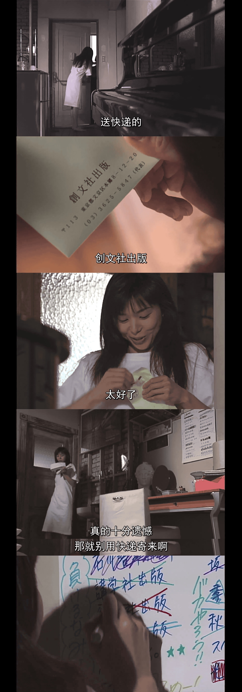
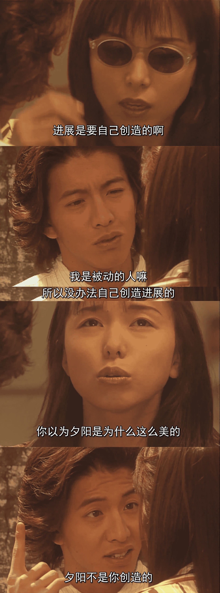

3月的随心写写，和碎碎念差不多，争取一个月写一次（一般立flag都会倒）。

本期内容有找工作的杯具和这段时间的娱乐活动

<!--more-->

## 找工作

找工作是这段时间最烦心的事了，但其实是以找实习为主。学期初果断选了一年半给自己多留一个学期时间想在新加坡找个实习感受一下新加坡的职场环境，但目前来看前景不是很顺利。这段时间是session几乎一个不落，offer确信一个没有。

### 身份与时间问题

绝大多数公司的实习期间至少是六个月全职带学分，但在NUS的master这个是不可能的。一方面来说，NUS确实有带学分的实习，但是这个实习只能在暑假期间做，但暑假本来也能做实习；另一方面来说，如果没有学分，拿着学生准证的国际生只能在学校学期之内做兼职实习，一周不超过16小时。虽然这个规定对大多数拿学生准证的外国学生挺合理的，但是对我们这种每周只有晚上上课的NUS硕士反而是一种没必要的束缚，更何况我下学期只需要选一门课，这种限制实在是头痛。

申请的公司多了，也就有不少公司会问实习时间之类的问题。每次要回答这些问题就几乎必然会得到拒绝。所以总结下来就有了以下的发疯文学：

> 向女神表白
>
> 女神问我能谈六个月全职恋爱吗
>
> 我说不能，全职恋爱只能最多3个月，3个月之后兼职恋爱
>
> 女神让我爬，我说那咋办嘛，开学还全职谈恋爱会被德育处抓走的
>
> 没办法，实在是很无奈，现在能做的也就是改改情书，看看女神有没有哪个限制不多的舔狗坑能留我。

### 面试

倒还真有个面试，是新加坡本地一家做工地注浆机器人初创的小公司，一共10多个人，看着里面的员工似乎比我还小。之前的网上笔试就做的乱七八糟，试题的邮件和表格都搞错了，但是题确实不是特别难（会的就不难）。数据结构有个二叉树，C++直接搞个冒泡排序就行。

线下面试说实话还是会比较紧张的，更何况就直接在他们十几个人的小办公室里直接搞了。问的问题会从易到难，比如接线接哪头、焊接和金属切割有哪些注意事项、之前用过什么机械工具之类的。后期问的很多都是他们现在在做的项目，比如水下螺旋桨的传动解决方案。一方面是大脑空空，另一方面是英文实在是拉稀，回答一个问题要思考好久，虽然说如果用中文可能会好一些，但大脑空空实在是没得解决。

最后的结果当场给拒了，8月开学之后的兼职实习也似乎没有机会。

### 听不懂

之前接过两个电话，都没听清到底是那家公司打来的。其中一个还能多少猜得出来，但另外一个就完全没听清。但除了公司名字，具体的内容还ok，新加坡英语还是很麻烦，是找工作路上不得不克服的困难之一。

### 日企

之前有个一个日企专场的招聘会。有个日企在新加坡有分公司，给了我一个现场面试的机会，但似乎并没有可用的岗位。其他公司很多公司都是需要日语基础，甚至日语就是公司的工作语言。这个月也有一个日企做了好几次信息介绍，但是似乎招聘的岗位多少都需要日语基础，而且招聘的人数还不多。国际化任重道远（X）

### 人力外包轶事

上个学期就遇到过印度HR给ABB做实习生招聘，这会又遇到了两个类似的情况。第一个是西门子的HR通过WhatsApp来找我（问实习时间）后来在领英上一找才发现这位HR也是实习生（让英雄去查英雄，让好汉去查好汉）。另一个则是AMD，AMD的HR问实习时间的时候邮件有名字，虽然是拼音，但是一开始我还以为是新加坡华人（新加坡华人名字很多也在用拼音），但是这个拼音并没有找到对应的领英界面。但后来我发现一个+21的开头，带着英文名字的邮件，+21找了一圈也没找到到底是哪个国家，后来用英文名搜领英发现这位HR人在上海……

## 恋爱日剧

<iframe src="https://player.fireside.fm/v2/3I5iKwMQ+qFHG1lTE?theme=dark" width="740" height="200" frameborder="0" scrolling="no"></iframe>

想起来看恋爱日剧还是听这期播客入坑的，沙青青老师的宅男属性和我的口味很搭。

这个月看了东京爱情故事和悠长假期，节奏上来说东爱比悠长假期紧凑许多，东爱的剧情冲突更为激烈，而且东爱看完一集就想追下一集，但悠长假期并没有这种感觉。不知道是不是因为看悠长假期时拒信收到头晕顶不住心情不好。

悠长假期的故事线上南和濑名的另一条感情线是错开的，濑名被学妹甩了之后南才和摄影师开始谈恋爱。再一个两个人关系升温也相当缓慢，即使第一次接吻之后南和濑名也还是大姐姐一般的感情。两个人在一起是同居时不断积累的感情溢出的结果。但即使节奏缓慢，也不影响悠长假期的地位。

> 谁不喜欢在大姐姐的膝盖上被摸着头说呦西呦西呢？

说回东爱，东爱实在是这几年看过最喜欢的恋爱剧了，炽热如火的莉香与内心犹豫的完治是悲剧的内核。本来还想写一段这个悲剧的观后感，但刚才看了一眼东爱的特番（不看也罢没有新内容），弹幕里都在刷莉香太惨了完治根本不爱她。转念想想算了，我不认为完治是三心二意的渣男，因为我也和完治一样犹豫与懦弱。这和悠长假期的前半段一样，濑名的犹豫让他与学妹的感情失之交臂。文化上也不止东亚都是看不起这样的男孩子的。

## 音乐

最近超喜欢YOASOBI的歌，分享一下

<iframe src="//player.bilibili.com/player.html?aid=416972183&bvid=BV1HV411v7Np&cid=303968725&page=1" scrolling="no" border="0" frameborder="no" framespacing="0" allowfullscreen="true"> </iframe>

YOASOBI还为了将JPOP推广国际还专门有英文版专辑，有很多歌听了半分钟还是很像日语（笑）

当然前面提到的东爱和悠长假期的主题曲也要放上来

<iframe src="//player.bilibili.com/player.html?aid=980730524&bvid=BV1244y137qJ&cid=576565600&page=1" scrolling="no" border="0" frameborder="no" framespacing="0" allowfullscreen="true"> </iframe>
