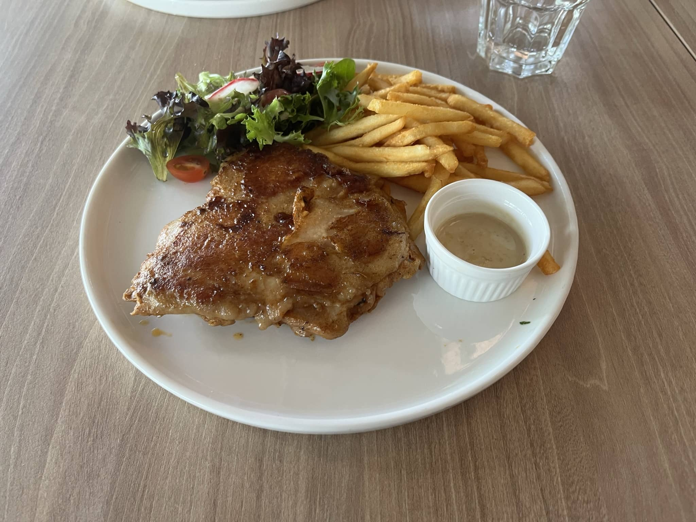
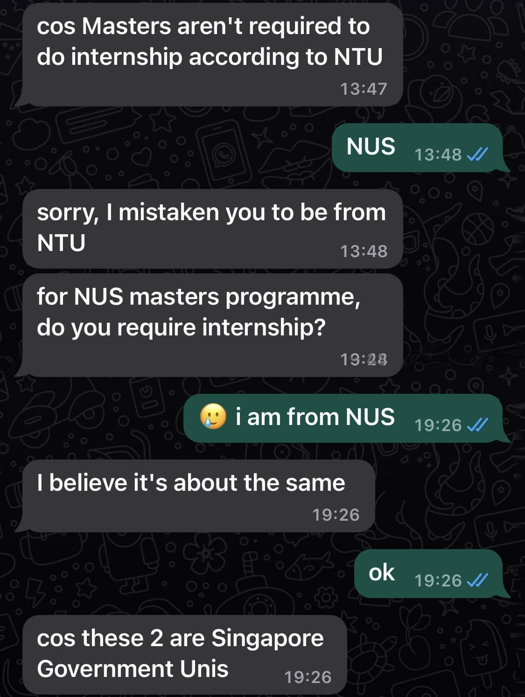
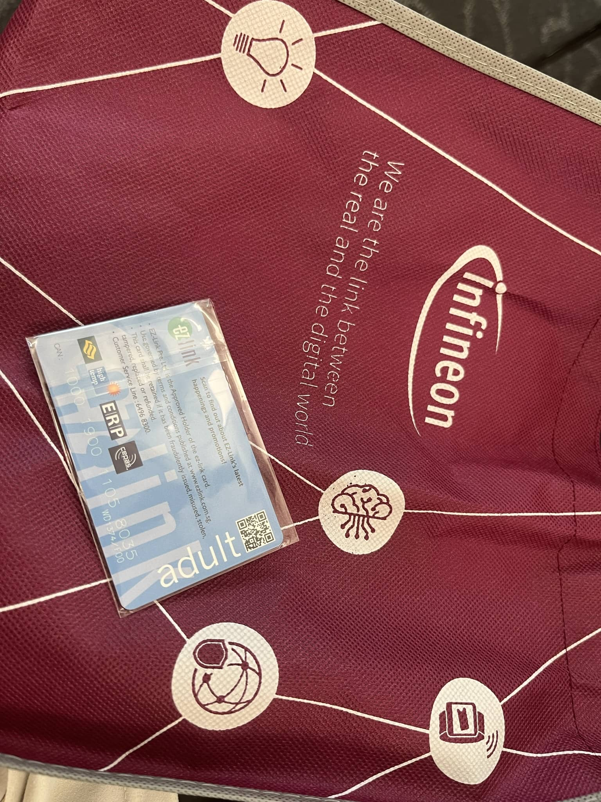
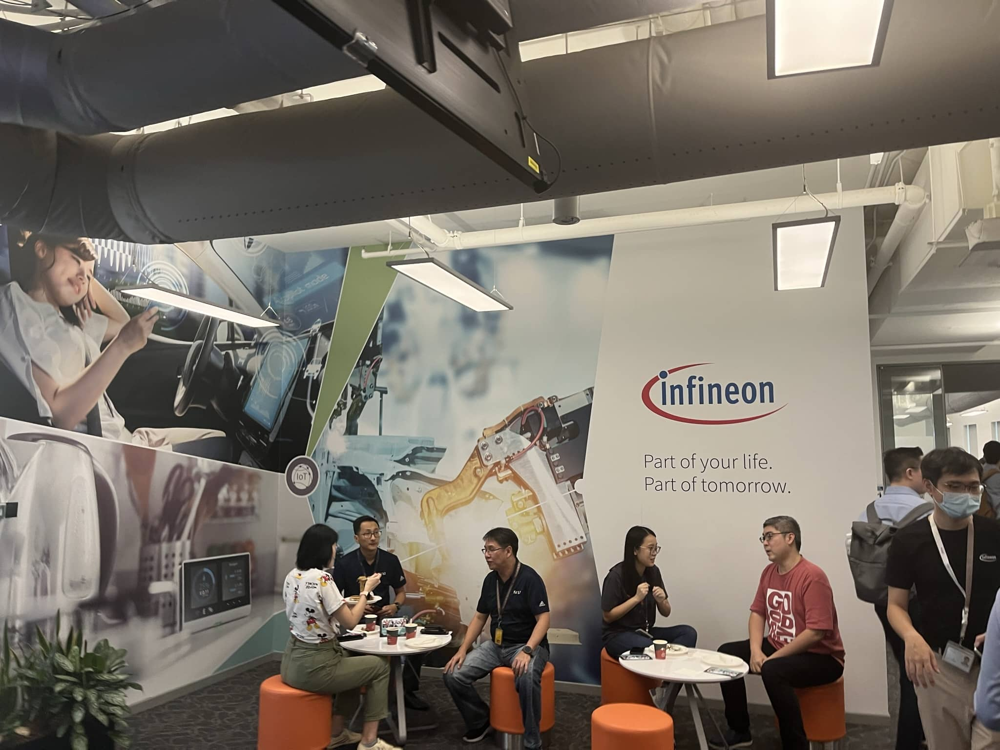
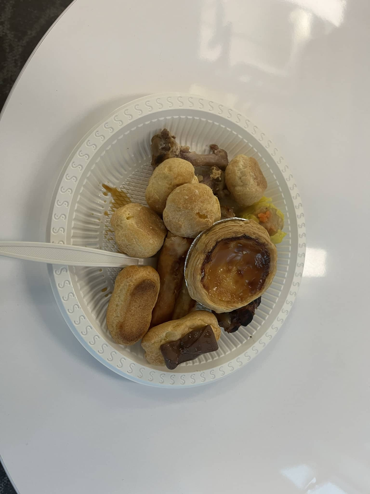
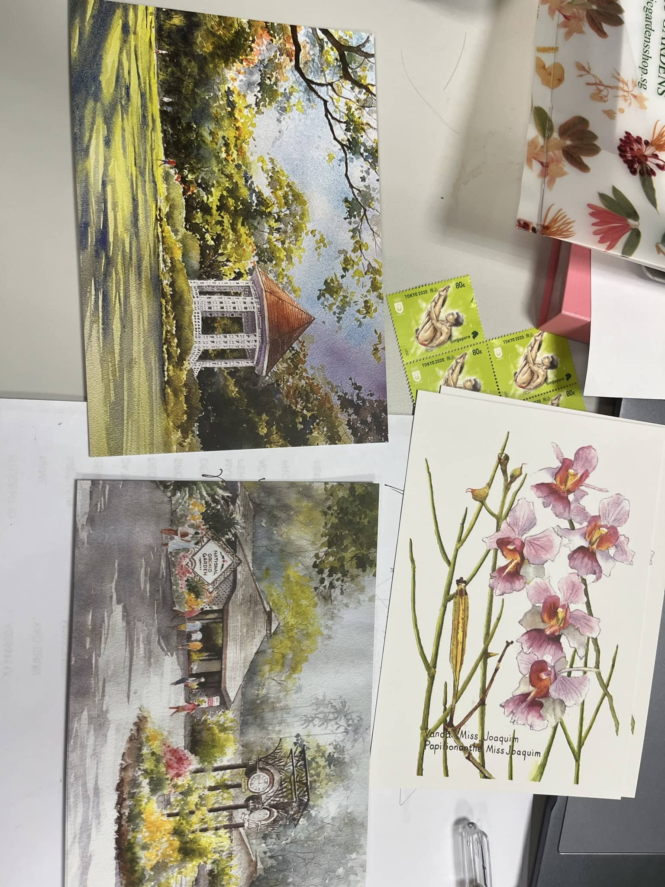
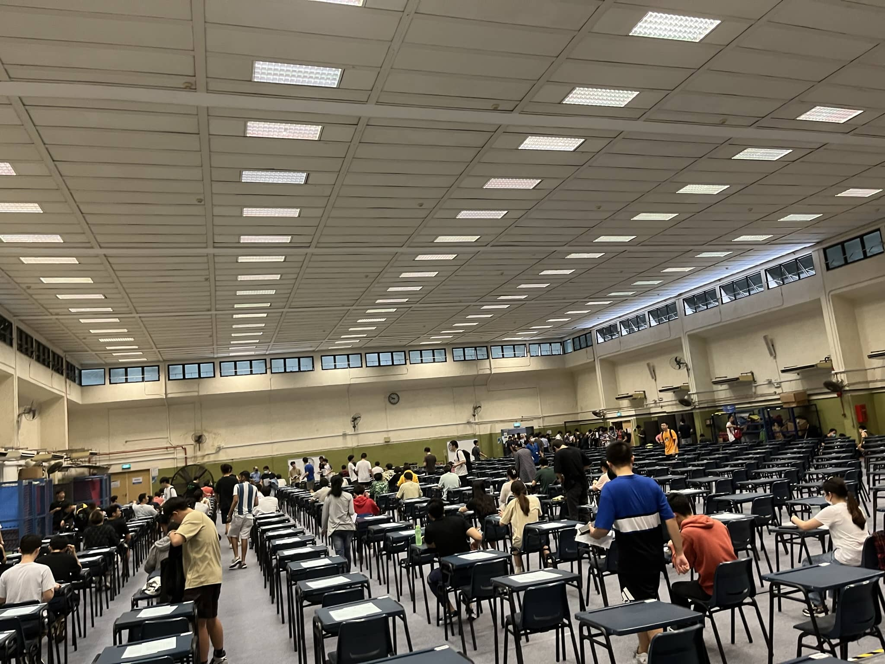
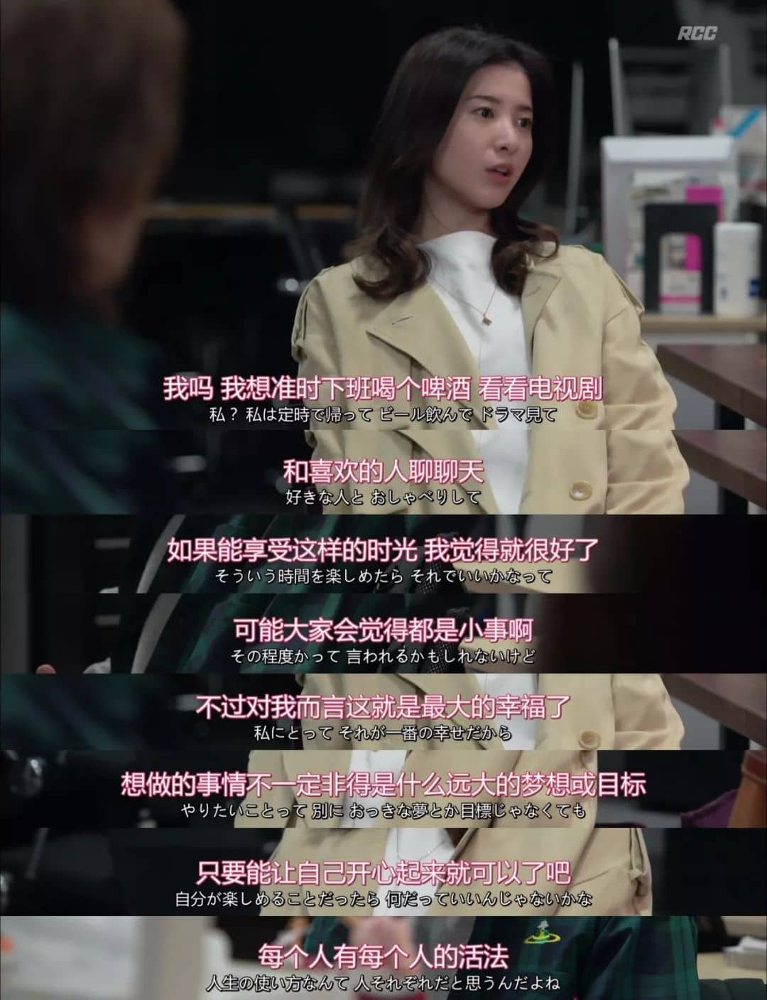
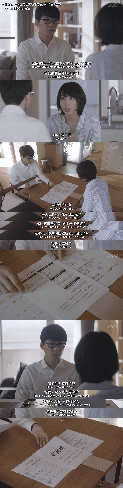
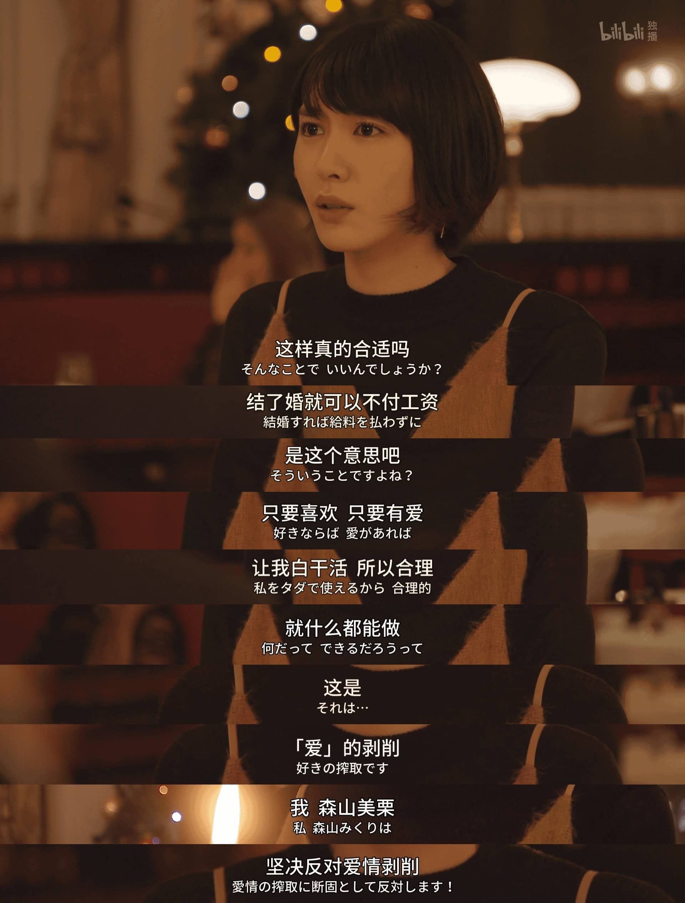

找到实习！期末考试QAQ、剧和播客

<!--more-->

## 找到实习啦

怎么说呢，其实这次找实习的经历还是比较离谱的。再之前找的电子厂实习大多数因为时间不合适而杳无音讯之后，逐渐改变了策略，开始向各大工程类公司海投。

虽然说之前也是海投，但申请的岗位投放的时间已经有相当长的一段时间了。举个栗子，同样是作为非半导体石油化工领域的埃克森美孚和哈里伯顿，他们的实习生岗位一年前都抛出来了，而且还在和NUS搞带学分的实习模块，那留给网招的名额就更少了。

当然，之前也是NUS的信息、LinkedIn双管齐下，但是这次将搜索结果放宽到了Engineering Intern，结果多了不少。而且领英会自动将最新的岗位放在前面，筛掉那些投了也不会有任何音讯的赞助广告之后（说的就是你镁光），剩下的都会有实际需求，点进官网之后再核对一下时间是不是就在最近一段时间，直接填简历就不会有太大问题。这次我的GE实习和拿到offer之后收到艾默生的面试邀请就是这样来的。

至于有两个小公司的面试，是从新加坡专门找实习的一个网站搜到的：www.internsg.com。至于这个网站，还是NUS的就业处CFG的一篇推文里推荐的。所以机会还是藏在各种地方。

同时NUS的各种企业开放日信息也一直在盯，虽然这两个都是3月份填表约的时间，但是好巧不巧也和几个实习面试赶到了同一周。关于这一周的发疯就业开始：

### 4.11

这是一家在新加坡中央企业区的仪器设备公司，主要产品有各种显微镜和自动化检测装置。4月11日参与了一场开放日活动。

公司场地并不大，写字楼也只租了半层，剩下半层是英特尔的。这场开放日搞得小巧精致，参与的学生总共只有6个人。首先肯定是简单介绍了公司的概况。总部在日本，全球各地都有分部，采用直销模式，主要客户都是生产企业，每员工利润率有点高得离谱，在新加坡仅次于DBS。至于为什么，因为他们在这里只招销售，并不招研发工程师。让我稍微有一点点感觉这一天要白来一趟。

然后进入了破冰环节，自我介绍、你画我猜再到迷你辩论，虽然说咋一听对我这个社恐来说有点震惊，但是玩完了之后就感觉还好，算是某种程度的走出舒适区。而且说来好笑，分组恰好分成了3个新加坡人和3个非新加坡人。和我一组的韩国女孩子非常健谈而且对新加坡非常了解，让我一度以为她也是local。

之后公司带我们6个人去楼下餐厅开饭，精致程度有点超出我对公司开放日伙食的想象，原本我还以为是盒饭或者盒饭pro，还是直接看图吧

作为一个日企当然是少不了日本人，今天开饭时就有一个日本总部的销售来和我们聊天。最尬的是他的姓名牌按照西方式写法，也就是名字+姓氏写的，让我炫日语的时候直接把名字+桑跟他打招呼，血压拉满。这位销售工程师也是从毕业新卒一开始就进入了大阪总部，之后负责京都地区，还负责过对接任天堂。真的是很厉害。

饭后到了笔试面试时间，笔试这种东西应该是从日本继承过来的，搞得和aptitude test一样。几道简单的计算题而已，比网上的两个小时写一大堆东西简单不少。而面试也基本上就是对对简历说一下之前做过的项目，但我还是直接摊牌了，我不想做销售。

面试完之后是参观各种检测设备，说实话挺多设备挺厉害的，有一款显微镜能仅仅通过直接从上往下照给出微米级别的截面高度。但UI不是特别好看。（每次遇到这种情况就很气为什么没多拍几张照片，至少是会议室的照片也没有。）

随后则来到了公司几位销售分享他们的日常，大多数时间周一周五销售们会在办公室打电话，看看潜在客户的意向，而周二到周四则会出外勤，拉着箱子带着各种仪器去企业处进行展示或协助安装。据他们说每周会打200多个电话……之前在新加坡打电话的经历直接给我劝退了。当然，待遇说实在的也是真不错，公司报销电话不说，还工作时间配车，非工作时间自己也只需要出油费。薪资待遇也很不错还支持EP，只可惜只招销售。

接下来是4月12日，我迎来了我最离谱的一天，一天面试三个公司。

### 4.12-上午

上午10点11点两轮面试，为了防止法学院太吵干脆就直接在宿舍开热点了。首先是一家搞5G的建筑公司，说实在的我想不太明白我这个背景到底和5G能扯上什么关系，但也是走了正常的流程，过了一遍简历。当然之后的提问，比如希望能从实习中有哪些收获这种问题，也只能照着数据分析这种比较抽象的方面去说。

工作主要是在商场和户外安装基站，寻找信号最好的地方。有时在户外工作还会开着车到处跑测试移动时的信号强度，当然也有不少数据分析处理的工作。HR介绍完公司情况之后感觉新加坡的中小企业生存实在是堪忧，这家公司好歹还是诺基亚爱立信和华为这种顶级基站企业的乙方，而且新加坡还承诺要在2025年之前全面实现5G普及，但薪资实在是没什么竞争力。实习生1000SGD，新入职员工2500SGD只给sp实在是给我听乐了，可能对面也没意识到我是以一个NUS的master来问这种问题。

### GE

说实话通用电力的面试我还挺紧张的，毕竟不管卖了多少子公司好歹人家还是世界上数一数二的航空发动机和燃气轮机制造商。所以之前的准备实在是不敢怠慢。GE燃气轮机官网上翻了好几遍，主管的领英介绍更是翻烂了。同样是自我介绍，当然要特意提一嘴关于航空发动机的课程，正好周一的时候刚刚介绍燃气轮机和航空发动机的区别，这正好用上了。

整场面试下来竟然出乎意料的简单，主管向我介绍实习任务时我写下来的东西现在我没看懂。所以我接着补了一个问题，问她平时时怎么用这些精益工具的，不知道为什么我记下来的东西还是支离破碎的，在写稿的时候根本派不上用场。但总之核心思想是降低缺陷率，通过分析数据找到根本原因。

感觉很不错的另一个原因是她很早就问我住在哪里，还跟我说有班车提供通勤。但是上班时间有点绷不住，从早上7点半上到下午4点45。我还很不要脸地问了一下表现怎么样，她说挺好，对我对这些精益工具感兴趣挺满意的（还是提前查了领英的功劳）。然后蹬鼻子上脸直接问了工资，这会让我直接对接HR去了。

#### GE后续

大概是过了不到一周，HR发了意向offer。又过了一周正式的offer发到手，在workway里面签了字。又过了几天，workday里面一大堆东西就开始涌出来，什么员工准则保密规范之类的。一开始我还翻译翻译，后来实在懒得看直接签字了。

### 4.12-下午

这个实习机会同样是在之前写到的网站上找到的。首先HR通过WhatsApp联系，HR热情到离谱，无论是问我通勤时间还是帮我查国际学生实习要求都很用心，但是也让我怀疑他到底是不是一个专职的HR。虽然有些NTR嫌疑，但姑且混乱的前置对接过程算是完成了。

虽然上午GE的面试基本上算是万事大吉了，但是本着尊重约定和不能掉以轻心的原则还是去了。一开始还以为没找到地方，人家工作场所挂着母公司招牌，子公司似乎没有什么存在感，签的招聘信息都和我在网上见的完全不一样。一开始我还以为是什么黑心企业或者是嘎腰子的，要不是这是在治安良好的新加坡我早就拔腿就跑。

这家公司的项目也挺离谱，有一家做电动车电表的加拿大公司要被收购了，找到现在这家公司，让这家公司赶紧抄个仿制品出来。免得被收购之后产品毁了。

老板很nice，HR很nice，薪资水平也很不错，上午的小公司只开1000，所以我写1500想激将法，但他们竟然一口答应了。还说之后可以继续兼职，有ep拿（在干好的前提下）。除了公司小了点，但这也是现阶段最大的问题，公司太小了，实习没有认可度。在为数不多的金钱和就业前景之间我还是会选择前景。

实习的任务就是3个月之内做出一个差不多的原型机。说实话，手册什么的都有，通信模块和电流控制模块都可以买。感觉复现一个不是什么大问题。但毕竟前面有了GE，所以我故意表现的很纠结。老板和HR竟然给我7天回去想想能不能做出来。

#### 后续

这家公司的后续也挺有意思，收到GE的意向offer之后我把这家公司拒了。但是之后他们又找到我，问我能不能帮他们推广一下他们的岗位。为此还帮他们发了一条朋友圈。

### 英飞凌

英飞凌是德国半导体厂，在新加坡这个台湾芯片企业一大堆的环境下据说十分养老。养老对18岁的大学生可能过于遥远，但对转瞬25、即将面临30大关的老年人最合适不过。但是对已经有了GE的我来说只是过来玩凑个热闹。更何况我之前在英飞凌的官网上已经把简历投烂了，但碍于6个月的时间限制，大概率是不会要我的。在英飞凌各种介绍的时候我的边角聊圣地巡礼播客还没听完，他们介绍了些啥我基本上没听。

但是怎么会有公司发公交卡当纪念品的？

有一组搞机器人控制的，大概是在工厂做流程优化的。过去简单面试了一下，为以后的全职工作留个印象分（如果有的话）。虽然这种面试大概率就是进人才库了。

要说这次有没有遗憾，当然是有的，有一个非常漂亮的法国小姐姐给我介绍这边机械工程的学生能干什么，但是最后走之前没和她合照呜呜呜（

这次企业参观最大的成果还是过去蹭了一大顿饭。旁边实习生的谈话也被我记录了下来。

> They said they need some interns to volunteer for the open day.
>
> And then I volunteered.
>
> Volunteer to eat.

## 期末考试

搞完实习的烂事，期末很快随之而来，没把实习和期末堆在一起也算是一件幸事。从临近期末的神经网络SVM和RL的报告再到复习，我似乎完全没能投入进去，但是也没能彻底摆了。

但是，在纠结了半天学与不学之间，还是叶叶一语点醒我，每次想到底要不要好好学习，我都会拿出这张截图自勉。

复习过程还是挺揪心的，期间收到启发寄出去十几份明信片，也算是复习期间的调节心情。（当然除了写明信片之外还看了不少剧）

考试本身恶心的一批，拿着前几年的题复习再看考试的试卷感觉就像是一种诈骗，前几年的题简直白给，但考试的时候难得一批。

当然航空发动机的老爷子还是实诚的，前几年的题做不完，今年的题同样做不完。

%20at%206pm%20-%20Zoom%20-%20Google%20Chrome%202023_4_30%2016_29_13.png)

## 剧

### 别当欧尼酱了

8/10

![[Sakurato] Onii-chan wa Oshimai! [未删减] [09][AVC-8bit 1080p AAC][CHS].mp4 - VLC media player 2023_4_3 20_09_09](./../media/2023-05-04-write-at-will-202304/%5BSakurato%5D%20Onii-chan%20wa%20Oshimai!%20%5B%E6%9C%AA%E5%88%A0%E5%87%8F%5D%20%5B09%5D%5BAVC-8bit%201080p%20AAC%5D%5BCHS%5D.mp4%20-%20VLC%20media%20player%202023_4_3%2020_09_09.png)

女孩子贴贴挺不错的，刻板印象虽然有但不多，全年龄限制了内容尺度，但能隔离一些恶臭未尝不是一件好事

体验卡结束了怎么还不想变回来了

### 我要准时下班

8.5/10

我从没想到看这部剧会在B站看，时间正好是电科员工截图流出。所以舆论上也是对加班深恶痛绝。

本颜狗当然是冲着小姐姐好看追的剧，而且剧情推动点还是一个上海餐厅，所以会有各种塑料中文。看完第一集直接追了大半夜，第二天直接看完。

以下剧透预警

女主一开始就是一个到点下班在网站制作公司的职场人。剧里有对到点下班的向往、对职场新人成长塑造、工作对恋爱的影响、对职场性骚扰的反抗、也有对女主成为项目管理人之后理解加班，并决定向公司领导要求生活平衡。从这个故事中我能从各种角度发现女主作为一个职场人的成长。

但感情线看个乐就行了。

### 逃避虽然可知但有用

9/10

这个剧最大的价值不在恋爱过程，而是真的认真探讨了家务劳动支薪的可能性。《父权制与资本主义》的核心议题

而且里面竟然还有EVA梗，美栗高中男友谐音就是真嗣，而大学男友叫渚薰，不知道这两位小男友最后有没有幸终

### 王冠

考试复习的时候看的，怎么还不出第五季第六集，早就可以盖棺定论了。

权力抹杀人性，无权力的权力象征更抹杀人性。

分就不评了，赶紧出完

## 播客

直接懒狗了复制粘贴朋友圈

### 搭子化友谊

[Vol.83 都市人的朋友，越处越少 没理想编辑部](https://www.xiaoyuzhoufm.com/podcast/5e2aaf28418a84a046542eb7)

> “现在更多的时候是在找一个搭子，你知道和ta聊这个话题是没有门槛的，但至于其他话题你会想这些东西对人家来说有什么价值。以至于能留到最后的亲密关系都是在交友热情比较旺盛的时期交的朋友。”
>
> “第一等级的关系是无论违法乱纪还是借钱对方都会支持你的。但虽然感情纽带依然还在，每次聊什么事都要讲一堆前情提要太麻烦了。更遗憾的是要是有一天我混不下去了，但ta们都在美国，所以也没法借我钱或者养我”

虽然这话说起来感觉会非常没有边界感（我也确实没有😅），但其实我非常不希望我的人际关系变得搭子化。一旦搭子化，人与人的交往过程中就不再是一个个完整的人，更像是一种专精的chatgpt：搭子可以在游戏、劳工运动、女权主义其中一个方面聊得很开，但一旦话题切换，就像打开了完全不一样的窗口，不知道怎么开启新的会话。

但仔细想想，确实有些友情并不需要一种搭子关系也能维持，但那种深入灵魂的挚友又怎么不是一种搭子复合体。你们有着共同的生活经历，类似的视角与观点，在许许多多的话题上都能聊到一块，才会让你们的联系如此紧密。

我没想明白当兄弟是哪种（bushi）

### 孔乙己

[028 孔乙己的长衫，玲娜贝儿的短褂 鼓腹而游](https://www.xiaoyuzhoufm.com/episode/644257a1fbc05629d3a42ae6)

[Why has a hundred-year-old short story gone viral among China’s graduates? Dram Tower](https://www.economist.com/podcasts/2023/05/02/why-has-a-hundred-year-old-short-story-gone-viral-among-chinas-graduates)

鼓腹而游讲的是年轻人去做轻体力劳动。也提到了玲娜贝儿以至于轻体力服务业的去人格化。但这个话题似乎也能被喷，播客界精致中产阶级生活与更加出卖体力阶层的代差让两拨人更加相互不理解。（于是之后他们做了一期更加中产阶级的逛公园LOL）

鼓楼的点就更加直接。经济不再高速增长之后社会阶层的落差与宣传机器的聒噪才是矛盾爆发的痛点。更不必说一纸行政命令就能将容量大量就业岗位的教培行业屠杀干净的现实。

