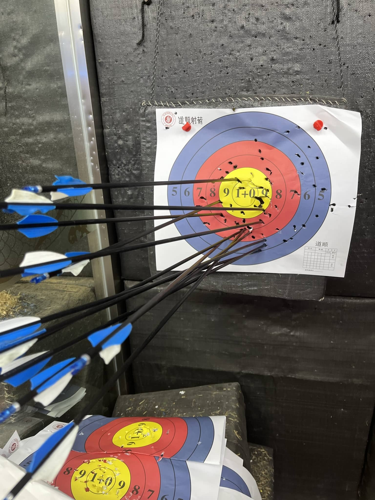
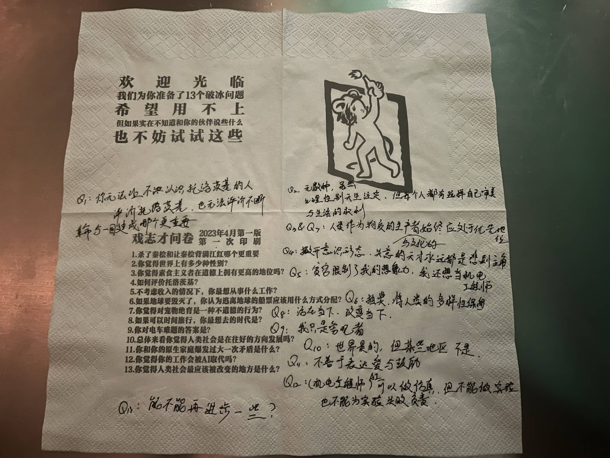
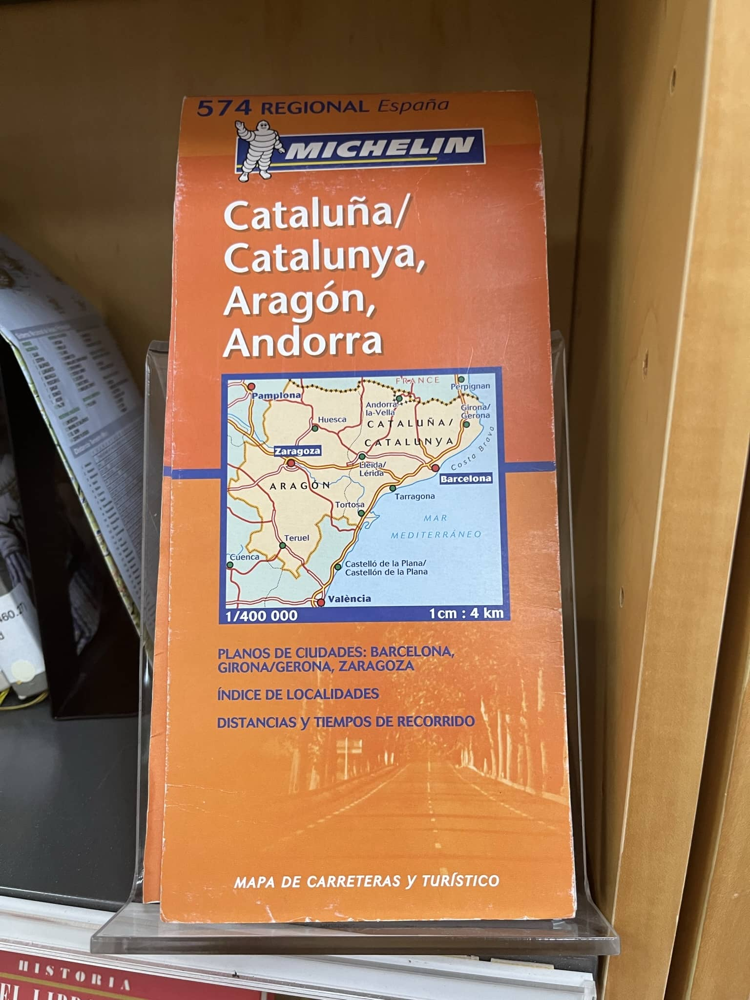

本文仅供留档，复制自朋友圈

<!--more-->

## 酒后疯言

上海足够大，足够包容，无论是大小明星的演唱会与脱口秀、无论何种主题的艺术展艺术展、二次元中单推京阿尼的小众社团都能在上海有一席之地。上海也非常适合压马路，从徐家汇的教堂开始，经过无数名人故居的武康路，穿过梧桐遮阴大大小小公园交织的老城区，或者沿着南京路商圈一直走到外滩。只要有精力沿线一直走下来不会有任何不适。新加坡太热也没什么历史积淀，北京被环线和大道切的支离破碎，苏州更适合单点游小园子，杭州甚至唐山还是适合绕湖。如果说哪个城市能将历史文化与商业结合在一起，上海显然是最佳选择。当然上海也因此尤其适合谈恋爱，如果不考虑开销的话。

[029“走，逛公园去” 鼓腹而游 ](https://www.xiaoyuzhoufm.com/episode/644ce66eb7b3c21b65b04188)

她不理解我要润，毕竟抽象茶杯只占了上海人生活的极小部分。但我心里始终有一种莫名的恐惧。就像在浦东出机场边检来回翻了几次我的学生准证，显示器上不知道写的是不是出入境人员危险系数，还把章盖在了日本签证页上。他说挤在一起省纸，但我始终怀疑这是下次入境抓我走的暗号。再一个则是我没有留下来的理由，我现在就像是赤名莉香，我的丸子没有试图让我留下。她还希望我赶紧把N1考过，不要因为语言限制了我的发展方向。

对一个从去年11月开始看到蓝底白字路牌就能颅内高潮的i人来说，诗歌散文与悬疑小说离我实在是过于遥远。武康路上的名人故居对她这个e来说也应如是。这种错位限制了交流的深度与频率。她不认识托洛茨基，就像我无法理解让秦桧背满江红到底是个什么鬼。

她问我两党政治一定更好吗，我跟她讲了驴象之争在性少数与堕胎权问题上引发的社会撕裂。她也提到了建设性反对，我无法回答这个问题。理想离现实过于遥远，但短线也看不到改变的可能性。就像这段感情长线短线都看不到未来。

我们遇到了一个东北大叔去看一个后现代主义哲学的展览，他是1997年下岗的高级工程师，之后他去乌镇戏剧节找木心并留了下来，到阿那亚看展时靠装修为生，现在在上海过着有一搭没一搭的生活。我们也羡慕过这种自由，但一听说他孩子还在上大学不由得眉头紧锁。这种将家庭责任抛给女性，又触及到了女权主义最核心的议题。也不禁让我想起上午和另一个朋友去的徐家汇天主教堂那些发了终身愿的神父，一生不娶将自己奉献给上帝。宅左也如此吗？

戏志才分不清水龙头左右，说不好是不是正经左人，不认识小杯和超小杯，但是知道什么是正经啤酒。一杯酸甜的果啤玉油柑之后又给我接了一杯正经散发着麦芽香气和啤酒花微苦的精酿。旁边的顾客会调酒，为我们一人调了一杯柠檬酒。正好老酒喝完，让我们尝了尝新上的红豆沙牛乳酸波特，酸味很重，很有红酒的味道。变了e自我意识过剩的我让戏志才把答卷贴在墙上。戏志才和他的顾客开着我的玩笑，说很羡慕这种小酌就能微醺人，非常快乐。

女生是天然对政治不感兴趣吗？外交学院以性别划分的保守派与激进派。那些在这条路上被带走主要都是的女孩子们。她们靠的是女生的共情优势吗？那男生天生的感兴趣有来自哪呢？我们暂定是社会规训。

我抱着鹅作剧的那只鹅，跟她说有些人想做鸡，有些人想做鸭，而我想做鹅。哪怕是被包养，也要去性别化。

虽然只关心历史政治的男生很下头，但能对外部环境保持关注的我真的很有魅力。这是我这次旅行中收获的最大的礼物。

我一直以为左人都是苦大仇深，所以我向来都是不传教的。很惊喜能为她带来这种新奇的感觉，也惊讶于她也会开“不够左”的玩笑。

在这次旅行之前我已经想象了无数种骚话，比如不要在上海听东爱会变成赤名莉香。但借着酒精我感受到的失意与痛苦完全不同的感觉：释然。

> 执念这东西没办法释怀，人如果在没做好告别的准备下被抛下，无异于丢了孩子的母亲，整日在一种一切还可以回去的可能性中忧愁。人和人终究会告别的，换言之，任何物质都是会消亡的，没有什么是永垂不朽，你就是要接受，接受此刻幸福狂热的感受会有消弭的一天，这不是悲观，是一种心理上的准备，坦然的面对爱是消耗品这件事，我觉得这是人长大的一个过程。

最后一个问题是，在18岁和30岁的转折点，我尝到的是什么味道呢？可能是那我只喝了一口的黄杏美式，一开始是黄杏水果酸的感觉会占满口腔，但当下咽时美式的酸苦悠久不息。

代谢带走的不止有积累的乙醇，还有临时变的e，以及那种释然感。感情到底是无法通过酒精代谢走的，心态也是。

## 戒断反应

在西班牙图书馆，我对着米其林加泰罗尼亚与阿拉贡旅行指南出神，那里有着无政府主义者的圣地：可以与1920广州和1967上海媲美的巴塞罗那；也有阿拉贡地区防御委员会，不亚于马赫诺曾驰骋的乌克兰草原。

同行的友人在身后问我：你听说过聂鲁达吗？他的情诗和十四行诗写的很好，年轻女孩们很喜欢。

我摇头。诗歌不属于我的世界，年轻女孩也是。

他是个智利诗人，你知道智利在哪吗？

开玩笑，哪有左人不知道智利在哪的，智利文旅特色直升机蹦极可是每个左人一生都要体验一次的项目，尤其是不带绳的那种。

几天之后我在整理自己的书影音种草清单，这段对话忽然又回现在我耳旁。诗人的名字我已经忘了，仅仅输入智利诗人四个字，聂鲁达的百科词条就跳在第一个搜索结果：诗人、诺贝尔文学奖得主、智利共产党员

我揉了揉眼睛，刷新了一下界面，确定自己没看错共产党员四个字，随后马上去找他的诗集与传记。

那首先肯定是他在中文互联网上流传最广的《二十首情诗和一首绝望的歌》，谷歌出来第一条就是中马库的网站。与其说是情诗不如说是情欲诗，19岁的作者用栩栩如生的修辞形容女性的身体只会加重我的性焦虑：那个年代可没有Pornhub。虽然说并不是每首诗都在描写性，但还是那句话，我欣赏不来诗歌，尤其是翻译诗，只有母语者才能理解诗歌背后的内涵与力量。

政治诗是类似的。相比爱情诗，政治诗是不需要那么多修辞的。或许是因为政治诗描写的内容——劳工、阶级与内战，相比从未触碰过的爱情对我来说更加熟悉。但果真如此吗？对我这个中产阶级出身的人来说工运或许与爱情一样虚无缥缈。

接着开始看聂鲁达的个人传记。在聂鲁达年轻时也曾是一位无政府主义者，在圣地亚哥与底层人民结成了联盟。但随着政治形势的变化成为了一名共产主义者，很像一位在政治上退居二线的毛泽东。虽然看到这很想再复读一遍活动平台比意识形态差异重要，但我好像已经不想活动了。

他在印尼遇到了自己的第一任妻子。这段婚姻放在今天绝对是一个人生污点：在西班牙抛弃了妻子和先天疾病的女儿去和别的女人幽会。挺好一诗人，可惜是个男的（x）

聂鲁达也是一位卷入国际浪潮的外交官，他在西班牙写下了不少诗歌歌颂人民阵线和国际纵队；在维希法国协助西班牙难民从集中营撤离；在墨西哥给杀害托洛茨基的凶手发智利签证。

作为共产党的坚定支持者，聂鲁达积极参与到选举活动中。当选参议员，但智利共产党被左派推举上台的总统背叛。紧接着的总统选举主动退出，积极支持阿连德为其辅选。不久之后在针对阿连德的政变中离奇死亡。

聂鲁达很罕见，大多数情况下，我们往往只能从作为诗人与政治家的聂鲁达中二选一。但与他人的连接会打开通往另一个聂鲁达的大门，世界的另外一个维度。这也是维持身边物种多样性的意义，保持与有趣的灵魂沟通。如果是我一个人前往，我可能永远不会了解这位共产主义诗人的传奇经历，更不必说可能根本不会来这个图书馆。

それでもいい
