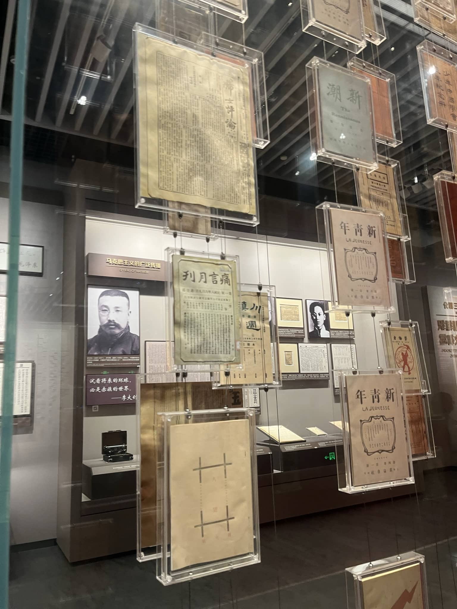
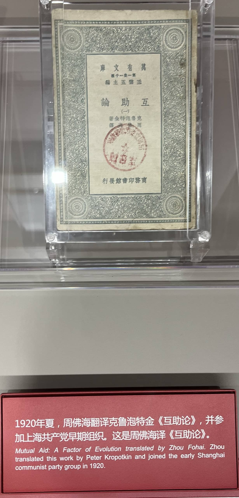
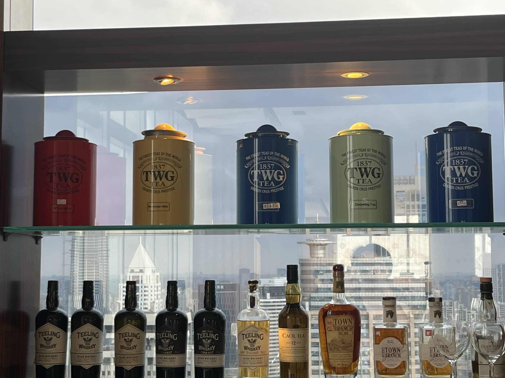
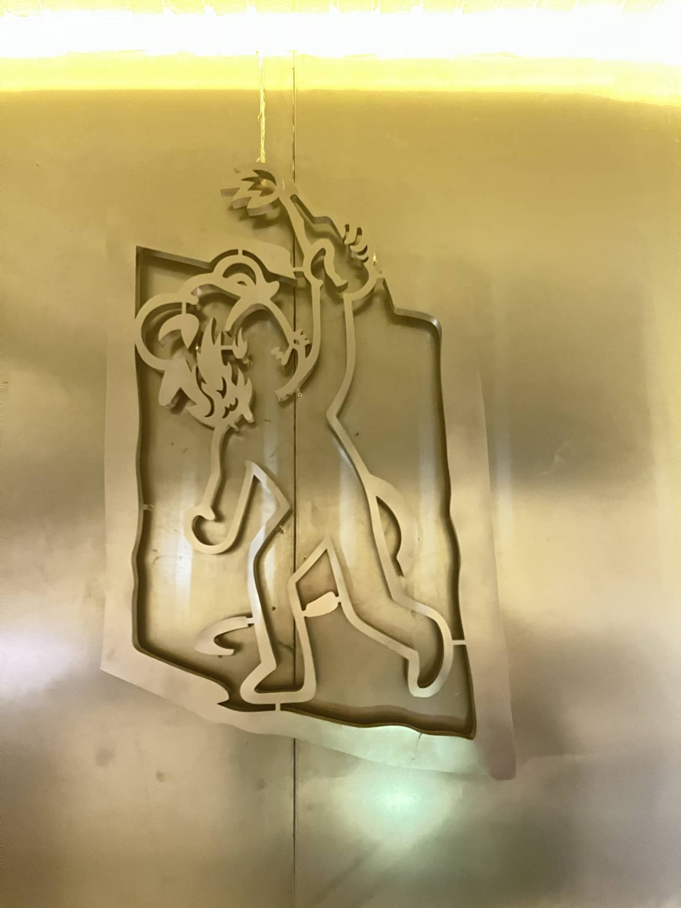

这个月发生的事实在是太多，一梳理起来回忆不断涌向心头，却又无从下手。

<!--more-->

## 上海游记

本节基于朋友圈内容补充

5月4号下午从家里出发，坐上了熟悉的东北开来的动车，甚至晚点8分钟，从头晚点到尾也没追回来，也算是遇上高铁彩票了，更离谱的是这辆车是我从携程上自动抢票能买到的所有的车中最慢的一个，不知道走的什么线还要过南通，晃晃悠悠几乎8个小时可算给我送到了。

晚上11点虹桥站的10号线都停运了，坐的2号线末班跳站车到静安寺再坐深夜巴士到的青旅。临行前家长还问我要不要多加衣服，我可是短袖从关西机场下飞机直面0度气温的，上海10余度的夜间气温对我这个从新加坡火炉中出来的人实在是正正好好。雨后的空气清新的很，一丝丝清凉从我的发梢和指尖掠过，深夜巴士从老城区里种满梧桐树的两车道小街中穿行，我打开了车窗感受上海的气息。

到了青旅已经是凌晨一点，我领了床单被罩和枕巾，在一片乌漆嘛黑中床单和枕巾倒是铺的上，但是被罩无论如何都套不进去，不知道为什么晚上没有开空调，干脆被子就不盖了撇在一遍，随它去吧。

说实话这次的旅行也非常极限。八点半起床之后简单看了下地图就一分钟决定将原来从北向南的计划改成了从南向北。自己一个人出去玩的好处就在于自己随时可以改行程，因此被咕了某种程度上也算是一件好事。出门进全家买了个菠萝包就上了地铁。

第一站是大韩民国临时政府旧址。我8点50几人到了馆还没开。馆内禁止摄影不然我必然一顿狂拍。临时政府的文件通告宣言很多都是汉彦混写或者直接都是汉字。里面的展品尽是家国沦亡之后故土的悲剧与流亡政府的奔走呼号，随着上海沦陷临时政府也与国民政府撤退到了重庆。好像无论评价些什么都不太合适。

撑着伞来到了一大会址，先进的是“一大会址”，这里是那些抽象玩意的所在地。茶杯可能被放了回去，除了茶杯开会之外乏善可陈，就是不知道哪位是天选之子。但说实在的，也就是抽象茶杯被反贼骂了才撤展，剩下安然无恙的展品一个比一个的更为抽象。

雨下大了，鞋湿透了。进了旁边的“一大会址纪念馆”避雨。

场馆本身建在地下，下楼之后有一大帮的老头老太太在听一个帅小伙子做解说，可惜是用新闻联播体讲初中近代史。挤进人潮在沙里淘金的收获也不少。但精华主要集中在建党之前的工人自发运动和五四运动上。

首先就是把本科期间这一面墙的新青年的草拔了。

然后则是不少关于广州组织中的安人、民国初期的安康论战。这帮进了康党的安人一次又一次的证明着行动的平台远比意识形态的差异重要。

哦对了，还有叛徒和汉奸（

以及数不胜数的境外势力

出门雨还在下但小了很多，沿着黄陂南路没走两步就看见一个瑞士银行。这玩意夹在了会址与代表宿舍之间。更有意思的是UBS门口贴了一个存款保险，结合前几天瑞信炸了被瑞银收购更加绷不住。但说回来，这周边也确实是结合了上海老城区的风貌和现代的金融商业体系，梧桐树的街道两旁，或者是低矮的历史文化遗迹，或者是高耸的金融中心。

淋着小雨来到上博，没预约，只能现场搞，但是只能约下一个时段，在会场外等了半小时。唯有在这个时间段我才感受到了被咕咕的痛苦（

特展是联合英国国家美术馆展出的文艺复兴时期以来的艺术作品。对这种事上海人表现出了与京爷完全不同的狂热。文艺气息透漏在上海各个年龄段的人群中。而且这群上海人还不约而同的注意作画的各种细节：角落的人物、作为背景若隐若现的伏线、甚至人物衣服上的蕾丝花边。他们不约而同地有选择地将镜头怼到相似的位置。让我怀疑是不是导览设备里面说了些什么。

其实我对博物馆最大的偏好永远都是最一开始的青铜器。青铜器作为古代人类技艺的结晶，同样与文献较为匮乏的夏商周联系在一起。周朝以后的记载基本上已经被文字和出土文物互证证明烂了，于是大家都开始拿着文字卖弄才学。但唯有青铜器可以引发历史的各种遐想。对青铜器的考古也一步步逼近华夏文明早期的深度与广度。在青铜器馆的中后期也有幸跟上了一位义务讲解员讲解。

到了下一个陶瓷馆我本想如法炮制跟着讲解员讲解，但一来是进度有点慢，再一个是我从唐山来的能不知道陶瓷怎么回事吗，于是开始加速游玩。之后的展厅有钱币展，在杭州我去过国家级的。书法绘画印章展我一个都看不懂。btw结合楼下的西方艺术展让我意识到我小时候说“我不能理解中国传统艺术”中的“中国传统”完全可以删掉。

但说实在的，一个好的博物馆仔细逛总能逛一天，上博本身也确实是值得逛一整天的，可惜时间太紧张。

在城市规划展览馆中溜达了一圈，没细看，不好和新加坡比较。但无论如何比北京强出10个苏州。

四点和赵公子相约在相亲角，可惜现在已经不出摊了，没能见识到人类高质量男性，随后我们去饮茶，润泽小天使就是人类高质量男性，可爱捏。

但看到TWG和凯德还是没绷住，新加坡资本国际化扩张

之后我们一起逛了南京路，我买了个肉粽子当午饭，当时已经下午5点了，在地铁口分别。

之前说南京路是上海的南锣鼓巷，真是对不住，应该是上海的王府井。但我似乎没去过王府井……南锣鼓巷的话还是应该由安福路对标，倒是第二天安福路上遇到了一群奇怪的人对路人随机采访，问的问题就像磕高了一样不知所云。

在外滩绕了好大一圈跑到了苏州河，这个传统的上海滩的经典取景地，我也是过去取景的，或者说过去踩点的。但这件事说起来就比较恶心人了，按下不表。

建国首任市长

晚上约了一位圈内网友，试图建设一个讨论内殖民的聊天平台。但说实话我一个润人聊内殖民，我真润成了自己就是殖民者，就算润不成高低也是个买办，到时候第一个先枪毙我（X）。再一个我对成体系的机制建设实在是已经不感兴趣了，一来是没什么心力，再一个是胆小怕事的天性出了事我肯定第一个把大家都卖了。

第二天和来看演唱会的初中同学疯狂贴贴，先去了徐家汇天主教堂，听教堂的志愿者讲基督教的派系划分和告解（忏悔）制度。

随后还跑到了旁边的徐光启纪念馆。上海的魅力之一也在于这种大大小小的纪念馆遍布着整个城市。

吃了好久没吃的达美乐，三个人三个披萨，还吃到了最喜欢的卷边，一本满足。

第三天也就是临走那天晚上睡不着，还去海底捞找他们疯狂贴贴。其中还有一件特别好玩的事：一遍是喝酒略微上头的我，另一边是听完演唱会累得半死不活的两人。我看着包包上的星戴璐（迪士尼兔子）和他们说下午听说的达菲一家小动物组CP的事，结果没想到他们两个也聊了这个话题，我恍惚之间还以为是我酒喝多了把中午和下午的事记混了，确实没想到两拨人竟然能不约而同聊到相似的话题。

最后赶着凌晨五点的第一班地铁去看了EVA，听着单曲循环的One Last Kiss，在上海的小雨天里寻找蒙娜丽莎

汶水路的产业园是由上海的一个老机械厂改装而来，前改开时期风格的标语在园区内部随处可见。

说实在的，上海真的好好玩也是一周都不嫌多的城市，浦东没去，武康路上的名人故居没去，还有各种博物馆科技馆演出漫展……呜呜呜呜呜呜呜

## 实习

### 好困好难受

先说缺点，最大的问题是上班时间太早，7点半上班平时算一个半小时通勤的话就得6点起，想要7-8小时睡眠的话就得晚上10点多上床睡觉。这样一来生物钟完全向前提了2个小时甚至4个小时。更离谱的是，才上班一周，iPhone的自动定位已经学会了我到公司自动打开工作模式了。

再一个就是人际交流，Singlish对我来说依然是痛苦的根源，英音美音的文化霸权真的是英语初级教育里面该死的一条。算上文化的差异让这种感觉更加明显。虽然说多少已经能够了解新加坡人的人生轨迹，比如National Service，但是更为广义上的互相交流还是让我感到望而却步。

实习的第一周说实在的稀里糊涂就过去了，整个入职的过程还是给了我非常大的新鲜感和大公司内部的安定感。无论是公司配发的电脑、office工作套、还是各种工程项目软件，无一不体现出大厂的组织架构和办事流程。第一份工作当螺丝钉对我来说其实是个好事，在异国异文化开始工作毕竟是走出舒适圈，如果没有一份良好的工作准则去一步一步照着来做确实会让人不知所措。也好在所有的Work Instruction都已经写好了，正式交接之后也只需要一步一步照做就可以。

### 哪都有的团建

再一个就是第一周有一个满搞笑的事，第一周正好赶上全公司开团建，稀里糊涂就进了团建支援组，离谱的是我还不知道这件事，还是我看了我的teams发现自己应该在开会才急冲冲地感到团队的开会地点。作为开斋节主题的庆祝活动几乎晚了半个月：开斋节在4.22，但是这活动在5.11开的。我们几个实习生说实在的也没干什么，就是组织人员进场，扫码登记活动结果罢了。活动主要是包马来粽Ketupat，我们用的丝带打滑很厉害，所以十个实习生只有一个能完整把粽子包好。到了实际的现场结果也差不多：只有少数几个团队能做很多粽子，也基本上出自同一个人之手。有点类似于：会就是会，不会就是不会。一线的操作工人们在艺术创作上也是很有创意的。开斋节的海报设计虽然是照着葫芦画瓢但反正让我来我画不来。

### KAIZEN

第二周进入了一个KAIZEN项目，日语就是改进的意思。我们组的项目是要解决一个涡轮内部密封件的分层问题。刚进组的时候我对整个零件几乎是一无所知。由于语言沟通不顺畅做起事来也呆头呆脑的。

第一天上午我们先进行了现场调研，结果很有意思：粗糙度测试是人工用手测的、贴保护层是随心贴的、喷砂有一个操作手册，但是根本没人看，内容也不对。最后在一个库房里好不容易找到了，表面粗糙度的要求200被划掉了，改成了150。旁边也没有批注是谁改的。总之基本上靠着操作员的随心操作。

下午我们组搞了一个粗糙度测试仪的支架，之后我们为这个支架做了一个小桌子做了一天。有个工程师第一天上午请了病假，下午就给我当头来了两棒子：一是他要把毫米换英寸，我说我不会换平时不用英制单位，他反手问我哪个poly毕业的，几乎是学历歧视了。另一件事是他问我中国有没有宜家，我让他重复了三遍直到他给我把ikea拼出来我才明白他说的是啥。这种没话找话本来压力就大，再一个我因为语言问题还答不上来，实在是折磨。

第二天昨天那个工程师没来请了病假。我们上午做了半天表面粗糙度测试，下午发现测试仪器坏了没校准，之前做的测试都白做。看来我们工程师自己也会犯这种简单的错误。

当然做实验是要控制变量的，控制变量控制半天结果都差不多

第三天我也开始嗓子不舒服，茶歇期间和美国来的工程师聊了不少。他给我发了整个燃烧室后面的部分的截面图。带我参观了涡轮部分的各种零部件，比如扇叶、我们在用的Near Flow Pass Seal，固定的喷嘴和Honeycorn Seal。有了他的讲解我基本上已经明白这个零件对整个涡轮的作用了。再加上他给我发的截面图，我对整个机器了解增加不少。

这个美国人也很有意思，他过几天要去蒙古度假，但是他是那种对大草原没什么兴趣，而是会在酒店大床上一躺躺一天。他有个朋友则是那种美式生存狂的样子，租一匹马带个帐篷在草原上流浪了半个月。他在聊到新加坡兵役制度的时候和我们讲到他德裔爷爷去领二战养老金，去政府领了表之后交给工作人员，工作人员看了半天告诉他爷爷他在二战中站错边了参加的德军。当时正好也聊到美国战后对军队的看法：现代美国人基本上就是把参军当个班上，征兵制也只有在越战的时候被短暂提出过，但实在是因为越战反对声浪太大把美军的形象都败没了推行不下去。当时正好赶上脱口秀用军队的骁勇形容两只狗的风波，多少有一些黑色幽默的巧合在里面。

主要的问题是由美国人那一组发现的。他们两个做了一个指示操作员贴胶带的罩子，在合适的位置贴好胶带就再也没有分层了，之前都是操作员随便贴的。发现问题之后缺陷率直接降到0了，magic~

这之后其实我们事就不多了，这一周的改进活动一开始在我看来多少还是有些小题大做，有些地方我现在也觉得是没什么用，但有一些内容还是很受用的，比如搞一些指示标记之类的。当时我看见粗糙度仪器支架上贴的密密麻麻的位置标识，我冷不丁问了一句：真的有必要搞这么多标记吗？另一个工程师眼珠子瞪大了看着我对我说：这里可是制造业，你永远都不知道是什么神仙在操作这些机器。

最后一天还是被语言困扰的一天，最后只需要我帮忙做一个小贴纸，每四次提醒工人换喷砂的氧化铝砂，首先是听不懂塑封机跑了半天，再一个是听不懂双面胶……一想到teamleader要做我将来的boss我恐惧直线上升。

起床忘了换衣服，穿着久美子拍合照真的抽象

### 生病

以下内容粘贴自微信朋友圈

我印象里从小就体弱多病，但是自从上了大学之后就很少出什么大病，最严重的一次应该是把臭袜子扔床头眼睛肿了。最近去医院还是几乎一年前去nus校医院卖血：和生病没什么关系。

这次的故事可能要从上周末说起，周六游完泳之后剩下的假期都在塞尔达，以至于周一周二上班的时候才发现大腿内侧走路的时候是酸的，我倒希望不是游泳游得腿酸。周二团队里有个工程师说得了流感请了病假，我寻思着这是好事啊，能在团队里多点参与感，没想到周三就开始嗓子酸，周四就开始咳咳咳，周五已经烧的晕呼呼的了。

好像健身对我来说更像是一种诅咒：高中的时候心情好了去操场跑两圈，第二天大概率会生病。大学四年一直没出什么问题应该也是因为退化成了宅宅几乎从来都不动。几乎每次一运动，病毒都会趁虚而入。明明是为了不生病的运动却每每导致生病，总给我一种“本意是好的但结果歪了”的感觉。

除了运动和感染，心理上的低沉显然也是原因之一。脱口秀风暴的开端并不让我意外，但舆论场却让我感到格格不入。十年前的美好年代就算是当下衬托出来的幻影，也难免不让人留恋。

当然还有这个班上的憋屈。每天早上六点起床已然是个习惯，但上班第二周开始的项目却让我挫败感拉满。teamwork本身已经是让我这个内向至极的人走出舒适圈太远，语言上的不适更是让我感到无能。Singlish实在是太难懂，以至于我交流最多的是一位美国工程师，不得不说从小到大的英语口音崇拜就是一种毒瘤。

生理上的疾病容易解决，但心理上的问题却是没有立竿见影的解药。如果不能改变大环境，那只能改变自己了。我虽然胆小怕事但做出违心的改变绝对不可能。所以到头来还是选择改变环境，这方面意外的效果显著：周五下班的时候办公室已经有三分之一的人在咳了。

update: 已经快三周了我还在咳，这几周人就没来全过，时不时有人请病假。

### 微小的成就感

第三周开始正经交接流程，但是之前的实习生周一周二请了病假。这段时间也陆陆续续有不少人请病假，多少有一些凭一己之力干费整个公司的感觉。这份实习每周一似乎都很忙，周一至少要做两份周报，一份是计算返工和残次品的花销，另一个是给下面上报的生产隐患分类统计。两份工都有比较清楚的工作流程，但即使如此都还是有不断改进的空间。我自己开始独立工作的那一周开始就是如此：公司给Rotor的零件名称在2023年换了个遍，但是在excel中还是用的原来命名的判断公式，这就导致有一些零件即使按照操作流程也无法被统计，解决这个问题其实很简单，只需要在excel里面多加一个判断条件就行，但每一次解决这种简单问题的快感远比重复性的大量工作要高。

另一个简单excel的例子是给工程师做质检的excel清单，同样也是用了一些简单的判断逻辑，在这个过程中还优化了一下原先的测量流程：项目要求不同级别的漏斗有不同的筛粉能力，原先的输入数据是每一级筛出的质量，我改成了筛完之后测量每一层漏斗和留下的粉的总质量，在excel里面内部计算一番之后直接将通过与否显示在屏幕上。这种事情其实五分钟就能搞定，但是成就感却是一个月里面最高的。至于为什么需要做这个，工程师又一次给了我答案：这里可是制造业，你永远都不知道是什么神仙在操作这些机器。这次的问题是操作员为了赶工期（或者偷懒），或者是因为测试件的变形角度太小要写好多个0很容易搞错，无论是什么原因，质检报告就稀里糊涂通过了，最后的结果硬是让根本不合格的产品一批又一批生产，机器和物料费就因为这些错误操作白搭了。对此我们工程师的解决方法一方面是用这个电子表格，另一方面则是用可以直接连到电脑上的测量仪器，测出结果之后按一下就能直接将数据传输到excel表格里面，等数据收集完之后再自动导出，从中试图减少人工操作失误带来的损失。

### 无聊的日常

除了每周一令人稍微有些抓狂的两个周报，其他时间基本上是来活就处理一下，没活的时间基本上都用来努力摸鱼，摸出新方法，摸出新高度。

团队聚餐，我前任实习生已经和我交接完毕离开了，没过多久我的boss也要换人，目前来说团队还是非常和谐的，希望我工作的这段时间能够保持下去~

## 书影音游

为什么从10分制改成了5分制，感觉10分制总能从8-8.5-9纠结好久，5分制能稍微缓解一下这个问题，毕竟不太可能打出4.25-4.75这种分数。

再一个是这个月大多数时间都在塞尔达，剩下看剧的时间只剩下吃饭了。

### 虚构推理

4.5/5

这部番真的是刷新我对推理番的印象。原先的推理类作品主线几乎都是在抽丝剥茧找凶手，但这部剧的主线竟然一反常态，凶手和真相在这部剧里只能屈居二位，而将“令人信服的解释”比凶手和案发过程放在了最重要的位置。日本传统的鬼神志怪融入到作品之中，完全打破了现实的真实性，反而更为有力地将逻辑大于事实这个剧集主旨突出。个人拙见是，这部剧有意刻画了后真相时代的互联网众生相，结果如何成了第二因素，而最重要的是故事是否吸引人还能自圆其说。再一个就是，这部剧长短故事结合的非常好，小故事一集结束，而钢人七濑的长故事用了6-7集，这种沉浸式的长故事真的非常吸引人。最后女主开车开的真的快，超级老司机。

### 白色巨塔

4/5

慕名去追的经典老剧，但我印象中似乎是撇到一眼老剧列表顺手给下了。故事线讲的是医疗腐败和医患关系，人物线则是里见的理想主义与财前的现实主义碰撞的过程。说实话对于医疗系统的道德我无权评判，对患者的关怀和医疗系统的效率不是我这个呆逼能分析的，所以我直接回归老本行分析权力斗争。

以下内容剧透

先说东贞藏，为了把财前拉下水，同样是动用了各种人际关系。但是听说要用职位贿赂教授会议时，东教授作为“正直”医生的一面就彻底忍受不了了。剧中东教授的衣角被花盆盆栽钩住，也是这位老教授在这场权力斗争中被拉下水的隐喻。

权力既是实现梦想的必要，但也是毒药。在升任教授之后财前也很快被金钱与名利腐化（或者一直如此）。在巡诊的时候对一般病人的问题不管不顾，对特殊病人（大手老板）照顾有加。对病人趾高气昂的态度也是财前后期深陷医疗事故的悲剧之源。

新开了部龙女仆，但说实在的有深度的剧看多了日常真的看不下去。日常番完全没有看完一集还想看下一集的追剧的紧张感，纯电子榨菜罢了。

### 王国之泪

下个月写，主线正好没推完

## 自爱下头恋爱脑

这一个月其实处在一个持续的自我感动和戒断反应中……自作孽不可活。为了不污染正文留档处理了，再一个朋友圈也发过全文。

[https://pokemyself.github.io/Shanghai-no-love-story.html](https://pokemyself.github.io/Shanghai-no-love-story.html)

我越发觉得每一次情感宣泄的背后都是对自我的补完尝试。五年前可能是在寻找一个勤奋踏实肯干的形象，现在则是在试图弥补大学时代失去的人生的广度。以至于面对真人的时候还能淡化感情保持克制，还时不时涌现出一种释然感。但是到了深夜里孤身一人，独自面对自己残破不堪的灵魂之时，永无止境的发癫就开始了。所谓的“不要试图忘记，开始新一段恋情，上一段自然会淡出”的说辞，怎么看都变成了人生自我满足的转向。

就像我从来都不会将（想象中的）另一半纳入到自己的人生规划之中，或许也从来没有真正认识理解过对方，或者任何人。可能我真正爱着的只有自己。

这个话题其实已经说烂了，感觉5年前就已经写过一遍，现在又来一遍，烦。
