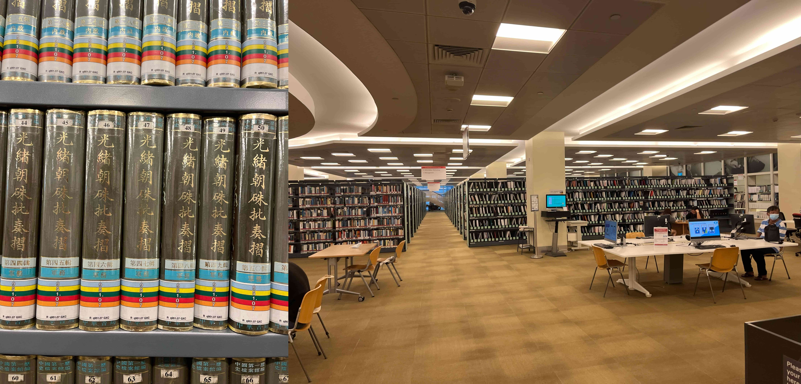
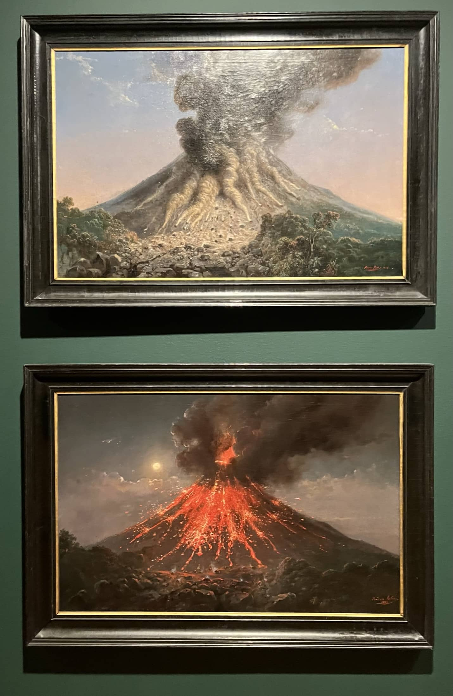

开始写这玩意的时候已经进入到八月了。过了感情过山车和工作第一个月的挣扎之后，一切开始步入正轨，也因此开始逐渐平淡。

<!--more-->

## 去哪玩

### 国家图书馆与国家美术馆

新加坡如我之前所说是一个资本主义乐园，除了钱眼里没有丝毫其他问题，建立在这座岛国之上的一切都是为资本增殖服务的——无论是当地的威权主义体制、越发分化的海外劳动力进入机制、还是在世界其他地方都良莠不齐但搞得火热的各种活动，在新加坡杳无音讯。

撇开特殊时节的鬼扯不谈，到底也该出去一趟，再不出门真的要发霉了。中午吃面的时候还赶上一场阵雨，下了一个多小时就当我的耐心将快耗尽之时雨下小了，撑伞出门直奔地铁站。

第一站是国家图书馆，本来期望很高，绕了一圈发现书籍的尺度还没NUS的高，尤其是中文书籍。或许是因为借阅阅览区还没开所以书并不是很有意思。但这光绪奏折全集还是有点惊到我。

这里的中文书籍还是非常在地化的，有一大堆南洋移民家谱和风俗宗教相关的内容。甚至还有一些为数不多的ccp历史比教科书还要教科书，

沙里淘金的话还是有些好东西，并不在政治和历史区域，而是在劳资关系。找到了一本Against the Law: Labor Protests in China’s Rustbelt and Sunbelt。一本关于在国企大下岗转型后时期在东北与广东发生的工人抗议观察。但这本书是新加坡人用英文写的所以某种程度上来说很读不下去。

再一个是国家图书馆为了服务社区很早就“去中心化”，所以可能馆藏来说也比较分散。

路过国会到了国家美术馆

在美术馆里的前半个小时都处于一种蒙圈状态：美术馆似乎要门票，但不知道去哪里搞。有一台自助取票的机器，但是只支持SG/PR的证件。在场馆内晃了半天也不知道去哪取票。当时正好是学生的假期，国家美术馆有小朋友的活动，大厅内全都是小孩子的叫嚷声，差点畏难直接跑回家。在馆里饶了好几圈才发现只绕了一半，售票处在两栋建筑的连接处中间。掏了半天学生证和签证，售票处的一听我是学生立刻给我打了一张门票，证件看都没看。正好旁边有个洋老太太义务讲解，顺手就跟了个团。

国家美术馆前几年改建自殖民地以来的最高法院和政府大楼。中间的空地用东南亚特色的“茅草”覆盖起来作为房顶。从地面向上生长的金属树在高出分叉，支撑着茅草屋的房顶。到了两侧入口的位置茅草屋顶弯曲滑落下来，与地面留下了一段高度作为开放式入口。

重新回到了一开始在最高法院的入口，这个法院在1939年由当时的海峡殖民地总督（GCGC，一等勋爵士，God Call Me God）宣布建成并转交给当时的法官。在牌匾前面的奇怪玩意是活动给小孩玩的，之前还以为是什么展品，敲了敲，空心的。在法院这一侧的美术馆里也处处可见之前法院的痕迹。

讲解洋老太太给我们介绍的第一幅作品就算是开幕雷击
：泰国国王的肖像画。在泰国接触西式文化之前给王室作画算是一种大不敬，因此没人知道前任国王到底长什么样。在将佛陀的意象和欧洲传统王室中的骑士精神一番大杂烩融合之后，一张前任国王的肖像画就虚构完成了。泰国也就此走上了近代化的道路。

接下来这一张姐妹情深则出自菲律宾。正如许多殖民地的知识分子所想，殖民地的人民掌握了与宗主国可比拟的文化水平，自然应该与宗主国平起平坐。这两幅画也是相似的主题。期间还提到了美西战争，美国在这场战争中夺取了菲律宾的宗主权。期间还提到美国在美西战争之前美国给菲律宾许下革命成功之后的美好愿景，等到战争结束之后翻脸不认人又将菲律宾殖民了。

印尼的自然风光

越南的纤夫

还有一幅据说是描绘核战争之后悲惨场面的抽象画，作者忘了。这幅画摆在了法庭法官席的中央，有一种权力恐怖。

甚至还有越战期间的宣传海报

我们的旅程在这幅画中作结：这幅画作于1973年一场泰国军事政变之前，表现了作者对时局的忧虑，果不其然，作者的忧虑成了真。学生运动被血腥镇压。这幅画值得说的几点，除了骨骼与血液上凝结的花朵，监狱探照灯一斑福柯式的全景敞视隐喻，还有在远方搭建在骷髅头山上的，随风飘扬的泰国国旗。可以说为没能成行的纪念弥补了遗憾。

### 6.18 孙中山南阳纪念馆

这是一间由华商小洋楼改造的博物馆。很长时间一来一直都是作为华商会的活动中心，直到近几年才被新加坡政府接管并改造为关于孙中山的博物馆。我隐约有感觉是新加坡国族主义已经在社会中占据主流地位之后新加坡政府才愿意接手，以免中国政治相关的内容影响新加坡内政，但没证据且听一乐。之所以选中这个小院子是因为孙中山几次来新加坡筹钱都是住在这里，虽然总时长占孙中山人生当中极小一部分，但通过孙中山结识的南洋富商也在南洋华人中传播了不小的革命影响力。

波靖南溟，光绪御笔

宗风远鬯（chang4），徐世昌写的

早期革命势力与南洋黑社会密切相关，这一点在新加坡国家博物馆的展品中也有体现。在新加坡建国之前革命的氛围也十分浓郁

有毛笔字体验，不如新加坡本地小朋友写得好看

随后去芽笼吃米其林田鸡粥，新加坡这么热喝粥实在是有点……

### 7.1 Singpost+音乐节

上班期间保持着每两周出去玩一圈的频率，所以在不知道去哪的时候决定动身前往种草了好久的singpost总部。虽然说是总部，但其实没多大，附属的纪念品商店也就很小一块，甚至没有复数的博物馆（荒漠无疑）

但好在本社恐和新加坡当地的华人大叔聊了起来，大叔应该是个资深的集邮爱好者。他的明信片是自己打印出来的，自备印泥到这里来盖新的集邮印章（免费的）。在交流的过程中还有个新发现：即使是本地人也不是特别清楚NUS和NTU哪个是哪个……

晚上被拉去看新加坡本地小乐队的露天音乐节。说实在的我i对音乐节这种表现形式还是接受不能，看着姐妹全国的音乐会乱跑还是很佩服的（i人各有i的方法）

这之后就没怎么出去玩过了，期间一直在修电脑，一会好一会坏实在是把心情折磨殆尽了

### 碎碎念

说到底也满感慨的，这一年如往常一样没什么社交，很多人见了一面之后也就散了，我时常想着这会是这辈子见的最后一面了（大雾）。

## 上班

怎么说呢，两个月上班生活过的比我想象中要快许多。无论是前几周屡屡犯错的QCR还是日常维护的其他项目都在有序推进。同时也发现即使像是GE这样的大公司里面许多工具也只不过是开始没多长时间的项目。往好里说这算是一种不断提升不断改进的过程。

.png)

在这两个月中也完成了RCA Tracker。其实对我自己来讲这玩意的意义要远大于tracker本身。因为Root Cause Analysis作为一种工程类领域常用的分析工具可以泛用到各类工程类公司中去。但这个Tracker本身却因为leader换人而被冷藏了。虽然没有被完全删除还是留了下来以备后用但是还是很不爽。另一方面是之前说的不断更新，也很有可能是各级boss个人偏好的结果。

具体到KAIZEN来说，已经从之前不知道塑封机和双面胶是什么的呆逼进化成为能够帮忙取东西的杂役了，虽然想出什么解决办法还是费劲，但做实验统计数据之类的活还是能干的。这种进化稍微也是有一点成就感。

.JPG)

话说之前还以为没有dress code，所以穿着久美子乱逛，这次KAIZEN之前被说了一顿。

## 影视

以下内容均为朋友圈留档

### 漫长的季节

4🌟

我曾简单的以为这部剧讲的是东北下岗潮时期的恋爱故事，也没想到故事的基调会极其阴暗压抑：如果不是穿插着东北喜剧还能活跃一下气氛，可能看到四五集就弃了。压抑的根源几乎无处不在：无论是身份未知的碎尸案、黑社会的暴力机器、几位家长无限膨胀的控制欲、穿越20年的大男子主义、还是个体与时代的悲剧。

从这个角度上来说，沈墨更像是这个故事的主角，她所遭受的压迫是这个故事里一系列悲剧的根源。不在沈默中爆发，就在沈默中灭亡，她选择了爆发。

这似乎回到了改良还是革命的悖论。我没办法对傅卫军有任何好感，他的黑社会暴力行当从来都是让我敬而远之的对象。但为了向曾经遭受过的压迫复仇，傅卫军是她唯一的依靠。沈墨的世界里从来都没有改良的话语空间在。解放还是野蛮，没有别的路可以选。

再说故事的背景，东北的工人阶级，这是我本科创伤的之一，也是追这部剧的另一个理由。但这部剧的故事背景让我想起人民的名义，前WTO的工人阶级成为景观，下岗潮从不是这部剧的主线剧情，而是一群失意中老年人的调味品。得亏在厂长责任制下这位侵吞国有资产的工厂主被抓了，但鞍钢宪法甚至在动荡时期昙花一现的工人民主，随着传统意义上工人阶级的消失，再也没人提了。

王阳没能离开桦林，他在铁轨上给沈墨念诗时渴望着诗和远方，但他抛不下一切离开，他的人生永远定格在了桦林。沈墨顶着殷红的身份离开了桦林，但桦林永远是她悲剧的根源， 打出ace之后她的故事也结束在桦林。但王北不一样，凶杀案与他无关，国企改革与他无关，他和我们一样是在后wto时代成长起来的青年人。他离开了桦林前往北京，但他的未来依然是未知数。

喜欢也是一种特权

### 势冲青天 

4🌟

到底谁说这片子是商战片的商战占全片1/4还不到（

作为涩泽荣一的传记性剧作，本剧前半部分几乎花了同等篇幅讲述了一桥庆喜在就任将军前在权力中心的活动。虽说无论是在情节上（庆喜日后成为荣一的主君），还是为了给观众了解幕末的中枢政治环境，这两条暂时未产生交集的剧情并行完全无可厚非。但是时间上的压缩和一些意识形态上的刻意而为却把当时的幕府描绘的非常草台班子：庆喜生父德川齐昭是个天天喊着尊王攘夷的神经病、而井伊直弼是个靠着奉承将军上位的公子哥。细节上樱田门外刺身的刀还拔出来了。

无论京都和江户的朝廷与幕府多草台班子，人家至少也是最优质情报的集散地。当乡下的义士们还在尊王攘夷的上个版本，脑子灵光的西南诸藩已经在推动幕府朝着开国的方向走，再怎么样幕府里也没人认真把尊王攘夷当回事了。这种信息差在剧集里的体现也是草草带过，旁白念了两句就算交代了，实在是一周一集的流水线电视剧的遗憾。

其实也是因为有了商战片的误解我才会对之前重笔墨双线程写庆喜意见很大，但是纵观全片庆喜作为荣一的主君是贯彻始终的。尤其是荣一打完价格战航运公司差点破产时的上头，与图7庆喜鸟羽伏见为什么稀里糊涂出兵的反思形成互文，也引出了荣一晚年积极投身公益试图在群情激愤的日本战争热潮中降温与各方沟通的故事（曾获诺贝尔和平奖提名剧里没拍）

总体上来说还算不错，虽然摆脱不了周更剧集靠回忆水时长的问题，但也展现出了日本资本主义之父涩泽荣一作为尊攘激进分子、作为幕臣、作为维新政府成员、企业家和社会活动家涉猎广泛的一生

但说实在的涩泽荣一想象中的“合本主义”，也就是株式会社（股份制公司）制度已经成为现代资本主义中的一部分，但显而易见这玩意也并没有真的实现共同富裕。毕竟资产吞并的马太效应总会两极分化。如果既要又要的温和改革的话，全民基本收入UBI可能确实是一个比较好的方案。

### 锅匠裁缝士兵间谍，1979版

约翰勒卡雷改编自剑桥五杰中金菲尔比的故事，1979版bbc7集电视剧+原作小说刷完。4.5🌟

英国情报机构圆场中出了叛徒，前任老总因为这事累死了，新负责人虚荣心极强靠不住，乔治史迈利临危受命，挖掘圆场叛徒的真相……

与碟中谍印象中杀人放火的印象不同，这部剧描绘的间谍机构是极其沉闷的。乔治就像一个rpg游戏里的主角一样在圆场这个游戏舞台里和各种npc对话收集线索。写到这里我忽然想到了极乐迪斯科：在海一样的档案与回忆中，找出各项时间地点人物事件的关系。没有枪战，没有打斗，甚至没有多少qte，这也是冷战甚至当今情报工作的主流：坐办公室，拿个社工库、sns或者是xx日报、x华社、x交部网站做爬虫，企图在文字的毫厘之间微言大义。

甚至连极乐迪斯科中的士气值都能拿来类比：在老总嗝屁的风波中你被迫退休，为数不多的退休金老婆要提走一大半。哦对了你的老婆安恩，让你魂牵梦绕美若天仙的那个女人，出轨了。你的同事们像逾期未完成的提醒事项一遍又一遍问候着她。职场情场双重失意还要处理手头这摊烂事，精神不崩溃就算成功。

最意想不到的是，原作小说中的意识形态问题反而被可惜淡化，1979中下图的爆典在原作小说中反而是打省略号打点过去了。

不得不说我在阅读能力上下降的厉害，或许是手机天然不适合长时间专注阅读，即使是已经先看完1979版电视剧，还是总感觉小说很难看下去。

### 人选之人造浪者

不太好评价，综合来说4🌟

说实在的，这片子的性别意识的看头要远远大于选战。性别关乎权利，权利关乎政治；但政治又不能和选战划等号。这部片子亚静和她的metoo才是故事的主线，最后选战开票反倒是高潮结束后的贤者时间。更何况现实中选战无非是两个或者三个大帐篷互相喷垃圾话。所以这部片赶上metoo大爆发，正好可以反思一下到底什么才是真正重要的话题。

接下来是直男癌发情时间：实在是太喜欢亚静这种勇敢坚强的美少女了，赞爆！🥰

### 机动搜查队404

非常优秀的警察剧，感谢小玥的推荐！4.5🌟

编剧也是《非自然死亡》和《逃避虽然可耻但有用》的编剧，剧本依然和前两作一样保持了相当高的剧本质量，甚至还联动了非自然死亡，直接一个双厨狂喜

本剧“正义”的核心与很多警察/律政剧相同。但是角度很不一样：每个人的境遇与生长环境都各自不同，能对每一个犯罪分子进行相同的道德谴责吗？警察只是负责抓捕嫌犯，但问题的种子已经种下了。

而且这一对搭档也确实很好磕，即使我对BL不感冒也还是很喜欢这一对

明天吃菠萝面包！

## 结语

本来说是月更的内容拖到8月中，7月份每天通勤通了850公里34个小时，说实在的也没什么心情更新日记。7月份国内的一系列天灾人祸更是让我没心情管理自己的事情，上班忙起来想不起来写日记，闲下来的时候也就是刷手机摸摸鱼。台式机崩溃了之后更是心烦的一批，但趁着这个时间也刷了不少的剧。实习已经转成兼职了，开始摸下个学期的鱼，但正式工作还是遥遥无期。
