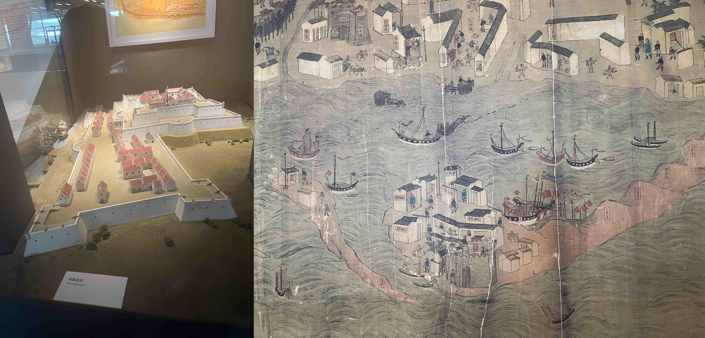
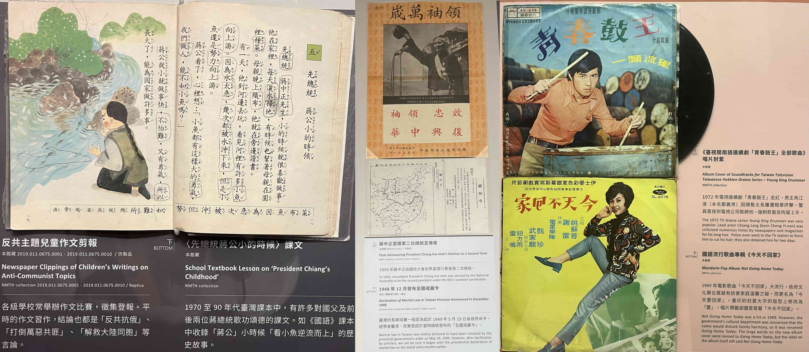
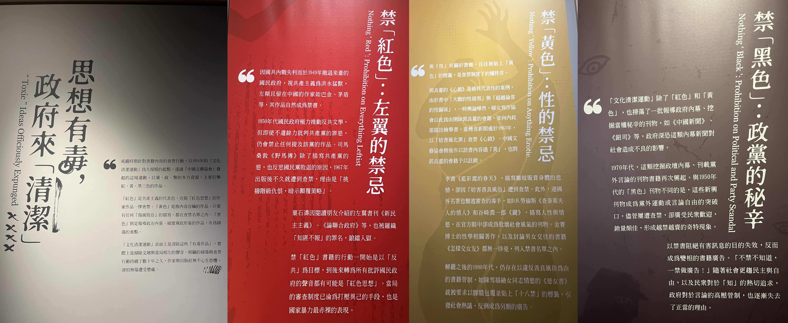

台南如果站在中国城市发展的视角，可能更像一座三线城市甚至县城，但台南丰厚的历史资料无愧是全台湾的历史文化之都！史料丰富的国立台湾历史博物馆介绍了系统的台湾历史脉络与沿革、安平古堡与德记洋行则是提供了实实在在的历史建筑。台南市区中心的文学馆孔庙和美术馆更是为这座历史城市提供了充足的人文气息。第二天前去的奇美博物馆则是更多的提供了现代化的艺术表达，表明这座城市也与现代保持接轨。

<!--more-->

## 国立台湾历史博物馆

早饭吃的虱目鱼粥，因为和青旅有合作所以量大便宜。吃了早饭之后直接坐计程车去在郊区的台史博，昨天查路线坐公交车需要1个小时，回市区还要1个小时。对于时间紧张行程密集的台南来说实在是耽搁不起这么久，因此在台南旅行成本的最大头就变成了打车，总共花了大概250人民币。花这么多钱最主要原因之一也是因为台史博在市郊很偏远的地方，当然安平古堡离市中心也不近，但总的来说前往这个博物馆的开销还是占了大头。事实证明这往返的车钱并没有白花。

通史总要从这片土地的原住民开始讲起，这里的原住民历史使用了录音来展现台湾各个地区不同族群原住民之间的语言风俗差异，但总的来说这一块内容还是不多。

在郑成功来台之前，台湾已经是荷兰和日本商人进行大规模交易场所。两拨外来者从贸易战到外交战，最后在台湾大打出手。博物馆的多媒体设备很有新意地将整个历史过程模拟成了卡牌游戏，用卡牌表现荷兰与日本商人的历史行为。

在台湾大打出手的不仅仅有日本人，还有西班牙人。当时正处于荷兰独立的八十年战争，西班牙人与荷兰人在台湾争夺贸易利益也在台湾进行对峙。荷兰人以台南为据点占据南台湾，而西班牙人以淡水为为据点占据北台湾。双方在台湾经过长时间对峙之后以荷兰人将西班牙人赶出台湾告终。

很搞笑的是，在明朝的部分，对台湾的理解误差非常的大，也证明在明朝以前对台湾基本上没有任何控制力。当时的皇明大一统图里面的台湾被认为是“大琉球”，里面基隆淡水、北港（在嘉义）和澎湖被画成几乎相连的三个岛屿。很有趣的是这里也展出了国姓爷郑成功在厦门金门的据点——在文字里将国姓爷说成是海盗。

盼望着，盼望着，国姓爷来了，同样也是在台南建立政权，将据守此处的荷兰人赶走。听义工老奶奶说郑成功与荷兰人之间是签协议对等离开而非荷兰人投降，台南市政府开展纪念活动时立了几个跪在地上投降的红毛番，还引发了荷兰代表处的抗议。国姓爷仅仅控制了台南到高雄的一小片地区，其余很大一部分区域仍然是由原住民控制。

清军入台了，画里描绘的是清军与明郑的海战场景，左侧明郑兵败如山倒的另一个原因，是天上妈祖助大清一臂之力。而清军入台后有效统治台湾的仍然是西部平原地区，很长一段时间东部山区并不认为是大清疆域。

接下来是闽南移民到台湾开垦的故事，当时清朝还有海禁，所以不可以携家眷去台湾。不少移民还需要偷渡，生死都被握在蛇头手里。

> 勸君切莫過台灣，台灣恰似鬼門關，千個人去無人轉，知生知死都是難。

在拓荒过程中，原汉之争的热度上升让清廷对番民进行分类。生番熟番是以汉化的程度进行区分。当然也少不了“先进文化”殖民落后地区时原住民背井离乡前往山区的血泪史。

在介绍平埔族故事的展区有两点很吸引人：第一是平埔族的祭祀地点公廨只允许男性进入祭祀，瓦罐内的水一般是祖传的显灵圣水。但另一方面，在与汉人商议土地契约的过程中，出场的却只有平埔族的女性，这则是因为在平埔族是母系社会，女性掌握财富。这种祭祀与财产的划分让我很意外。另一件则是当地原住民结合了原住民的神明阿立祖与太上老君这种汉人道教的文化进行祭祀，来博物馆参展也是原住民进行祭祀之后得到的结果。

汉人移民带来了汉族文化，比如土地庙、妈祖崇拜与庙会游行，也把大陆的族群冲突一起带了过来。偶尔也会举行登高抢孤这种“和平”的活动，在这种活动中各个族群会保持和平并停战。庙会游行里领头的这位可以说是浑身上下全都有讲究，义工奶奶从头到脚给我讲了一遍，回来已经忘完了。

日本人来了，在台湾建立起了严密的社会管控体系。南无大警察菩萨从治安交易报章言论无所不管。同时日本人也带来了现代化的户籍管理制度，方便更为精细的社会管理。

日本人也影响了原住民的生活，日本人也镇压了原住民的势力，北部的太鲁阁族就在日据时期遭到了迫害，象征着男性首长地位的大羽冠也在逃亡过程中丢失，这里展出的是原住民重制的复制品。日本人在这之后给原住民配发统一的狩猎用村田枪并控制弹药数量防止原住民反抗。枪身上还有印记，表示这把枪一共打到多少猎物。

日据时期带来的现代化的城市生活，也有强制的同化政策和战争征召。台湾士绅在日据时期就开始争取选举权，以图维护台湾本地的利益。同样也有选择不和日本殖民者合作的义士，比如谢雪红。讲到谢雪红我随口一提说她是“台独”。周边的几位义工像是打开了报警器一样警戒但又神色怪异。其中一位连连说不是，但更多的是不想深谈这个问题，我还没来得及解释就到下一个展品了。

日本战败意味着台湾回归，但几十年的教育让台湾人对国家认同也比较迷茫。更不必说国民政府来台的腐败和二二八给台湾带来的伤痕。但义工奶奶应该是有意没给我介绍政治的内容，反而是给我看了一个皮包。这个皮包是一位日本女性从东京带来的，当时她去伪满洲国找人，人没找到却和一位中国军人相爱，最后这个皮包一路和她来到了高雄凤山，这个皮包见证了当时的动荡与意外。

国府迁台之后维持了在内战时期的戒严政策，也延续了对总统 蒋中正的推崇、反共的意识形态和保守的社会文化。男演员头发太长会被警察拘留，以《今天不回家》当专辑名称会破坏公序良俗被勒令下架。看到蒋公看鱼儿逆流而上的课本我笑道这玩意在大陆被当作段子，但义工奶奶这个时候严肃起来，这是当时他们要背的课文，背不下来还要打手心。之后还讲了她当时在救国团的日子，类似于一种国民党的青少年组织，虽然能教一些东西，但有些军事化和意识形态化，她并不喜欢参与那些活动。

美丽岛事件冲击了国民党统治的黑暗，戒严之后台湾的公民运动也如火如荼。最后的一个展品义工给到了拖家带口的摩托车，这是台湾经济起飞时期台湾的共同记忆。

应该是针对“台独”的话题念念不忘， 义工奶奶还语重心长的跟我说了她们家在台湾的历史。她们家在内战期间随她父亲来到了台湾，没有留在上海，也因此一个大家庭被分成了台湾和上海的小家。前一段时间他们曾去上海探亲，虽然在上海还有亲属，但依然是认为台湾才是他们的家。走之前拍了几张这个博物馆的外景照片，毕竟在市中心外远得很占了这么一大片地方，建筑建的也还是不错的。

## 与“赚奶粉钱的奶爸”的对话

赚奶粉钱的奶爸是uber司机的自我介绍。因为这段话实在是让我印象深刻，过了两个月还是余音绕梁，所以在这里记录下来

> 话题是从一个顺丰快递的三轮车开始的，司机也很认同顺丰虽然贵一点但确实很快。也从这里我表明了我陆客的身份。我说我从大陆来的之后还是问了我一句是大陆哪个省的，我说河北省，他说哦河北省啊，一定是也有很多历史遗迹吧。河北省哪有？好像他们对大陆的问题也不是太清楚。他很奇怪是不是从台史博到安平古堡的这条路线是有人做的攻略。我说没有啊，台南就这些历史相关的景区，想一天玩完基本上就这个路线了。他问道我是不是特别喜欢历史相关，还说我以后一定会去埃及和南美。但我在巴以冲突的时候听了一个去埃及旅游的播客，听说埃及的旅游开发还非常的“野蛮”，淳朴的当地人蹲在金字塔和狮身人面像景点前面想方设法搞你钱，抢你手机给你拍照或者请你上骆驼之后赚你一笔。但应该是迟早要去的。我抱怨道为什么台南没有捷运，打计程车花太多钱；为什么这个国立博物馆要放在离市中心这么远的地方，对游客来说实在是太不方便了。他说台南开发太早了，很多房子土地都很小一块，捷运地铁站一建就要占用很大的地，所以相比来说建捷运并不值得。在土地私有制的台湾确实城市和日本非常像，每栋建筑都小小一幢，窄窄的街道渗透到城市的每个角落。他告诉我因为市中心找不到这么大一片地，所以放在郊外。他好奇到台南本地市民根本不会把这里当景点，那当然了你们都是台湾人你们在课本里都学过台湾历史，我是游客我当然要去看看，我也觉得这个博物馆非常不错，而且义工听说我是大陆人之后特地没有给我介绍二二八白色恐怖和美丽岛。他对我知道二二八和美丽岛有点惊讶。我对台湾的民主斗士表示了敬意，他也提到了一些疫情封城的抗议，希望我对未来保持信心。一提到政治有些人就开启了话匣子的开关，他说民进党这几年党同伐异到处搞网军出征，执政了八年是台湾民主的倒退。民进党还贪腐，我问他是阿扁吗？他说阿扁贪得都是小钱，现在的民进党几亿几亿贪污。我大吃一惊，毕竟我当时还不清楚高端疫苗的来龙去脉。既然聊到这里了，我问他明年选举会投给谁，他比较坚定地说是柯文哲。我们都同意他重启两岸沟通的态度，统独问题这个世代不能解决留给下一代，但好歹要把交流和经贸往来先做起来。最后他很热心地给我推荐了安平古堡旁边的小零食，但我对吃食确实没什么兴趣。下车的时候还在因为没能问他怎么看高虹安的贪腐案耿耿于怀。

## 安平古堡与安平树屋

安平古堡和安平树屋之内也都有相关的台南历史展出，但实际上台史博在台湾早期历史对台南的描写也相当丰富。安平古堡是之前荷兰人所建的热兰遮城遗址，但相关的历史文物只有一面台南城墙，甚至荷兰人的遗迹基本上已经毫无痕迹。安平古堡周边有很多“民族英雄郑成功”的塑像。

安平树屋倒是有的一看，原址是英国的德记洋行，里面展出了不少外国洋行和贸易团队在台湾的经商活动。西班牙的里尔银币在高雄也有见到，在这里又见到了一遍，里尔银币在闽南语里面也称为“镭”。

台南市的四个历史景点，安平古堡、安平树屋、亿载金城、赤崁楼有通票，大约会节约25%，但当时我在第一个景区就没想到要买，而且亿载金城和我路线差太远，所以还是分开购票的。这种通票对整个城市的历史旅行还是很有帮助，日后淡水的景点就是一张票含三个景点，游客完全不需要担心会错过。

## 国立文学馆、台南孔庙、台南美术馆和赤崁楼

从安平树屋打车到台南市中心，来到了国立台湾文学馆。 市中心的大圆环完全没有我预想中的繁华，在路边找了一家寿司店草草吃了午饭。

文学馆常设展首先是用非常贴近生活的几组视频让观众意识到其实文学在我们的生活中无处不在，有选举的口号、商业广告以及各种语言和文字中的艺术。接着和其他的博物馆一样，贯穿着台湾的历史，从原住民的寓言故事，到清代的古典文学，甲午战败后日本人带来了亡国感和现代性，也带来了第一次的强制国语教育，国民政府迁台后这种强制的国语政策延续，大半个世纪里台湾的民众在政治的强制力下被迫将自己的母语当二等语言，从日语教育变为中文教育的强制措施也导致了台湾文学的严重断层。除了国语国民政府也带来了戒严，如果不是御用文人在戒严期间的创作则举步维艰，其中武侠小说和展现台湾人身份认同的作品在其中顽强的成长。解严后则迎来了文学自由发展的时期，禁忌的消失让台湾迎来了文学创作题材的大爆发。这里展出的文本设计的很精美，用半透明的塑封卡夹在金属夹具中间，想要阅读的话放在白色的背景光下，文字会从镂空的部分亮起。

特展则展出的是白色恐怖下的文学审查，各种题材的作品会因为各种莫名其妙的理由遭到封禁，因此作家们也不得不不断更换笔名和出版商来继续写作和传播。受影响的不仅仅只在文学，歌曲也会受到审查。

台南孔庙就在不远，这里是台湾传承最古老的孔庙，也曾是台湾唯一一处县学。除了祭孔时用的礼仪乐器的百科全书和各种儒学大家地方乡绅的牌位，台南孔庙最引人瞩目的是自康熙以来的清朝皇帝和历任中华民国总统所赐的牌匾。相比高雄孔庙，台南孔庙香火旺盛的多，旅客和学子们都络绎不绝，尤其是学生由老师带队组团来祭拜，希望考试能拔得头筹。

从台南孔庙出来大约4点多，花了1个半小时极限参观完了相隔不远的两个台南美术馆。园区氛围很好，但展品实在是有些后现代，我唯一能欣赏的是可爱的兔兔。

晚饭在台南古城墙公园旁的一家小店里，点了一份炒方便面，里面加了蛤蜊我并不是很喜欢。很遗憾的是旁边的城墙公园已经不开放了。

在台南夜晚的街头走了好久来到了赤崁楼，这里原先是荷兰人的据点，郑成功将荷兰人赶跑后将政治中心迁移到安平古堡。当时我去的时候赤崁楼正在整修，开放的部分只有文昌阁，在这里见到了闽南传统艺能掷杯筊，这里的说明还真的很实在，一直扔一直扔，扔到妈祖说ok为止。

## 奇美博物馆

奇美博物馆是台湾企业家的一个私人博物馆，后来由市政府一起运营。这里其实没有多少台湾本土的特色，反而更像是馆主个人的品味鉴赏。欧式建筑立面大多数也都是西方艺术的展品，在军事展区里面倒是有世界各地的兵器。这里的人可比台史博多多了，这里也是中小学生们团队出行的热门地点。非要说的话，这里更像是一个给本地人提供“欣赏高雅艺术”的地方，作为一个纯外地人来这里参观有些缘木求鱼的感觉。

从奇美博物馆出来走10分钟，到达保安车站，保安车站也是台铁知名网红车票永保安康的站点之一，可惜我进了站才发现这一点，要不然也买一张票作为收藏了。从保安站坐区间车到高铁台南，用三天中最后一天的周游券在柜台买好去台北的车票，在自动售货机帮了一对韩国情侣用自动售货机（我自己其实也不是很会用），带着台铁便当出发去台北。

最后集中放一下在台南吃的饭，从左到右依次是：

青旅旁的虱目鱼粥、文学馆旁的寿司、台南古城墙旁的炒方便面、赤崁楼旁边的盐酥鸡、青旅旁的鸭肉饭、高铁便当

